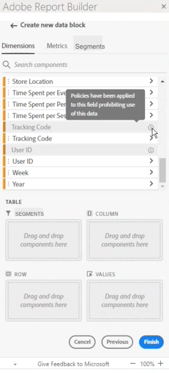

# Etiquetas restringidas en Report Builder

Por lo general, la configuración relacionada con la gobernanza de datos en Adobe Analytics se hereda de Adobe Experience Platform. La integración entre Adobe Analytics y Gobernanza de datos de Adobe Experience Platform permite el etiquetado de datos confidenciales de Adobe Analytics y la aplicación de políticas de privacidad.

Las etiquetas de privacidad y las políticas creadas en conjuntos de datos consumidos por Experience Platform se pueden ver en el flujo de trabajo de grupos de informes de Adobe Analytics. Estas etiquetas detienen o advierten a los usuarios que crean métricas o dimensiones a partir de campos confidenciales. Para obtener información acerca de los conjuntos de datos, consulte [Información general sobre conjuntos de datos](https://experienceleague.adobe.com/docs/experience-platform/catalog/datasets/overview.html?lang=es)

Además, cuando se exportan datos desde Adobe Analytics (mediante creación de informes, exportación, API, etc.), se añaden advertencias o etiquetas para notificar a los usuarios de que un informe contiene información confidencial que debe tratarse de una manera específica.

Esta integración le permite administrar el cumplimiento de normas más fácilmente. Los administradores de datos de su organización pueden establecer políticas para restringir el uso. Como resultado, los usuarios de Adobe Analytics pueden utilizar los datos con mayor seguridad, sabiendo que cumplen con las políticas definidas por los administradores de datos.

Para obtener más información, consulte [Adobe Analytics y control de datos](https://experienceleague.adobe.com/docs/analytics-platform/using/cja-privacy/privacy-overview.html?lang=es)

## Visualización de datos restringidos en Report Builder

En Adobe Analytics aparecen dos políticas definidas por Adobe que afectan a la creación de informes, a la descarga y al uso compartido:

* Aplicación de la directiva de Analytics
* Aplicación de la directiva de descarga

Los componentes afectados por estas directivas aparecen atenuados. Cuando pasa el puntero por encima de un componente que tiene una directiva aplicada, se muestra una nota para indicar lo siguiente: **Se han aplicado directivas a este campo que prohíben el uso de estos datos.** Para obtener más información, consulte [Etiquetas y directivas](https://experienceleague.adobe.com/docs/analytics-platform/using/cja-dataviews/data-governance.html?lang=es).

## Actualización de informes que contengan datos restringidos

En los casos en los que un usuario ha creado un informe de Report Builder con elementos de datos que se restrinjan posteriormente, cuando se actualiza el informe, se muestra un mensaje de error.

