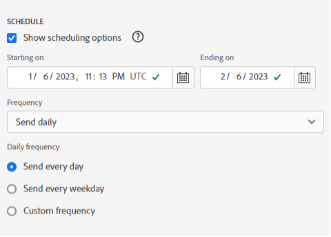

# Programar libros compartiéndolos por correo electrónico

>[!NOTE]
>
>Además de programar libros para compartirlos por correo electrónico, como se describe en esta sección, puede programar libros para que se exporten a destinos en la nube, como se describe en [Programar libros para exportarlos a destinos en la nube](/help/analyze/report-builder/report-builder-export.md).

Después de guardar un libro y completar el análisis, puede compartir fácilmente el libro con otros integrantes del equipo mediante la función de programación. La función Programación permite crear una programación que actualice automáticamente los datos del libro y envíe el archivo .xlsx del libro de Excel como datos adjuntos al público especificado en una fecha y hora específicas. La configuración de una programación proporciona a los destinatarios actualizaciones regulares de forma automática. También puede utilizar la función de programación para enviar el libro una vez sin programar actualizaciones automáticas.

Puede crear varias programaciones para un solo libro. Por ejemplo, puede enviar un libro a su equipo diariamente y enviarlo al administrador una vez a la semana creando dos programaciones diferentes.

La función Programación también permite configurar la protección con contraseña para un libro y editar los libros programados previamente.

>[!BEGINSHADEBOX]

Vea  [Programar libros](https://video.tv.adobe.com/v/3413079?quality=12&learn=on){target="_blank"} para ver un vídeo de demostración.

>[!ENDSHADEBOX]

## Programar un libro

Para programar un libro:

1. Seleccione **[!UICONTROL Programar]** en Report Builder hub para crear una programación de modo que pueda distribuir automáticamente un archivo de Excel de libro (.xlsx) a un individuo o grupo.

   {zoomable="yes"}

1. Seleccione **[!UICONTROL Programar libro]** o  para crear un nuevo libro programado.

   {zoomable="yes"}

   El panel de programación muestra información predefinida sobre el libro, como el nombre del libro y la última fecha de modificación del libro.

### Archivo

En la sección **[!UICONTROL Archivo]**, proporciona detalles del tipo de archivo, el nombre y una contraseña para proteger el archivo.

{zoomable="yes"}

1. Use  para seleccionar el libro actual, si no está seleccionado.

1. (Opcional) Escriba un **[!UICONTROL nombre de archivo]**.

   El nombre de archivo predeterminado del libro es el nombre del libro, pero puede cambiarlo si lo desea.

1. Seleccione un **[!UICONTROL tipo de archivo]**.

   * **[!UICONTROL Excel]**
   * **[!UICONTROL PDF]**
   * **[!UICONTROL CSV]**

   Cuando seleccione **[!UICONTROL CSV]**, tenga en cuenta que el libro programado se enviará como archivo adjunto zip. Algunas administraciones de correo electrónico corporativas pueden bloquear el correo electrónico con archivos adjuntos zip. Verá una advertencia en consecuencia.

1. (Opcional) Seleccione **[!UICONTROL Adjuntar marca temporal al nombre del archivo]**.

   Puede adjuntar una marca temporal al nombre del archivo para identificar la fecha en que se actualizó el libro. Una marca de tiempo es útil para ver qué versión de un libro se envió en una fecha específica. Al seleccionarlo, puede elegir entre:

   * **[!UICONTROL Formato de fecha ISO]**, que hace que `YYYY-MM-DD` se anexe al nombre de archivo.
   * **[!UICONTROL Formato de fecha ISO + marca de hora]**, lo que hace que `YYYY-MM-DD_HH-MM-SS` se anexe al nombre de archivo.

<!-- Does no longer seem to be an option? 
1. (Optional) Select **.zip compression** to compress the file and set up password protection on the file.

    When you make this selection, you're prompted to enter a password to open the file. This is helpful if you have concerns about data security and you want to password protect the workbook. Protecting the file with a password requires you to select **.zip compression**. The password must be at least 8 characters and contain a number and a special character.

    {zoomable="yes"}{width="55%"}
-->

1. Escriba una contraseña en **[!UICONTROL Proteger el libro con contraseña]**. Una contraseña válida requiere al menos 8 caracteres, un número y un carácter especial. Seleccione  para mostrar la contraseña y  para ocultarla (valor predeterminado).

### Correo electrónico

En la sección **[!UICONTROL Correo electrónico]**, debe proporcionar los destinatarios, el asunto y la descripción del correo electrónico.

{zoomable="yes"}

1. Introduzca los **Destinatarios**. Puede introducir el nombre de una persona reconocida en su organización. O bien, puede introducir una dirección de correo electrónico de una persona que esté fuera de su organización.

1. Introduzca el **Asunto** del correo electrónico y una descripción para sus destinatarios. El asunto adopta como valor predeterminado el nombre de archivo del libro, pero puede modificarlo si es necesario. Puede agregar detalles en la sección de descripción.

1. Si lo desea, puede escribir una descripción en el área de texto **[!UICONTROL Descripción]**.

### Programación

En la sección **[!UICONTROL Programar]**, puede definir la programación para enviar los correos electrónicos con el libro de trabajo a los destinatarios.

{zoomable="yes"}

1. Seleccione **[!UICONTROL Mostrar opciones de horario]** para definir una programación.

1. Escriba una fecha de inicio en **[!UICONTROL A partir del]**. Como alternativa, seleccione  para elegir una fecha de inicio del calendario.

1. Escriba una fecha de finalización en **[!UICONTROL Que termine el]**. Como alternativa, seleccione  para elegir una fecha de finalización del calendario.

1. Seleccione una **[!UICONTROL frecuencia]**. Según la frecuencia seleccionada, tiene opciones adicionales. Consulte la tabla siguiente.

   | Frecuencia | Opciones |
   |---|---|
   | **[!UICONTROL Enviar por hora]** | Escriba un valor para **[!UICONTROL Enviar cada número de horas]**. |
   | **[!UICONTROL Enviar diariamente]** | Seleccione una **[!UICONTROL Frecuencia diaria]**: **[!UICONTROL Enviar todos los días]**, **[!UICONTROL Enviar todos los días de la semana]** o **[!UICONTROL Frecuencia personalizada]**. Si selecciona **[!UICONTROL Frecuencia personalizada]**, escriba un valor para **[!UICONTROL Enviar cada número de días]**. |
   | **[!UICONTROL Enviar semanalmente]** | Escriba un valor para **[!UICONTROL Enviar cada número de semanas]**. Y selecciona **[!UICONTROL Día de la semana]**. |
   | **[!UICONTROL Enviar mensualmente por día de la semana]** | Seleccione un **[!UICONTROL Día de la semana]** y una **[!UICONTROL Semana del mes]**. |
   | **[!UICONTROL Enviar mensualmente por día del mes]** | Seleccione un valor de **[!UICONTROL Enviar en este día del mes]**. |
   | **[!UICONTROL Enviar anualmente por día del mes]** | Seleccione un **[!UICONTROL Día de la semana]**, una **[!UICONTROL Semana del mes]** y un **[!UICONTROL Mes del año]**. |
   | **[!UICONTROL Enviar anualmente por fecha específica]** | Seleccione un **[!UICONTROL Mes del año]** y elija un valor entre **[!UICONTROL Enviar en este día del mes]**. |

### Enviar

Para enviar el libro:

* Si no ha definido una programación con **[!UICONTROL Mostrar opciones de programación]**, seleccione **[!UICONTROL Enviar ahora]** para enviar el libro por correo electrónico inmediatamente.
* Si ha definido una programación con **[!UICONTROL Mostrar opciones de programación]**, seleccione **[!UICONTROL Enviar según lo programado]** para enviar el libro por correo electrónico según la programación que haya definido.

En ambos casos, verá un mensaje de confirmación en la parte inferior de Report Builder hub.

Para cancelar el envío del libro, seleccione **[!UICONTROL Cancelar]**.

## Administrar libros de trabajo programados

Para obtener información acerca de la administración de libros que ya están programados, vea [Administrar libros programados](/help/analyze/report-builder/manage-reportbuilder.md).

<!--

## Schedule a workbook

Use the Schedule button in the Report Builder hub to quickly create a schedule so that you can automatically distribute a workbook Excel file (.xlsx) to an individual or a group.

1. Click the Schedule button in the Report Builder hub.

    {width="55%"}

1. Click Schedule Workbook or the plus button in the upper-left to create a new scheduled workbook.

    {width="55%"}

    The scheduling pane displays some pre-defined information about the workbook such as the workbook name and the last date that the workbook was modified.

    {width="55%"}

1. (Optional) Enter a file name.

    The workbook file name defaults to the name of the workbook but you can change this if you want. If you\'re sending the same workbook to multiple audiences and you want to name it something a little bit more friendly for a certain audience, you can change the name.

1. (Optional) Select **Append time-stamp to file name**.

    You can append a timestamp to the file name to identify the date the workbook was updated. This is helpful to quickly see which version of a workbook was sent on a specific date. The **Filename preview** shows how the workbook file name will appear in the email when the workbook is distributed. The time-stamp format is YYYY-MM-DD.

1. (Optional) Select **.zip compression** to compress the file and set up password protection on the file.

    When you make this selection, you're prompted to enter a password to open the file. This is helpful if you have concerns about data security and you want to password protect the workbook. Protecting the file with a password requires you to select **.zip compression**. The password must be at least 8 characters and contain a number and a special character.

    {width="55%"}

1. Enter **Recipients**. You can enter the name of a person that is recognized in your organization, or you can enter an email address of a person inside or outside of your organization.

1. Enter the **Subject** of the email and a description for your recipients. The subject defaults to the workbook file name but you can modify the subject if needed. You can add details in the description section.

    {width="55%"}

1. Set up the scheduling options to set the date and time that you want the workbook emailed to your recipients.

    Choose the start and end date and time frames. This can be today's date or a date in the future.

    Choose the **Frequency** from the drop-down menu. You can set the frequency to be hourly, daily, weekly, monthly, or yearly on a specific day. For example, you can set up a schedule to send the workbook on the first Sunday night of the month so that your recipients will have the email in their inbox first thing on Monday morning.

    {width="55%"}

1. After you set the schedule, click **Send on schedule**.

    {width="55%"}

    You see a confirmation toast at the bottom of the Report Builder hub and the scheduled workbook is listed under the Workbooks tab.

    {width="55%"}

## Schedule a converted workbook {#converted}

1. Schedule a [converted](/help/analyze/report-builder/convert-workbooks.md) legacy workbook.

   A pop up appears, asking if you want to use the scheduling metada from the legacy workbook to create a new scheduled task. 

1. If you select **[!UICONTROL Use]**, Report Builder automatically fills in the legacy scheduling information. 

1. Ensure that this information is correct and schedule. 

1. If you want to send the workbook on a different schedule, schedule a completely fresh scheduled task. 

## Send the workbook one-time only

You can also send out the workbook only once.

1. Un-check **Show scheduling options** 

    {width="40%"}

1. Click **Send Now**.

## Manage scheduled workbooks

For information about managing workbooks that are already scheduled, see [Manage scheduled workbooks](/help/analyze/report-builder/manage-schedules-reportbuilder.md).

-->