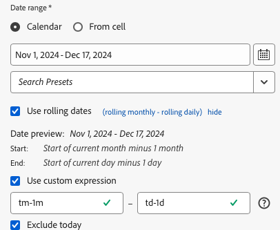

# Selección de un intervalo de fechas

Para cambiar el intervalo de fechas de un bloque de datos existente:

- Seleccione **[!UICONTROL Editar un bloque de datos]** o
- Seleccione el vínculo **[!UICONTROL Intervalo de fecha]** en **[!UICONTROL Edición rápida]**.

Utilice las siguientes opciones para cambiar el intervalo de fechas de un bloque de datos.

## Calendario

La opción **[!UICONTROL Calendario]** le permite crear fechas estáticas o móviles mediante las siguientes opciones:

### Intervalo de fechas

El campo intervalo de fechas muestra el intervalo de fechas actual para la solicitud de bloque de datos. Puede introducir fechas directamente o usar  para especificar un intervalo de fechas.

{zoomable="yes"}

### Ajustes preestablecidos

Utilice el menú desplegable de ajustes preestablecidos para seleccionar un ajuste preestablecido. También puede introducir texto para buscar ajustes preestablecidos.

{zoomable="yes"}

El menú desplegable de ajustes preestablecidos incluye un conjunto estándar de intervalos de fechas preestablecidos y componentes de intervalo de fechas para un grupo de informes que haya guardado o un grupo de informes que se haya compartido con usted.

### Fechas móviles

Para definir fechas móviles:

{zoomable="yes"}

1. Seleccione **[!UICONTROL Usar fechas móviles]** para definir la lógica de una definición de fecha móvil. Puede seleccionar el texto entre corchetes (por ejemplo **[!UICONTROL inicio fijo - desplazamiento diario]**) para ampliar el panel y especificar detalles para **[!UICONTROL Inicio]** y **[!UICONTROL Fin]**.

1. Selecciona **[!UICONTROL Inicio de]**, **[!UICONTROL Fin de]** o **[!UICONTROL Día fijo]**.

   - Cuando hayas seleccionado **[!UICONTROL Inicio de]** o **[!UICONTROL Final de]**, puedes generar una expresión completa. Por ejemplo: **[!UICONTROL Fin de]** **[!UICONTROL año actual]** **[!UICONTROL más]** `1` **[!UICONTROL día]**. Elige el valor apropiado para cada parte individual de la expresión.

      - Selecciona valor para actual. Por ejemplo, **[!UICONTROL año actual]**.
      - Seleccione un valor para un cálculo adicional opcional. Por ejemplo, **[!UICONTROL plus]**.
      - Cuando haya especificado un cálculo adicional, especifique un valor. Por ejemplo, `1`.
      - Cuando haya especificado un cálculo adicional, seleccione el período de tiempo que desea utilizar para el cálculo. Por ejemplo, **[!UICONTROL día]**.

   - Cuando haya seleccionado **[!UICONTROL Día fijo]**, especifique un día fijo o use el selector para seleccionar un día.

1. Seleccione **[!UICONTROL ocultar]** para ocultar los detalles del cálculo de fechas móviles.


### Expresiones personalizadas

La opción de expresión personalizada permite cambiar el intervalo de fechas creando una expresión personalizada o introduciendo una fórmula aritmética.

{zoomable="yes"}

1. Seleccione **[!UICONTROL Usar fechas móviles]**.

1. Seleccione **[!UICONTROL Utilizar expresión personalizada]**.

   Al seleccionar **[!UICONTROL Usar expresión personalizada]**, los controles de intervalo de fechas móviles estándar están deshabilitados.

1. Escriba una [expresión personalizada](#create-a-custom-expression).

1. Use **[!UICONTROL Vista previa de fecha]** para comprobar el intervalo de fecha resultante.

#### Creación de una expresión personalizada

1. Escriba una [referencia de fecha](#date-references).

1. Agregue un [operador de fecha](#date-operators) opcional para mover la fecha al pasado o al futuro.

Puede escribir una expresión personalizada que incluya varios operadores, como `tm-11m-1d`.

#### Referencias de fechas

En la tabla siguiente se muestran ejemplos de referencia de fechas.

| Referencia de fecha | Tipo | Descripción |
|----------------|--------------|----------------------------|
| `1/1/10` | Fecha estática | Introducido en formato de fecha ISO |
| `td` | Fecha móvil | Inicio del día actual |
| `tw` | Fecha móvil | Inicio de la semana actual |
| `tm` | Fecha móvil | Inicio del mes actual |
| `tq` | Fecha móvil | Inicio del trimestre actual |
| `ty` | Fecha móvil | Inicio del año actual |

#### Operadores de fechas

En la tabla siguiente se muestran ejemplos de operadores de fecha.

| Operador de fecha | Unidad | Descripción |
|----------------|---------|--------------------|
| `+6d` | Día | Añadir 6 días a la referencia de fecha |
| `+1w` | Semana | Añadir una semana completa a la referencia de fecha |
| `-2m` | Mes | Restar 2 meses completos a la fecha de referencia |
| `-4q` | Trimestre | Restar 4 trimestres a la referencia de fecha |
| -`1y` | Año | Restar un año a la fecha de referencia |

#### Expresiones de fecha

En la tabla siguiente se muestran ejemplos de expresiones de fecha.

| Expresión de fecha | Significado |
|-----------------|--------------------------------------|
| `td` | Hoy |
| `td-1w` | Primer día de la semana pasada |
| `tm-1d` | Último día del mes anterior |
| `td-52w` | Mismo día hace 52 semanas |
| `tm-11m-1d` | Último día del mismo mes del año pasado |
| `"2020-09-06"` | Fecha específica, 9 de septiembre de 2020 |


## Intervalo de fechas de la celda

El intervalo de fechas se puede especificar en celdas de hoja de cálculo. Utilice la opción **[!UICONTROL Intervalo de fechas de la celda]** para elegir las fechas de inicio y finalización del bloque de datos de las celdas seleccionadas. Al seleccionar la opción **[!UICONTROL Desde la celda]**, el panel muestra los campos **[!UICONTROL Desde]** y **[!UICONTROL Hasta]**, en los que puede especificar la ubicación de una celda o usar  para elegir la celda seleccionada actualmente.

{zoomable="yes"}


## Excluir hoy

Seleccione **[!UICONTROL Excluir hoy]** para excluir hoy de un intervalo de fechas seleccionado. El día actual se excluye de todos los modos utilizados para definir un intervalo de fechas: calendario, fechas móviles o expresiones personalizadas.


## Intervalos de fechas válidos

La siguiente lista describe formatos de intervalo de fechas válidos.

- Las fechas de inicio y finalización deben tener el siguiente formato: AAAA-MM-DD

- La fecha de inicio debe ser anterior o igual a la fecha de finalización. Ambas fechas se pueden configurar en el futuro.

- Al utilizar fechas móviles, la fecha de inicio debe ser hoy o en el pasado. El día de inicio debe ser anterior si se selecciona **[!UICONTROL Excluir hoy]**.

- Puede crear un intervalo de fecha estático definido para el futuro. Por ejemplo: es posible que necesite establecer una fecha futura para el inicio de una campaña de marketing la semana que viene. Esta opción crea una monitorización de libro para una campaña con antelación.

## Cambio del intervalo de fechas

Puede editar el intervalo de fechas de un bloque de datos existente.

1. Seleccione una celda del bloque de datos.

- Seleccione **[!UICONTROL Editar bloque de datos]** en el panel **[!UICONTROL Comandos]** o
- Seleccione el vínculo **[!UICONTROL Intervalo de fecha]** en el panel **[!UICONTROL Edición rápida]**.

1. Modifique el intervalo de fechas utilizando cualquiera de las opciones de selección de fechas disponibles.

1. Seleccione **[!UICONTROL Aplicar]**.

Report Builder aplica el nuevo intervalo de fechas a todos los bloques de datos de la selección.

<!--
To change the date range of an existing data block, select Edit a data block or use the QUICK EDIT panel.

Use the following options to change a date range for a data block.

**Calendar**

 The Calendar allows you to create static or rolling dates using the following options:

- Date range field
- Calendar
- Preset drop-down menu
- Rolling date mode
- Customize expressions


**From cell**

The **[!UICONTROL From cell]** option allows you to reference dates entered in worksheet cells.

You have the option to exclude today on any selected date range.

 

## Use the Calendar

When you use the **Calendar**, the date range field displays the current date range for the data block request. You can enter dates directly into the date range field or use a data range selection option.

### Date range field

To enter dates directly into the date range field

1. Click the date range field next to the calendar icon.

1. Enter start and end dates for your date range.

### Calendar

To select dates using the calendar

1. Click the calendar icon to display a monthly calendar.

1. Click a start date.

1. Click an end date.

To set a date range in reverse, click the end date first and then click the start date.


### Preset drop down menu

The preset drop-down menu includes a standard set of preset date ranges and date range components for a report suite that you saved or a report suite that was shared with you.

### Rolling dates

The rolling dates option allows you to select a date range using rolling dates.

1. Select **Use rolling dates**.

1. Select a rolling expression for your start and or end date.

    

    **Start of** — Allows you to select the beginning of a day, week, month, quarter, or year.

    **End of** — Allows you to select the end of a day, week, month, quarter, or year.

    **Fixed day** — Allows you to fix a start or end date while the other date is rolling.

1. Choose day, week, month, quarter, or year as the rolling period.

    

1. Add or subtract days, weeks, months, quarters, or years from your rolling date.

    

1. Click Next to define the data range.

    Use the date preview to confirm the resulting date range is the desired range.

### Custom expressions

The custom expression option allows you to change the date range by building a custom expression or you can enter an arithmetic formula.

1. Select **Use rolling dates**.

1. Select **Use custom expression**.

    When you select the **Use custom expression** option, the standard rolling date range controls are disabled.

    

1. Enter a custom expression.

    For a sample list of custom expressions, see **Date expressions**.

1. Use the date preview to verify the resulting date range is the desired range.

#### Create a custom expression

1. Enter a **Date reference**.

1. Add **Date operators** to move the date to the past or future.

You can enter a custom date expression that includes multiple operators, such as ```tm-11m-1d```.

#### Date references

The following table lists date reference examples.

| Date Reference | Type         | Description                |
|----------------|--------------|----------------------------|
| 1/1/10         | Static Date  | Entered in ISO Date format |
| td             | Rolling Date | Start of current day       |
| tw             | Rolling Date | Start of current week      |
| tm             | Rolling Date | Start of current month     |
| tq             | Rolling Date | Start of current quarter   |
| ty             | Rolling Date | Start of current year      |

#### Date operators

The following table lists date operator examples.

| Date Operators | Unit    | Description   |
|----------------|---------|--------------------|
| +6d            | Day     | Add 6 days to the Date Reference |
| +1w            | Week    | Add one full week to the Date Reference |
| -2m            | Month   | Subtract 2 full months to the Date Reference |
| -4q            | Quarter | Subtract 4 quarters to the Date Reference |
| -1y            | Year    | Subtract one year to the Date Reference |

#### Date expressions

The following table lists date expression examples.

| Date Expression | Meaning                              |
|-----------------|--------------------------------------|
| td-1w           | First day of last week               |
| tm-1d           | Last day of previous month           |
| td-52w          | Same day, 52 weeks ago               |
| tm-11m-1d       | Last day of the same month last year |
| "2020-09-06"    | Sept 9th, 2020                       |

## Date range from cell

The date range can be specified in worksheet cells. Use the **Date range from cell** option to choose the data block start and end date from selected cells. When you select the **From cell** option, the panel displays **From** and **To** fields where you can enter a cell location.


## Exclude today

Choose the **Exclude today** option to exclude today from a selected date range. Choosing to include today may pull incomplete data for today.

When selected, the **Exclude today** option excludes the current day from all date range modes including calendar, rolling dates, or custom expressions.

## Valid date ranges

The following list describe valid date range formats.

- The start and end dates must be in the following format: YYYY-MM-DD

- The start date must be earlier to or equal to the end date. Both dates can be set to the future.

- When using rolling dates, the start date must be today or in the past. It must be in the past if **Exclude today** is checked.

- You can create a static date range set for the future. For example, you may need to set a future date for a marketing campaign launch next week. This option creates a workbook monitoring for a campaign ahead of time.

## Change the date range

You can edit the date range of an existing data block by selecting Edit data block in the COMMANDS panel or by selecting the date range link in the QUICK EDIT panel.

**Edit data block** — Allows you to edit multiple data block parameters, including date range, for a single data block.

**Quick Edit: Date range** — Allows you to edit the date range of one or more data blocks.

To edit the date range from the QUICK EDIT panel

1. Select cells within one or more data blocks in a worksheet.

1. Click the **Date range** link in the QUICK EDIT panel.

1. Select the date range using any of the date selection options.

1. Click **Apply**.


Report Builder applies the new date range to all data blocks in the selection.
-->