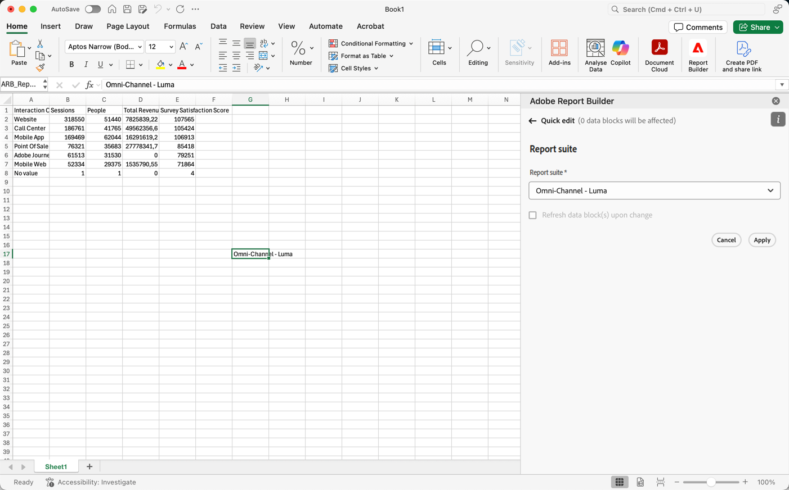

# Seleccionar un grupo de informes

Puede seleccionar un grupo de informes en el menú desplegable o seleccionar un grupo de informes de una celda y actualizar automáticamente el bloque de datos con un nuevo grupo de informes.

## Selección de un grupo de informes de una celda

Al seleccionar un grupo de informes de una celda, es más fácil actualizar los bloques de datos con distintos grupos de informes. En lugar de crear informes completamente nuevos con bloques de datos independientes, puede actualizar los bloques de datos con un grupo de informes seleccionado desde una celda.

Seleccionar un grupo de informes de una celda resulta útil cuando tiene:

* Varios grupos de informes que son similares o idénticos entre sí en estructura.
* Formatos de bloque de datos complicados que incluyen componentes y diseños personalizados.

Para seleccionar un grupo de informes de una celda, primero genere un bloque de datos y asigne varios grupos de informes a una celda fuera del bloque de datos. A continuación, utilice el panel **[!UICONTROL Grupo de informes de la celda]** para actualizar los bloques de datos de diferentes grupos de informes.

1. Cree un bloque de datos. Para obtener información sobre cómo crear un bloque de datos, consulte [Crear un bloque de datos](/help/analyze/report-builder/create-a-data-block.md).

1. Seleccione  en **[!UICONTROL grupos de informes]**.

1. Seleccione una celda con  fuera del bloque de datos.

1. Agregue uno o más grupos de informes de **[!UICONTROL Seleccione los grupos de informes que desee agregar al grupo de informes de la celda]** arrastrando y soltando. También puede seleccionar un grupo de informes para agregar el grupo de informes a la lista **[!UICONTROL Grupos de informes incluidos]**.

   * Puede usar  **[!UICONTROL _Seleccionar grupos de informes_]** para buscar grupos de informes.
   * Use  para abrir un menú contextual y así poder mover grupos de informes hacia arriba o hacia abajo en la lista **[!UICONTROL Grupos de informes incluidos]**.
   * Use  para eliminar un grupo de informes de la lista **[!UICONTROL Grupos de informes incluidos]**.

   {zoomable="yes"}

1. Seleccione **[!UICONTROL Aplicar]** para aplicar los grupos de informes seleccionados a la celda seleccionada.

## Cambiar el grupo de informes de una celda

1. Seleccione la ubicación de la celda del grupo de informes en la hoja.
1. En Report Builder Hub, seleccione el vínculo **[!UICONTROL Grupos de informes de la celda]** en **[!UICONTROL Edición rápida]**.
1. Seleccione un grupo de informes en el menú desplegable **[!UICONTROL Grupo de informes]**.

   {zoomable="yes"}
1. Opcional, seleccionar **[!UICONTROL Actualizar bloque(s) de datos al cambiar]**.

1. Seleccione **[!UICONTROL Aplicar]**. Report Builder actualiza el bloque de datos en función del grupo de informes seleccionado.
