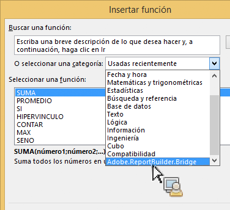
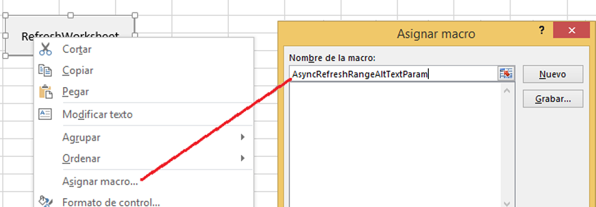
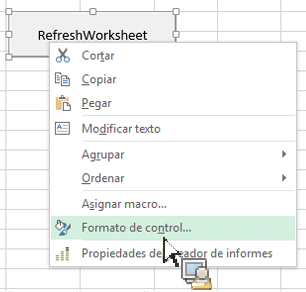
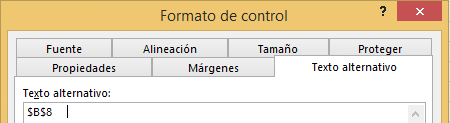

# Invocar la funcionalidad de Report Builder desde las funciones de Microsoft Excel

Esta capacidad integra aún más el uso de Report Builder dentro del flujo de trabajo natural de Excel, sin necesidad de acceder a la interfaz de usuario de Report Builder.

Por ejemplo, es posible que desee actualizar automáticamente las solicitudes de Report Builder cuyo filtro de entrada se basa en datos recuperados en Excel a partir de otras fuentes. Ahora puede hacerlo mediante la función de la cadena RefreshRequestsInCellsRange(..) . Todas las llamadas son asíncronas. Se devuelven inmediatamente y no esperan que se ejecute completamente una llamada.

>[!NOTE]
>
>Debe tener Report Builder 5.0 (o posterior) instalado para poder usar esta funcionalidad.

A continuación encontrará una tabla con la lista de funciones expuestas:

| Nombre de función | Descripción |
|---|---|
| string AsyncRefreshAll() | Actualiza todas las solicitudes de Report Builder presentes en un libro. |
| string AsyncRefreshRange(string rangeAddressInA1Format) | Actualiza todas las solicitudes de Report Builder presentes en la dirección especificada del intervalo de celdas (una expresión de cadena que representa un intervalo de celdas en formato A1, por ejemplo, &quot;Hoja1!A2:A10&quot;). |
| string AsyncRefreshRangeAltTextParam() | Actualiza todas las solicitudes de Report Builder presentes en el intervalo de celdas especificado que pasan por el Texto alternativo de MS Form Control. |
| string AsyncRefreshActiveWorksheet() | Actualiza todas las solicitudes de Report Builder presentes en el libro activo. |
| string AsyncRefreshWorksheet(string worksheetName) | Actualiza todas las solicitudes de Report Builder presentes en el libro especificado (el nombre del libro tal y como aparece en la ficha). |
| string AsyncRefreshWorksheetAltTextParam(); | Actualiza todas las solicitudes de Report Builder presentes en el libro concreto que se pasó por el Texto alternativo de MS Form Control. |
| string GetLastRunStatus() | Devuelve una cadena que describe el estado de la última ejecución. |

Para acceder a estas funciones dentro de Report Builder, vaya a [!UICONTROL Fórmulas] > [!UICONTROL Insertar función]. Al final de la lista de categorías, encontrará Adobe.ReportBuilder.Bridge:



## Usar estas funciones en una fórmula {#section_034311081C8D4D7AA9275C1435A087CD}

Por ejemplo, la fórmula

```
=IF(OR(ISTEXT(P5),ISBLANK(P5)),AsyncRefreshRange("P9"),"")
```

quiere decir que &quot;Si el valor de la celda P5 es un texto o está en blanco, actualizar el rango de la celda P9&quot;.

## Usar las funciones de Report Builder con control de formato {#section_26123090B5BD49748C8D8ED7A1C5ED84}

Ahora puede asignar una macro a un control creado y este control puede ser una función que actualice una solicitud de libro. Por ejemplo, la función AsyncRefreshActiveWorksheet actualizará todas las solicitudes de un libro. En ocasiones, sin embargo, es posible que solo quiera actualizar ciertas solicitudes en lugar de todas.

1. Establezca el parámetro de macro.
1. Haga clic con el botón derecho en el control y seleccione **[!UICONTROL Asignar macro]**.
1. Introduzca el nombre de función de Report Builder (sin parámetros ni paréntesis).



## Pasar parámetros a funciones de Report Builder a través del control de formato {#section_ECCA1F4990D244619DFD79138064CEF0}

Las dos funciones que toman un parámetro pueden utilizarse con formato de control, pero solo a través del campo de texto alternativo:

* AsyncRefreshRange(string rangeAddressInA1Format)
* AsyncRefreshWorksheet(string worksheetName)

1. Haga clic con el botón derecho del ratón en el control y seleccione **[!UICONTROL Formato de control]**.

   

1. Haga clic en la ficha [!UICONTROL Texto alternativo].

   

1. En [!UICONTROL Texto alternativo], introduzca el rango de celdas que desee actualizar.
1. Abra la lista de parámetros de Report Builder en [!UICONTROL Fórmulas] > [!UICONTROL Insertar función] > [!UICONTROL Adobe.ReportBuilder.Bridge].

1. Elija una de las dos opciones que acaban con AltTextParam y haga clic en **[!UICONTROL Aceptar]**.

