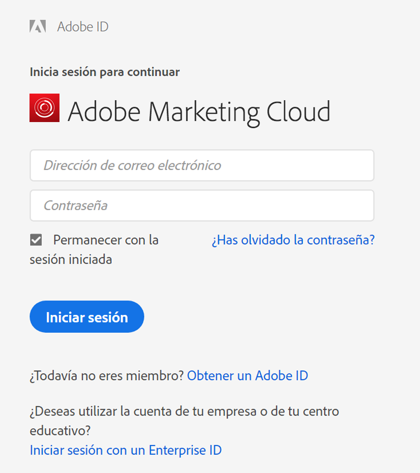

# Inicio de sesión en Report Builder

>[!IMPORTANT]
>
>La versión 5.6.47 y posteriores del Report Builder solo son compatibles con el inicio de sesión del Experience Cloud y no admiten inicios de sesión heredados, como el inicio de sesión único de Site Catalyst o el inicio de sesión estándar. Para el 30 de abril de 2021, todos los usuarios del Report Builder deben actualizar el complemento del Report Builder a la versión 5.6.47 o posterior, lo que incluye una actualización crítica del proceso de inicio de sesión.

Para iniciar sesión en el Report Builder, utilice su cuenta de inicio de sesión del Experience Cloud.

## Experience Cloud {#section_1FA230F35AB54021A874A7A28DE4C850}

El inicio de sesión de Experience Cloud permite utilizar su Enterprise ID (correo electrónico y contraseña) para iniciar sesión en Adobe Experience Cloud. Haga clic en **[!UICONTROL Iniciar sesión]** > **[!UICONTROL Iniciar sesión con un Enterprise ID]** para redirigirse a la página de inicio de sesión único de su empresa. Para obtener más información sobre Enterprise ID, haga clic [aquí](https://helpx.adobe.com/es/enterprise/kb/enterprise-id-faq.html#whatis).

>[!NOTE]
>
>El inicio de sesión de Experience Cloud se basa en una sesión y un token, que caduca a los 30 días.

## Iniciar sesión en Report Builder

Para iniciar sesión en el Report Builder

1. En Excel, haga clic en **[!UICONTROL Complementos]**.
1. Haga clic en **[!UICONTROL Iniciar sesión]**. Otras operaciones de inicio de sesión son las siguientes:

   * Haga clic en **[!UICONTROL Crear]**.
   * [Seleccione una solicitud en el Administrador](/help/analyze/report-builder/manage-requests/r-arb-manage-requests.md) de solicitudes y haga clic en  **** Addor  **[!UICONTROL Manage]**.
   * Haga doble clic en una solicitud en Excel.

1. Rellene los campos de la página [!UICONTROL Inicio de sesión] y, a continuación, haga clic en **[!UICONTROL Aceptar]**.

