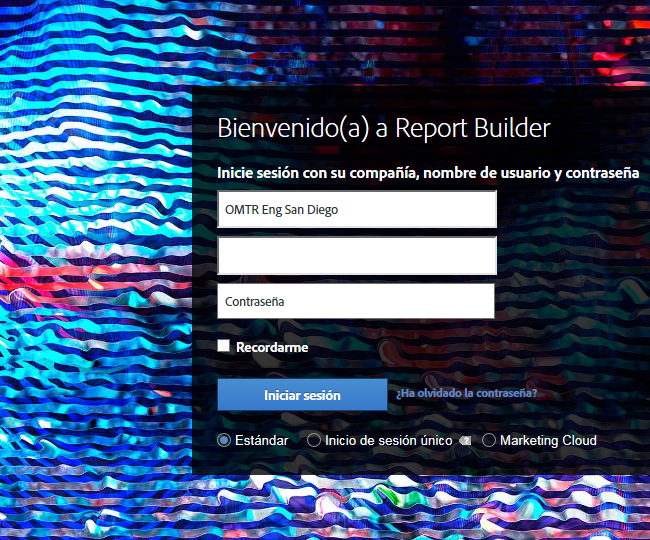

# Inicio de sesión en Report Builder

Información sobre las tres formas de iniciar sesión en Report Builder.

Actualmente están disponibles las siguientes opciones de inicio de sesión al hacer clic en **[!UICONTROL Iniciar sesión]** en Report Builder.

* [Estándar ](/help/analyze/report-builder/setup/login.md#section_6D54B8ADAE7F416BB83F5082B3771CFA)
* [Inicio de sesión único ](/help/analyze/report-builder/setup/login.md#section_6970A5F926774976B85FFE576610E85F)
* [Experience Cloud y el inicio de sesión único ](/help/analyze/report-builder/setup/login.md#section_1FA230F35AB54021A874A7A28DE4C850)

## Estándar {#section_6D54B8ADAE7F416BB83F5082B3771CFA}

Use este inicio de sesión si desea iniciar sesión en Report Builder con sus credenciales de Adobe Analytics.

**Inicio de sesión de Report Builder: definiciones de campo**

| Campo | Definición |
|--- |--- |
| Empresa | Credenciales de inicio de sesión de la empresa que utilice para Adobe Analytics. |
| Nombre de usuario | Nombre de usuario del inicio de sesión que use para Adobe Analytics. Las tareas programadas para un usuario se vinculan al nombre de usuario. Las tareas programadas se pueden ver desde cualquier equipo si se inicia sesión en Report Builder con las mismas credenciales de inicio de sesión. |
| Contraseña | Su contraseña de Analytics. |
| Recordarme | La información de inicio de sesión se cifra y se almacena en un archivo de perfiles de usuario en el equipo donde se encuentra instalado Report Builder. Debido a que la información de inicio de sesión se guarda, cualquier usuario que utilice el mismo equipo que el creador del informe que abre una hoja de cálculo que contiene un informe, podrá actualizar y editar los datos. Si comparte el equipo con otros usuarios y desea que los datos de la hoja de cálculo sean privados, no active esta opción.  Para desactivar el inicio de sesión automático, haga clic en **[!UICONTROL Iniciar sesión con credenciales diferentes]** en la barra de herramientas y desactive **[!UICONTROL Recordarme]**. |
| Usar un servidor proxy | Active esta opción si accede a Internet mediante un servidor proxy y se solicita que introduzca una contraseña y nombre de usuario de proxy. |

## Inicio de sesión único {#section_6970A5F926774976B85FFE576610E85F}

Con este inicio de sesión único (heredado), solo se inicia sesión en Adobe Analytics, no en todo Experience Cloud.

También puede escribir un dominio que el sistema reconozca para que se le redirija a la página de inicio de sesión de su empresa y pueda iniciar sesión en Adobe Analytics.

## Experience Cloud {#section_1FA230F35AB54021A874A7A28DE4C850}

El inicio de sesión de Experience Cloud permite utilizar su Enterprise ID (correo electrónico y contraseña) para iniciar sesión en Adobe Experience Cloud. Haga clic en **[!UICONTROL Iniciar sesión]** > **[!UICONTROL Iniciar sesión con un Enterprise ID]** para redirigirse a la página de inicio de sesión único de su empresa. Para obtener más información sobre Enterprise ID, haga clic [aquí](https://helpx.adobe.com/es/enterprise/kb/enterprise-id-faq.html#whatis).

>[!NOTE]
>
>El inicio de sesión de Experience Cloud se basa en una sesión y un token, que caduca a los 30 días.

