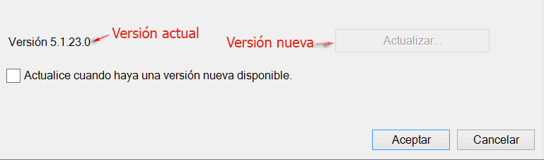
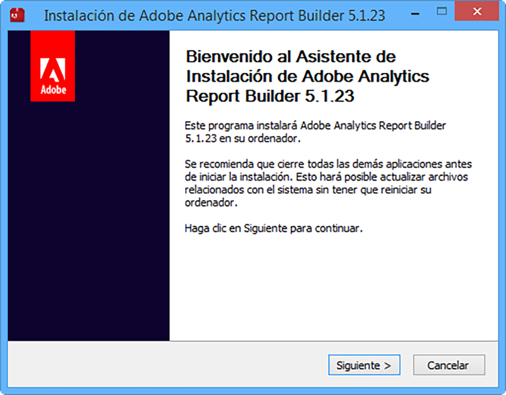

# Actualizar Report Builder

Pasos y consideraciones a tener en cuenta al actualizar Report Builder.

## Preguntas frecuentes sobre la actualización {#section_AFE40FF5544C418790A1C298C25CC18A}

**P: ¿Se mantiene la versión antigua de Report Builder al actualizar?**

R: No, la versión antigua se eliminará.

**P: ¿Perderé alguno de los informes existentes?**

R: No, todos los informes existentes seguirán funcionando.

**P: ¿Tendré que volver a autenticar en la nueva versión?**

R: No, su configuración completa, incluyendo la configuración de autenticación, continuará funcionando.

## Instrucciones de actualización {#section_73B8110A619549189A30079735E81867}

1. Inicie sesión en su versión actual de Report Builder.
1. Vaya al menú **[!UICONTROL Opciones]** para actualizar a la versión más reciente. El número de versión actual se muestra hacia el final del cuadro de diálogo Opciones.

   

1. Si existe una versión nueva, haga clic en **[!UICONTROL Actualizar...]**. El botón mostrará a qué versión está actualizando, por ejemplo: &quot;Actualizar a la versión 5.0.50&quot;.

   >[!NOTE]
   >
   >Si este botón aparece en gris, significa que no hay una versión nueva de Report Builder disponible.

1. Si lo desea, seleccione la casilla de verificación **[!UICONTROL Actualizar cuando una nueva versión esté disponible]**. Más adelante, esto iniciará el proceso de actualización de forma automática cuando haya una versión nueva disponible.
1. Cuando aparezca la pantalla de configuración, haga clic en **[!UICONTROL Siguiente >]**.

   

1. Una vez se haya completado la actualización, vuelva a iniciar sesión en Report Builder.

## Instrucciones de actualización manual {#section_27A0200010DC4747A718F1A65B180599}

Siempre puede obtener la versión más reciente de Report Builder desde Adobe Analytics.

1. Regístrese en Adobe Analytics y vaya a **[!UICONTROL Herramientas]**.
1. Haga clic en **[!UICONTROL Report Builder]**.
1. En la pantalla de **[!UICONTROL Información general]**, seleccione la versión de 32 o 64 bits.
1. Haga clic en **[!UICONTROL Descargar ahora]**.

