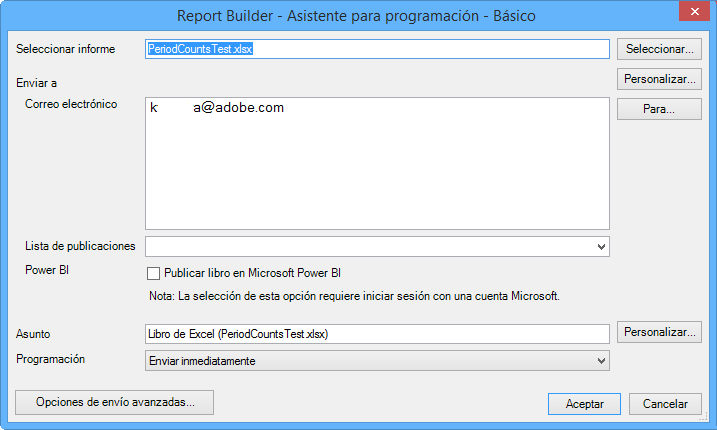

# Programar libros de trabajo

Puede programar libros de trabajo, especificar opciones de entrega avanzadas, definir destinatarios y ver el historial de programación. Las opciones de envío avanzadas permiten configurar los libros de trabajo que se desean enviar a una hora concreta o a intervalos. También se puede especificar el formato de archivo en el que se desea enviar el libro.

Por ejemplo, los libros de trabajo se pueden programar para enviarse inmediatamente o en una programación recurrente, así como especificar el formato de archivo en [!DNL Advanced Delivery Options]. No es posible cargar archivos de libros de trabajo que superen los 5 MB.

Además, después de crear una programación de libro de trabajo en Report Builder, puede visualizarse y editarse en **[!UICONTROL Analytics]** > **[!UICONTROL Informes]**. (Consulte [Programación y distribución de informes](/help/analyze/reports-analytics/scheduling.md) en la ayuda de Reports &amp; Analytics).

>[!NOTE]
>
>Para poder programar un libro de trabajo, debe disponer de Excel 2007 o tener el paquete de compatibilidad instalado. Puede tener un máximo de 10 libros programados por cada licencia de Report Builder. Sin embargo, puede aumentar este número si resta de otras licencias. Para hacerlo, vaya a **[!UICONTROL Administración]** > **[!UICONTROL Configuración de la empresa]** > **[!UICONTROL Informes de Report Builder]**. Un libro que se ha programado (o cargado a la Biblioteca de libros) y no se ha tocado (actualizado, reemplazado) en más de 28 meses se eliminará.

>[!NOTE]
>
>La “Hora de envío”/“Hora del día” introducida por el usuario especifica la hora en que el libro debe comenzar a procesarse, no la hora en que se enviará. El momento real en el que se enviará el libro se basa principalmente en el tiempo que tarda en procesarse (los libros de trabajo grandes y complejos tardan más en procesarse que los libros más simples). Por ejemplo, si un libro tarda 15 minutos en procesarse, la hora de entrega real será al menos 15 minutos después de la hora de entrega u hora del día especificadas originalmente.
>Además, hay otros factores que pueden aumentar aún más el retraso antes de que se envíe el libro de trabajo:
>
> * **La ejecución de muchas programaciones diferentes del mismo tipo al mismo tiempo** puede sobrecargar el sistema. El sistema de programación solo permite que se ejecuten simultáneamente algunos libros de trabajo (5-10) de cualquier tipo, por lo que cuando se programen más de 5-10 a la vez, algunos tendrán que esperar en la línea para que otros libros terminen antes de que puedan empezar a procesarse. Este problema se puede mitigar programando los libros de trabajo de una empresa en horas escalonadas durante el día o la hora, en lugar de hacerlo simultáneamente.
> * Además del tipo de libro específico, los libros también esperarán en línea si la empresa tiene **más de 15-20 libros de trabajo programados a la vez (en todos los tipos de libro)**. Esto se puede mitigar escalonando los tiempos de programación en lugar de tener varios ejecutándose al mismo tiempo.
> * **Los problemas en los servicios descendentes** en los que se basa el planificador también pueden afectar al envío de libros de trabajo. Por ejemplo: si utiliza las API de forma independiente para ejecutar libros de trabajo y rellenar la cola de solicitudes de API, los libros programados pueden entregarse más despacio mientras solicita ese recurso.
> * **La latencia del grupo de informes** (un retraso en la recopilación de datos) también puede retrasar algunos libros de trabajo programados.

## Programar un libro

1. Genere y guarde un libro de trabajo.
1. En la barra de herramientas de Report Builder, haga clic en **[!UICONTROL Programar]**.

   La ficha [!UICONTROL Informes programados] resume todas las tareas que se han creado, así como el número de tareas restantes.
1. En la ficha **[!UICONTROL Informes programados]**, haga clic en **[!UICONTROL Nuevo]**.
1. El Asistente de programación básico muestra:

   

1. En el [!UICONTROL Asistente de programación básico], configure las siguientes opciones:

| Campo | Descripción |
|--- |--- |
| Seleccionar informe | El nombre del libro de trabajo. Para los nuevos informes programados, este campo se completa con el nombre del libro activo. |
| Select | Muestra la página Seleccionar informe. Se puede seleccionar un informe del servidor (donde se almacenan todos los libros programados previamente) o del equipo local. Si se selecciona un libro de la unidad local en formato .xls, el sistema convierte el archivo a .xlsx. Como parte de la conversión, el archivo se abre en Excel y se activa. Si el libro seleccionado para el informe programado tiene el mismo nombre de archivo que el libro abierto actualmente en Excel, el sistema selecciona el archivo local en lugar del archivo cargado previamente. Si selecciona un informe desde el repositorio de programación, se creará una copia del libro en el servidor, con su nombre de archivo actualizado con 1. El informe programado recién creado utilizará el libro copiado. |
| Personalizar | Le permite personalizar el formato de fecha. |
| Hasta | Muestra la libreta de direcciones de Outlook, si corresponde. |
| Enviar a: Correo electrónico | Destinatario de correo electrónico del libro de trabajo. |
| Enviar a: Lista de publicación | Muestra las listas de distribución disponibles para esta empresa. |
| Power BI | Consulte [Publicar libro en Microsoft Power BI](/help/analyze/report-builder/c-publish-power-bi/integration-power-bi.md) para obtener más información. |
| Asunto | Descripción definida por el usuario. |
| Programación | Permite especificar el momento de envío del libro de trabajo. (Inmediatamente, por hora, diariamente, semanalmente, mensualmente, trimestralmente y anualmente). |

## Opciones de envío avanzadas

1. Haga clic en **[!UICONTROL Opciones de envío avanzadas]** para configurar las opciones de archivo y publicación:

| Campo | Descripción |
|--- |--- |
| Ficha **Programación** |  |
| Hora de envío | Permite programar el libro de trabajo inmediatamente o para un momento posterior. La hora del día se relaciona con la zona horaria especificada en el equipo. |
| Modelo de periodicidad | Envía el libro de trabajo en función de sus selecciones. |
| Intervalo de periodicidad | Permite especificar cuándo iniciar y detener la recepción del libro de trabajo.   Si se programa un libro de trabajo el primer día de cualquier período actual (semana, mes, trimestre o año), solo se devuelven datos del primer día. |
| Ficha **Opciones de archivo** |  |
| Formato del archivo | Permite seleccionar un formato de envío de Excel 2007 (.xlsx) o 2003 (.xls), .pdf, .csv, .mht, .txt y .xml. |
| Destino del archivo | Especifica un correo electrónico o FTP. Las opciones de la página dependen de lo que seleccione. Para los datos de FTP, debe comprobar que el host se encuentra disponible de forma externa. |
| Lista de publicaciones | Si el libro de trabajo programado se envía a varias listas de publicación, el libro se ejecuta una vez para cada lista. Los grupos de informes variables se reemplazan por el grupo de informes asignado a la lista de publicación. |
| Idioma del contenido del archivo | Especifica el idioma que desea utilizar para la carta de presentación. Puede seleccionar chino (simplificado o tradicional), alemán, francés, japonés, coreano, portugués de Brasil o español. |
| Ficha **Opciones de publicación** |  |
| Publicación en Power BI | <ul><li>Publicar libro de trabajo en Power BI</li><li>Publicar todas las solicitudes de Report Builder como conjuntos de datos de Power BI</li><li>Publicar todas las tablas con formato como conjuntos de datos de Power BI</li></ul> |
| Etiquetar este informe de Power BI como | Detalles de etiquetado |

1. Haga clic en **[!UICONTROL Aceptar]** y, a continuación, en **[!UICONTROL Salir]**.

   Report Builder muestra el libro de trabajo programado en el [Administrador de tareas programadas](/help/analyze/report-builder/r-arb-scheduled-reports.md).

