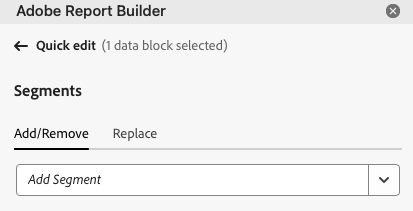

# Trabajar con segmentos

Puede aplicar segmentos cuando cree un nuevo bloque de datos o cuando seleccione **[!UICONTROL Editar bloque de datos]** en el panel **[!UICONTROL Comandos]**.

## Aplicación de segmentos a un bloque de datos

Para aplicar un segmento a todo el bloque de datos, seleccione un segmento o arrastre y suelte segmentos de la lista de componentes en la sección de segmentos de la Tabla.

## Aplicación de filtros a métricas individuales

Para aplicar filtros mediante segmentos a métricas individuales:

* Arrastre y suelte uno o más segmentos de **[!UICONTROL Segmentos]** en una métrica de la tabla.

* Alternativamente:

   1. Seleccione  para una métrica específica en el panel **[!UICONTROL Tabla]** y, a continuación, seleccione **[!UICONTROL Métrica de filtro]**.

      La pestaña {zoomable="yes"}

   1. Seleccione uno o más segmentos del menú desplegable **[!UICONTROL Segmentos]**. Los segmentos se agregan a la lista **[!UICONTROL Segmentos aplicados]**.

      
   1. Seleccione  para quitar un segmento de la lista **[!UICONTROL Segmento aplicado]**. O bien, seleccione **[!UICONTROL Borrar todo]** para eliminar todos los segmentos de la lista **[!UICONTROL Segmento aplicado]**.
   1. Seleccione **[!UICONTROL Aplicar]**.

Para ver los filtros aplicados, pase el puntero por encima de una métrica o selecciónela en el panel Tabla. Las métricas con segmentos aplicados muestran un icono de segmento.

## Edición rápida de segmentos

Puede usar el panel **[!UICONTROL Edición rápida]** para agregar, quitar o reemplazar segmentos para bloques de datos existentes.

Cuando selecciona un rango de celdas en la hoja de cálculo, el vínculo **[!UICONTROL Segmentos]** del panel **[!UICONTROL Edición rápida]** muestra una lista resumida de los segmentos utilizados por los bloques de datos de esa selección.

Para editar segmentos con el panel **[!UICONTROL Edición rápida]**:

1. Seleccione un rango de celdas de uno o varios bloques de datos.

1. Seleccione el vínculo **[!UICONTROL Segmentos]** para iniciar el panel **[!UICONTROL Edición rápida]** **[!UICONTROL Segmentos]**.

### Añadir o quitar segmentos

Puede añadir o quitar segmentos mediante las opciones Añadir/Quitar.

1. Seleccione la ficha **[!UICONTROL Agregar/Quitar]** en el panel **[!UICONTROL Edición rápida]** **[!UICONTROL Segmentos]**.

   1. Seleccione uno o más segmentos del menú desplegable **[!UICONTROL Segmentos]**. Los segmentos se agregan a la lista **[!UICONTROL Segmentos aplicados]**.
   1. Seleccione  para quitar un segmento de la lista **[!UICONTROL Segmento aplicado]**.
   1. Seleccione **[!UICONTROL Aplicar]**.

Report Builder muestra un mensaje para confirmar los cambios del segmento aplicado.

### Reemplazar segmentos

Puede reemplazar un segmento existente por otro para cambiar la forma en que se segmentan los datos.

1. Seleccione la ficha **[!UICONTROL Reemplazar]** en el panel **[!UICONTROL Edición rápida]** **[!UICONTROL Segmentos]**.

1. Utilice el campo de búsqueda **Lista de búsqueda** para localizar segmentos específicos.

1. Seleccione uno o varios segmentos que desee reemplazar.

1. Busque uno o más segmentos en el menú desplegable Reemplazar con para agregar el segmento a la lista **[!UICONTROL Reemplazar con]**.

1. Seleccione **[!UICONTROL Aplicar]**.

Report Builder actualiza la lista de segmentos para reflejar el reemplazo.

## Definir segmentos de bloque de datos de la celda

Los bloques de datos pueden hacer referencia a segmentos desde una celda. Varios bloques de datos pueden hacer referencia a la misma celda para segmentos, lo que le permite cambiar fácilmente entre varios bloques de datos a la vez.

Para aplicar segmentos desde una celda:

1. [Cree un nuevo bloque de datos](create-a-data-block.md#create-a-data-block) o edite un bloque de datos existente.
1. Seleccione la ficha **[!UICONTROL Segmentos]** para definir segmentos.
1. Seleccione .

   {zoomable="yes"}

1. Seleccione la celda desde la que desea que los bloques de datos hagan referencia a un segmento.

1. Haga doble clic para añadir un segmento a la celda. También puede arrastrar y soltar uno o más segmentos en la sección **[!UICONTROL Segmentos incluidos]**.

1. Seleccione **[!UICONTROL Aplicar]** para crear la celda de referencia.

1. En la pestaña **Segmentos**, agregue el segmento de celda de referencia recién creado al bloque de datos.

   {zoomable="yes"}

1. Seleccione **[!UICONTROL Finalizar]**.

Para aplicar la celda de referencia como un segmento a otros bloques de datos, use la referencia de celda como uno de los segmentos de la lista **[!UICONTROL Segmentos]** en la ficha **[!UICONTROL Tabla]**.

### Uso de una celda de referencia para cambiar los segmentos del bloque de datos

1. Seleccione la celda de referencia en la hoja de cálculo.

1. Seleccione el vínculo en **[!UICONTROL Segmentos de la celda]** en el menú **[!UICONTROL Edición rápida]**.

   {zoomable="yes"}

1. Seleccione el segmento en el menú desplegable.

1. Seleccione **[!UICONTROL Aplicar]**.

<!--
You can apply segments when you create a new data block or when you select the **Edit data block** option from the COMMANDS panel.

## Apply segments to a data block

To apply a segment to the entire data block, double-click a segment or drag and drop filters from the components list into the Segments section of the Table.

## Apply segments to individual metrics

To apply segments to individual metrics, drag and drop a segment onto a metric in the table. You can also click the **...** icon to the right of a metric in the Table pane and then select **[!UICONTROL Segment metric]**. To view applied segments, hover over or select a metric in the Table pane. Metrics with applied segments display a filter icon.

## Quick edit segments

You can use the Quick edit panel to add, remove, or replace segments for existing data blocks.

When you select a range of cells in the spreadsheet, the **[!UICONTROL Segments]** link in the Quick edit panel displays a summary list of the segments used by the data blocks in that selection.

To edit segments using the Quick edit panel

1. Select a range of cells from one or multiple data blocks.

    

1. Click the link underneath **[!UICONTROL Segments]** to launch the Quick edit - Filters panel.

    

### Add or remove a segment

You can add or remove segments using the Add/Remove options.

1. Select the **[!UICONTROL Add/Remove]** tab in the Quick edit-segments panel.

    All segments applied to the selected data blocks are listed in the Quick Edit-segments panel. Segments applied to all data blocks in the selection are listed under the **[!UICONTROL Applied to all selected data blocks]** heading. Segments applied to some but not all data blocks are listed under the **[!UICONTROL Applied to 1 or more selected data blocks]** heading.

    When multiple segments are present in the selected data blocks, you can search for specific segments using the **[!UICONTROL Add Filter]** search field.

    

1. Add segments by selecting segments from the **[!UICONTROL Add segment]** drop down menu.

    The list of searchable segments includes all segments accessible to the report suites that are present in one or more of the selected data blocks as well as all the segments that are available globally in the organization.

    Adding a segment applies the segment to all data blocks in the selection.

1. To remove segments, click the delete icon **x** to the right of segments in the **[!UICONTROL Segments applied]** list.

1. Click **[!UICONTROL Apply]** to save changes and return to the hub panel.

    Report Builder displays a message to confirm the applied segment changes.

### Replace a segment

You can replace an existing segment with another segment to change how the data is segmented.

1. Select the **[!UICONTROL Replace]** tab in the Quick edit-segment panel.

    

1. Use the **[!UICONTROL Search list]** search field to locate specific segments.

1. Choose one or more segments that you want to replace.

1. Search for one or more segments in the Replace with field.

    Selecting a filter adds it to the **[!UICONTROL Replace with]**... list.

1. Click **[!UICONTROL Apply]**.

    Report Builder updates the list of segments to reflect the replacement.

### Define data block segments from cell

Data blocks can reference segments from a cell. Multiple data blocks can reference the same cell for segments, allowing you to easily switch segments for multiple data blocks at a time.

To apply segments from a cell

1. Navigate to Step 2 in either the data block creation or editing process. See [Create a Data Block](./create-a-data-block.md).
1. Click the **[!UICONTROL Segments]** tab to define filters.
1. Click **[!UICONTROL Create segment from cell]**.

    

1. Select the cell from which you want the data blocks to reference a segment.
   
1. Add the segment choice you wish to add to the cell by either double clicking the segment, or by dragging and dropping it into the **[!UICONTROL Segments Included]** section. 
   
   Note: Only one choice may be selected for the given cell at one time.

    

1. Click **[!UICONTROL Apply]** to create the reference cell.

1. From the **[!UICONTROL Segments]** tab, add the newly created reference cell segments to your data block.

    

1. Click **[!UICONTROL Finish]**.

    Now this cell can be referenced by other data blocks in their segments. To apply the reference cell as a segment to other data blocks, simply add the cell reference to their segments from the Segments tab. 

#### Use the reference cell to change data block segments

1. Select the reference cell in your spreadsheet.

1. Click the link under **[!UICONTROL Segments from Cell]** in the Quick Edit menu.

    

1. Select your segment from the drop-down menu.

    

1. Click **[!UICONTROL Apply]**.
-->