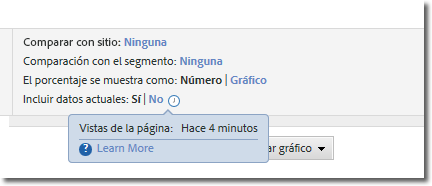

# Datos actuales

La opción Incluir datos actuales de Reports &amp; Analytics le permite ver los datos de Analytics más recientes, con frecuencia antes incluso de que dichos datos se hayan completado y procesado totalmente. Datos actuales muestra la mayoría de las métricas en cuestión de minutos y proporciona datos procesables que facilitan una toma de decisiones rápida.

Aparece como una opción en la configuración de un informe:

Datos actuales está habilitado de forma predeterminada en todos los informes compatibles. Si prefiere ver todas las métricas una vez que los datos se hayan procesado por completo, existen varias opciones:

* Utilice Analysis Workspace, que usa datos completamente procesados.
* Haga clic en “No” en la configuración del informe de datos actual para utilizar solamente los datos completamente procesados.
* Elimine el elemento de permiso “Datos actuales” de un perfil de producto en Admin Console para evitar que los usuarios que no son administradores vean esta opción. Consulte los [elementos de permiso de herramientas de Analytics](/help/admin/admin-console/permissions/analytics-tools.md) en la guía del usuario de administración para obtener más información.

Los datos actuales no se pueden utilizar actualmente con segmentos, clasificaciones, desgloses, rutas y algunas métricas. debido a la disponibilidad de los datos con prioridad, Si se utiliza una de estas características, los datos actuales aparecen como “No” en el informe y se muestra un aviso amarillo que explica por qué no se encuentran disponibles los datos actuales.

## Latencia de datos actuales típica

Las métricas aparecen en uno de los tres lapsos de tiempo siguientes. Al hacer clic en el icono de reloj que aparece junto al botón de alternancia Incluir datos actuales, se muestra el valor de latencia real de las distintas métricas del informe.

| Lapso de tiempo | Métricas |
| --- | --- |
| Menos de 10 minutos | Instancias y vistas de página en variables de tráfico |
| Entre 10 y 35 minutos | Eventos de conversión, instancias y vistas de página en variables de conversión |
| Entre 45 y 120 minutos | El resto de los datos, como visitas, visitantes únicos y participación |

Algunos de los datos que se muestran en la vista de datos actuales no se han procesado por completo, por lo que se podrá apreciar una diferencia entre los valores que aparecen en esta vista y los de la vista finalizada. En los informes de tendencias, la diferencia de los datos suele alcanzar un 1%.

## Métricas calculadas

Las métricas calculadas pueden crearse con métricas de latencia variada, por lo que es posible que algunos valores recientes se calculen en la vista de datos actuales con datos incompletos.

Por ejemplo, se crea la métrica calculada “Vistas de página por visita” mediante la fórmula `Page Views divided by Visits`. Ya que las vistas de página suelen aparecer aproximadamente en 10 minutos y, por lo general, las visitas tardan 2 horas, las métricas calculadas en esta ventana de latencia se calcularán con métricas incompletas. Si se publica una nueva página a la que se han realizado 4000 visitas en 4000 ocasiones diferentes en un lapso de tiempo de 2 horas, la diferencia de latencia entre estas métricas puede generar cálculos incompletos.

Esta diferencia de datos puede apreciarse mejor cuando se generan informes con valores nuevos o que usan lapsos de tiempo breves. Cuando un informe utiliza intervalos de fecha prolongados, lo más probable es que las diferencias de latencia que se producen respecto a las últimas horas del informe no afecten de forma significativa a las métricas calculadas.

Si se han calculado métricas que podrían verse afectadas por estas diferencias, desactive los datos actuales o utilice métricas con la misma ventana de latencia esperada.

## Informes descargados

Al descargar un informe con la vista de datos actuales habilitada, el informe se coloca en cola, se genera y a continuación se devuelve al explorador. Si los datos se recopilan mientras se genera el informe, esos datos se muestran en el informe. Este intervalo de tiempo puede hacer que el informe descargado contenga más datos.
