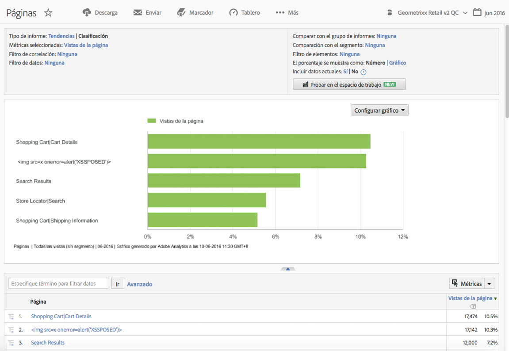

# Introducción a Reports &amp; Analytics

Antes de usar Reports &amp; Analytics, es necesario que comprenda estas tareas básicas de inicio de sesión y configuración, y que sepa cómo acceder a la información de la cuenta.

Los informes ofrecen perspectivas de sus canales tradicionales basados en web y de los canales emergentes como móvil, vídeo y redes sociales. A continuación, mostramos algunos ejemplos de informes de marketing:

* La cantidad de personas que visitan el sitio
* La cantidad de esos visitantes que son únicos (se cuentan solo una vez)
* La forma en la que llegaron al sitio (si siguieron un vínculo o llegaron directamente)
* Las palabras clave utilizadas por los visitantes para buscar el contenido del sitio
* El tiempo que los visitantes permanecieron en una página determinada o en todo el sitio
* Los vínculos en los que hicieron clic los visitantes y en qué momento salieron del sitio
* Los canales de marketing que son más eficaces para generar ingresos o eventos de conversión
* Cuánto tiempo emplearon en ver un vídeo
* Qué exploradores y dispositivos utilizaron para visitar el sitio

## Requisitos del sistema y del explorador

Requisitos del sistema y del explorador para iniciar sesión en la interfaz de Reports &amp; Analytics.

* Exploradores:

   * Preferidos: versiones más recientes de Firefox, Chrome, Safari o Edge.
   * Versión más reciente de Microsoft Internet Explorer 11

      >[!NOTE]
      >
      >El 13 de noviembre de 2018, Adobe dejó de admitir Internet Explorer 11 en Adobe Analytics. Cambie a Microsoft Edge o a otro navegador compatible en cuanto pueda.

* JavaScript y las cookies deben estar activados.
* Resolución de pantalla de 1024 x 768 con una profundidad de color de 16 bits (o superior).

## Inicie de sesión en Reports and Analytics

Antes de acceder a la interfaz, colabore con su administrador de cuentas o con el servicio de atención al cliente de Adobe para configurar la cuenta de su empresa.

## Inicie sesión utilizando Experience Cloud

Instrucciones sobre cómo iniciar sesión utilizando Adobe Experience Cloud.

1. En un equipo con acceso a Internet, abra un explorador.
1. Vaya a [!DNL https://login.experiencecloud.adobe.com/].
1. En la página [!UICONTROL Inicio de sesión], haga clic en **[!UICONTROL Inicio de sesión único]**.
1. Rellene la información siguiente y, a continuación, haga clic en **[!UICONTROL Inicio de sesión]**.

   **[!UICONTROL Empresa]**: especifique el ID de la empresa.

   **[!UICONTROL Nombre de usuario]**: especifique su ID de cuenta.

   **[!UICONTROL Contraseña]**: especifique la contraseña de su cuenta.
1. En la página de inicio de Experience Cloud, vaya a **Analytics > Informes**.

   Experience Cloud cierra sesión automáticamente tras 30 minutos de inactividad.

## Ejecutar un informe

Instrucciones sobre cómo generar un informe.

1. Inicie sesión en [!UICONTROL Reports &amp; Analytics].

   Se muestra el menú Informes o un [panel](/help/analyze/reports-analytics/dashboard.md), en caso de que haya configurado uno.

1. Haga clic en **[!UICONTROL Contenido del sitio]** > **[!UICONTROL Páginas]** (por ejemplo).

   

   Consulte [Características de los informes](/help/analyze/reports-analytics/overview/report-overview.md) para obtener información sobre las características de la interfaz de un informe.

## Editar la configuración de la cuenta de un usuario

Información sobre la edición de cuentas de usuario, el restablecimiento de contraseñas de usuario y la edición de información de contacto.

Puede ver y editar información de contacto, especificar una contraseña, visualizar información de los servicios web y excluir este equipo de la recopilación de datos.

Haga clic en el icono Cuenta  en la parte superior derecha y luego haga clic en el icono **[!UICONTROL Configuración de la cuenta]** (rueda) junto al nombre de inicio de sesión.

Todos los usuarios tienen acceso a la página [!UICONTROL Información de la cuenta]. La información siguiente está disponible para consultarse o editarse:

<table id="table_58F5D292485F45F9902B372E4E1E3103"> 
 <thead> 
  <tr> 
   <th colname="col1" class="entry"> Tipo de información </th> 
   <th colname="col2" class="entry"> Definición </th> 
  </tr> 
 </thead>
 <tbody> 
  <tr> 
   <td> 
Contacto 
 </td> 
   <td> 
Especifique la siguiente información personal de su cuenta: 
 
    <ul id="ul_7925E35904EB47E3AC648FA80A09EF91"> 
     <li id="li_CDD8D7B73A1D4C78A41FF02BD0E5E788">Nombre (obligatorio) </li> 
     <li id="li_7255F50ABFFA4EE8A0A9D04F92BE432D">Apellidos (obligatorio) </li> 
     <li id="li_3DF6107291CC4D46AAA0E4A13D59128F">Título </li> 
     <li id="li_B5BE95E0FE594939A2D4C6680A6B8BDD">Dirección de correo electrónico (obligatoria) </li> 
     <li id="li_B764239241CE4F1CA74F77D796E7AB1D">N.º de teléfono </li> 
    </ul> </td> 
  </tr> 
  <tr> 
   <td> 
 Inicio de sesión 
 </td> 
   <td> 
Muestra el nombre de usuario de la cuenta y le permite cambiar la contraseña de la cuenta. 
 
Vea también: <a href="https://helpx.adobe.com/es/analytics/kb/How-to-Reset-Report-and-analytics-password.html"  >Cómo restablecer la contraseña de la cuenta de Reports &amp; Analytics</a>. 
 </td> 
  </tr> 
  <tr> 
   <td> 
Servicio web 
 </td> 
   <td> 
Muestra el nombre de usuario de los servicios web y el secreto compartido asociado a esta cuenta. Utilice estas credenciales cuando acceda a Experience Cloud a través de las API de servicios web. Si desea más información, consulte <a href="https://marketing.adobe.com/developer"  >Developer Connection</a>. 
 
 
Nota: Esta información se muestra únicamente si la cuenta está autorizada como usuario de servicios Web. 
 
 </td> 
  </tr> 
  <tr> 
   <td> 
 Excluir este equipo 
 </td> 
   <td> 
Aplica una cookie al equipo actual para excluirlo de la recopilación de datos. Resulta útil si no desea que sus actividades en línea afecten a los recuentos de Vista de páginas y Visitantes de su dominio. 
 
 
Nota: Para usar esta función, su navegador debe tener habilitadas las cookies. Si elimina las cookies de su equipo, debe restablecer la cookie de exclusión. 
 
 </td> 
  </tr> 
 </tbody> 
</table>

## Cambiar el idioma de la interfaz

Instrucciones sobre cómo cambiar el idioma de la interfaz. Puede ver la interfaz de Reports and Analytics en el idioma que prefiera.

1. Inicie sesión en Analytics y seleccione la pestaña **[!UICONTROL Informes]**.
1. En el pie de página, haga clic en el idioma activo en el menú **[!UICONTROL Idioma]** y, a continuación, seleccione el idioma que prefiera.

Puede acceder a la documentación y a la página principal desde Adobe Experience Cloud. (**[!UICONTROL Ayuda]** > **[!UICONTROL Página inicial de Ayuda]**.)
