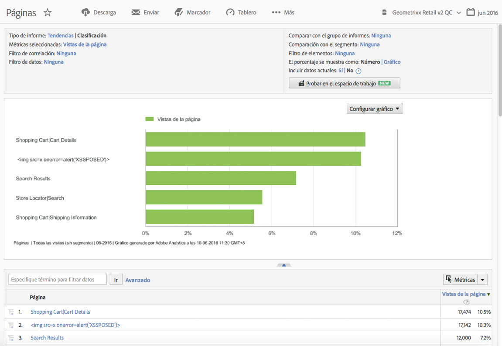
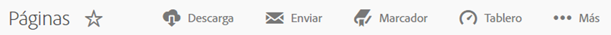
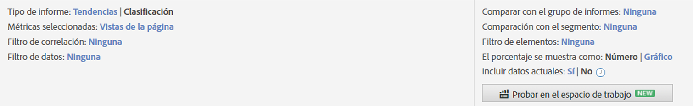
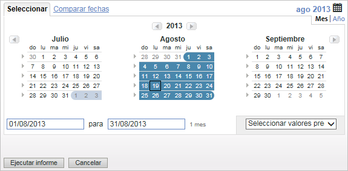
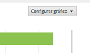
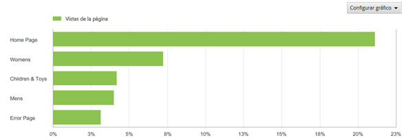
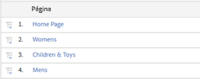

# Características de los informes

Introducción a las características de un informe; incluye la barra de herramientas, el calendario y la tabla de detalles.

Este ejemplo muestra un [!UICONTROL Informe de páginas]. Las opciones de configuración pueden variar, dependiendo del informe que ejecute. Por ejemplo, en vez de seleccionar Tendencias o Clasificación en un informe [!UICONTROL Contenido del sitio], puede especificar la granularidad y el nombre de página de un informe [!UICONTROL Métricas de sitio].

## Ejemplo de informe de páginas {#section_288CC85536684C2DB184141358481EF0}

Un ejemplo de informe de páginas (**[!UICONTROL Informes]** > **[!UICONTROL Contenido del sitio]** > **[!UICONTROL Informes de páginas]** > **[!UICONTROL Páginas]**).

{width=&quot;672px&quot;}

## Barra de herramientas de informes {#section_0D674177AE6C4A71B07234DB25910ECD}

Comparta los datos del informe con quienes toman decisiones y pueden cambiar las estrategias de marketing o del sitio basándose en los datos.

{width=&quot;672px&quot;}

Consulte también [Personalización de un informe](/help/analyze/reports-analytics/reports-customize/customizing-reports-overview.md).

## Encabezado y configuración de informes {#section_12A90FAE02EC43FB9F11F0E2CE8FAE8F}

Muestra la configuración del informe y permite configurar el tipo de informe, seleccionar las métricas, etc. Las opciones disponibles en este grupo varían dependiendo del informe que ejecute.

{width=&quot;672px&quot;}

Consulte [Personalización de un informe](/help/analyze/reports-analytics/reports-customize/customizing-reports-overview.md) para obtener más información.

## Calendario {#section_8C6C4AD84D9043E8ABD53FF8F645AAB1}

Especifique la fecha haciendo clic en el botón de calendario y seleccionando un intervalo de fecha. También puede seleccionar dos intervalos de fechas para comparar el rendimiento.

{width=&quot;672px&quot;}

Consulte [Selección de una fecha o un intervalo de fechas](/help/analyze/reports-analytics/reports-customize/customizing-reports-overview.md) y [Comparación de fechas](/help/analyze/reports-analytics/reports-customize/customizing-reports-overview.md).

## Tipo de gráfico {#section_8B9CBA4096E64FC3B744E2E06EB83C19}

Seleccione el tipo de gráfico que desee ver:

Consulte [Cambio de los gráficos de informes](/help/analyze/reports-analytics/reports-customize/t-reports-graphs.md).

## Visualización de gráficos {#section_4C78ADC82C234CC6841AC92C803636F4}

Según el tipo de gráfico que haya seleccionado, generalmente, verá los artículos principales de la lista de detalles. Si el gráfico es un gráfico de tendencias que muestra diferentes periodos de tiempo, se muestran todos los periodos de tiempo.:

Consulte [Personalización de informes](/help/analyze/reports-analytics/reports-customize/customizing-reports-overview.md).

## Métricas {#section_8B8F9EC72B864E29B91039E7B7381EAD}

Añada métricas al informe. Los administradores pueden especificar métricas predeterminadas.

Consulte [Métricas](/help/analyze/reports-analytics/metrics.md).

## Tabla de detalles {#section_449A5DC848744F65A10DA12E189B835D}

Los detalles constituyen la mayor parte de los datos del informe. En este caso, se indican varias páginas y esas páginas se miden con Vistas de página, que indica la cantidad de veces que se cargaron las páginas durante el periodo de tiempo:

En la tabla de detalles, puede filtrar datos, crear desgloses, añadir métricas, etc.

Consulte [Personalización de informes](/help/analyze/reports-analytics/reports-customize/customizing-reports-overview.md).
