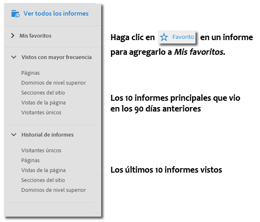
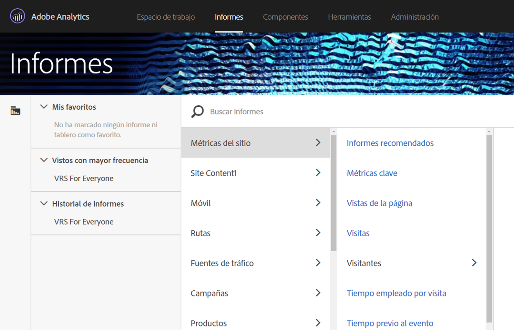
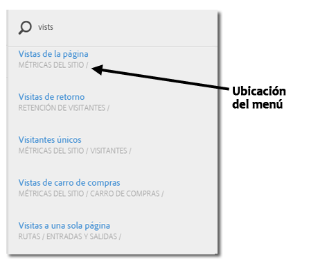

# Menú Informes {#reports-menu}

Una descripción general del menú Informes en Reports &amp; Analytics.

El menú Informes proporciona:

* Acceso al grupo completo de informes
* Posibilidad de establecer informes favoritos para acceso rápido
* Informes vistos con mayor frecuencia
* Búsqueda mejorada

Mis favoritos, Vistos con mayor frecuencia e Historial de informes son todos específicos del grupo de informes. Si cambia de grupo de informes, cambiarán las tres listas.

Se puede navegar por los informes con una vista de columna jerárquica. Haga clic en **[!UICONTROL Ver todos los informes]** o presione la tecla de barra diagonal (/) y, a continuación, presione la tecla de flecha abajo (↓) para visualizar rápidamente y navegar por el menú con las teclas de flecha. Presione la tecla Escape para cerrar el menú sin cambiar el informe actual; o bien, presione Intro para cargar el informe seleccionado.

{width=&quot;672px&quot;}

Para conocer los detalles sobre los informes individuales, consulte [Descripciones de informes](https://docs.adobe.com/content/help/es-ES/analytics/components/dimensions/overview.html).

## Búsqueda de informes {#section_E5EF11E36CB9451AA7B079E585CA7DB6}

El menú Informes proporciona una experiencia de búsqueda mejorada. Haga clic en **[!UICONTROL Ver todos los informes]** o presione la tecla de barra diagonal (/) y, a continuación, comience a escribir para encontrar rápidamente un informe. La búsqueda de informes se ha ampliado para incluir todos los elementos de navegación de la parte izquierda de Analytics (administrador, componentes, etc.).

Presione la tecla de tabulador o la tecla de flecha abajo (↓) para navegar por la lista de informes. Presione la tecla Escape para cerrar la búsqueda sin cambiar el informe actual; o bien, presione Intro para cargar el informe seleccionado.

>[!NOTE]
>
>También puede buscar en la lista de informes por propiedad, eVar y número de evento. En la barra de búsqueda, introduzca la propiedad, eVar o número de evento.

## Descripción general de navegación {#section_A6A0A369207149BABE504753B48A42D7}

<table id="table_3BA295966BBC4C94ABDC3718D1894698"> 
 <thead> 
  <tr> 
   <th colname="col1" class="entry"> Elemento del menú </th> 
   <th colname="col2" class="entry"> Descripción </th> 
  </tr>
 </thead>
 <tbody> 
  <tr> 
   <td colname="col1">Menú Soluciones de Experience Cloud  </td> 
   <td colname="col2"> Al hacer clic en este icono se expande el menú de Experience Cloud para que pueda acceder a otras soluciones de Marketing Cloud. </td> 
  </tr> 
  <tr> 
   <td colname="col1">Alternar menú de informes  </td> 
   <td colname="col2"> Al hacer clic en este botón, se expande o contrae el menú Informes, de modo que puede ver un informe con la anchura completa de la ventana del explorador. </td> 
  </tr> 
  <tr> 
   <td colname="col1">Segmentos  </td> 
   <td colname="col2">Muestra el carril de segmento que le permite agregar o administrar segmentos. También puede acceder a las interfaces de <a href="/help/components/segmentation/segmentation-workflow/seg-build.md"  >Generador de segmentos</a> y <a href="https://docs.adobe.com/content/help/es-ES/analytics/components/segmentation/segmentation-workflow/seg-manage.html"  >Administrador de segmentos</a> desde el carril del segmento. </td> 
  </tr> 
  <tr> 
   <td colname="col1">Métricas  </td> 
   <td colname="col2"> Muestra el carril de métricas que le permite agregar o administrar métricas y métricas calculadas. </td> 
  </tr> 
  <tr> 
   <td colname="col1"> Ver todos los informes </td> 
   <td colname="col2">Todos los informes, tableros, marcadores, todas las métricas calculadas y todos los objetivos que son específicos del grupo de informes están en las secciones Ver todos los informes. Haga clic aquí en cualquier momento para navegar por todas las opciones que estén disponibles para usted. </td> 
  </tr> 
  <tr> 
   <td colname="col1">Barra de búsqueda dentro de Ver todos los informes </td> 
   <td colname="col2"> 
 Le permite buscar el recurso que necesita. Usa la denominada búsqueda "difusa" de modo que usted no necesitará especificar las palabras exactas que está buscando. Los resultados de búsqueda se muestran en una lista derecha por la que puede navegar con las flechas arriba, abajo y al costado. Al presionar Intro en un resultado de búsqueda, puede ir directamente a ese informe. 
 </td> 
  </tr> 
  <tr> 
   <td colname="col1">Mis favoritos </td> 
   <td colname="col2">Puede recuperar fácilmente los informes marcados como Se marcó como "Favorito" dentro de esta área. Ya sea por usuario o por grupo de informes, muestra diez Favoritos y un vínculo Más... si tiene más de diez favoritos. 
Observe que puede cambiar el nombre de los informes pero no los tableros en Mis favoritos. 
 
Los favoritos son similares a los marcadores, pero no están almacenados en una carpeta ni se administran mediante el <a href="/help/analyze/reports-analytics/bookmarks.md"  > Administrador de marcadores</a> tal como son los marcadores. 
 </td> 
  </tr> 
  <tr> 
   <td colname="col1"> Vistos con mayor frecuencia </td> 
   <td colname="col2"> Adobe Analytics lleva un registro de los diez informes ejecutados con más frecuencia durante los últimos 90 días y los muestra aquí, ordenados por la frecuencia con que se ejecutaron. Si no estuvo en este grupo de informes por más de 90 días, se completa la lista con una lista general de diez informes populares. </td> 
  </tr> 
  <tr> 
   <td colname="col1"> Historial de informes </td> 
   <td colname="col2"> Aquí podrá encontrar los diez informes o tableros más recientes a los que accedió en los últimos 90 días. Puede regresar fácilmente a un paso anterior en su análisis o informes. </td> 
  </tr> 
  <tr> 
   <td colname="col1"> Descargar </td> 
   <td colname="col2">Permite descargar el informe con formato PDF, CSV, de Excel y Word. </td> 
  </tr> 
  <tr> 
   <td colname="col1"> Enviar </td> 
   <td colname="col2">Permite enviar por correo electrónico el informe inmediatamente o programar el correo electrónico de forma recurrente o de una sola vez. Las opciones de formato incluyen PDF, CSV, Excel, HTML, Word o Mobile (solo texto).</td> 
  </tr> 
  <tr> 
   <td colname="col1"> Marcador... </td> 
   <td colname="col2">Permite <a href="/help/analyze/reports-analytics/bookmarks.md"  > marcar</a> el informe. </td> 
  </tr> 
  <tr> 
   <td colname="col1"> Panel... </td> 
   <td colname="col2">Le permite agregar el informe a un <a href="/help/analyze/reports-analytics/dashboard.md"  >panel</a>.. </td> 
  </tr> 
  <tr> 
   <td colname="col1"> Más... </td> 
   <td colname="col2"> Le permite realizar algunas o parte de las acciones siguientes: imprimirlo, extraer datos de él, agregarle una alerta, crear un informe personalizado, copiar un gráfico, vincular a este informe y abrir una nueva ventana. </td> 
  </tr> 
  <tr> 
   <td colname="col1">Selector de grupos de informes  </td> 
   <td colname="col2">Le permite seleccionar <a href="https://docs.adobe.com/content/help/es-ES/analytics/admin/manage-report-suites/report-suites-admin.html"  >grupos de informes base</a> o <a href="https://docs.adobe.com/help/es-ES/analytics/components/virtual-report-suites/vrs-about.html"  >grupos de informes virtuales</a>. </td> 
  </tr> 
  <tr> 
   <td colname="col1">Calendario  </td> 
   <td colname="col2">Muestra el <a href="/help/analyze/reports-analytics/overview/report-overview.md#section_8C6C4AD84D9043E8ABD53FF8F645AAB1"  >calendario</a> para que pueda determinar el período del informe. </td> 
  </tr> 
 </tbody> 
</table>

## Personalización del menú Todos los informes {#section_7E47312747564FBE8A55EE5726B7DFF4}

Los administradores pueden cambiar los informes que incluye el menú Informes. Consulte [Personalización de menús](https://docs.adobe.com/content/help/es-ES/analytics/admin/admin-tools/customize-menus.html) en la Ayuda de Administradores.
