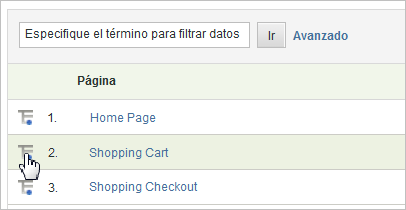

# Desgloses

Utilice desgloses cuando quiera obtener más información sobre la relación que tiene un segmento o artículo de un informe con otros informes. Generalmente, esto se denomina “desglosar” un informe mediante otro informe.

Un ejemplo es el desglose de un informe de tráfico personalizado llamado Grupo de edad, en el que han recopilado las edades de los visitantes del sitio a partir de la información de una encuesta. Este informe permite ver qué grupo de edad es responsable de la mayor cantidad de tráfico en el sitio. Sin embargo, si se ha tomado la molestia de capturar información como la edad de un visitante, es posible que desee saber más que solo las vistas a las páginas. En dicho caso, puede generar un informe de desglose sobre los motores de búsqueda y las palabras clave que utilizan o su ubicación geográfica. Está correlacionando el grupo de edad y el motor de búsqueda.

Si desglosa un informe por  *`Referrer Type`*, es posible que vea un punto de datos para *`Inside Your Site`*. Este valor indica una página de referente que se encuentra en la lista de filtros URL internos. Consulte [Filtros URL internos](/help/admin/admin/internal-url-filter-admin.md) en la referencia del administrador.

Puede desglosar cualquier variable de Analytics (eVar o propiedad) mediante cualquier otra variable. El menú **[!UICONTROL Desglosar por]** de la tabla de informes es igual que el menú estándar de informes de Analytics, para mantener la coherencia.

## Ejecutar un informe de desglose {#task_F685624830E64C829C8BE6435A107F69}

Instrucciones sobre cómo ejecutar un informe de desglose.

<!-- 

t_reports_breakdown.xml

 -->

1.  Abra un informe, como **[!UICONTROL Análisis]** > **[!UICONTROL Informes]** > **[!UICONTROL Contenido del sitio]** > **[!UICONTROL Páginas]**.
1. En la tabla del informe, haga clic en el icono **[!UICONTROL Desglosar por]**.

   Si no está visible el icono **[!UICONTROL Desglosar por]**, la función no está disponible o no está habilitada.

   

   El menú **[!UICONTROL Desglosar por]** muestra todas las opciones de desglose disponibles para el informe actual.
