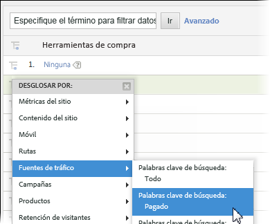
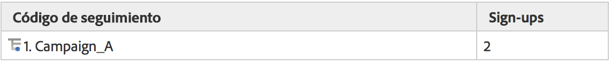
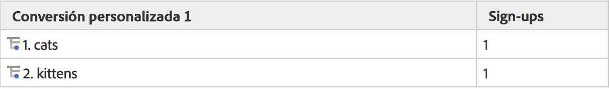
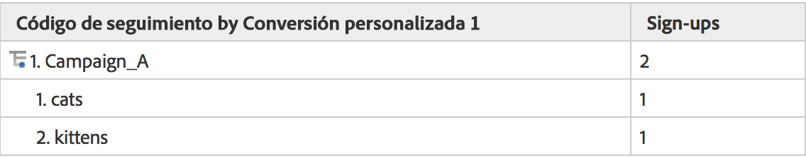
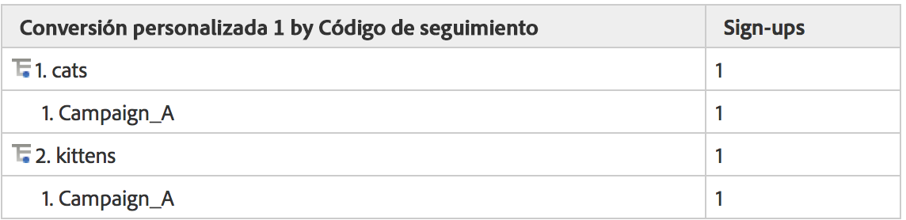

# Subrelaciones

Las subrelaciones completas están activadas en todos los informes de conversión, para poder desglosar cualquier eVar por otra eVar. El menú Desglosar por de la tabla de informes es igual que el menú estándar de informes de Analytics, para mantener la coherencia.

## Funcionamiento de las subrelaciones {#section_5BD862BB74FE411B96B59204520E4631}

Para demostrar cómo funcionan las subrelaciones, fíjese en el ejemplo siguiente:

1. Un usuario llega a su sitio por medio de Campaign_A y llega a la página principal.
1. El usuario busca “gatitos” y se muestra en los resultados de búsqueda. eVar1 realiza el seguimiento de los términos de búsqueda interna.
1. El usuario se suscribe a la lista de correo cuyo seguimiento se realiza mediante event1.
1. Un usuario distinto llega a su sitio por medio de Campaign_A y llega a la página principal.
1. Este usuario busca “gatitos” y se muestra en los resultados de búsqueda (eVar1), y también se suscribe a la lista de correo (event1).

Si extrajera un informe de código de seguimiento, vería lo siguiente:

Si extrajera un informe de eVar1, vería lo siguiente:

Si subrelacionara el informe de campaña mediante eVar1, obtendría lo siguiente:

Si subrelacionara el informe de eVar1 mediante campañas, obtendría lo siguiente:

Debido a la naturaleza persistente de las variables de conversión, hay dos columnas de datos que se utilizan para almacenar valores eVar: el valor que se activa y el valor que persiste. Si nos fijáramos en los datos sin procesar para este ejemplo, tendría este aspecto (simplificado para este ejemplo):

Nuestro servidor funciona al permitir que post_campaign y post_evar1 conserven los valores definidos en campaign y evar1. Los informes de subrelación se fijan de forma específica solo en las visitas que contienen eventos de éxito (filas resaltadas en amarillo claro). A continuación rellenan los informes de subrelaciones basados en los valores persistentes (en este caso, post_campaign y post_evar1, celdas resaltadas en amarillo brillante).

Fundamentalmente, las subrelaciones siguen estos pasos para rellenar su informe:

* Aíslan las solicitudes de imágenes que contienen los eventos de éxito que visualiza en el informe.
* Devuelven los valores persistentes de cada variable de conversión usada en la subrelación.
* Organizan los valores en función del orden de subrelación. Si una variable no tiene un valor persistente (como si nunca se hubiera definido una eVar o esta hubiera caducado), se clasificará como “Ninguno”.
