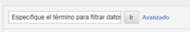

# Filter Report Data {#concept_09DC5B986A644738B12204DAC76A90E1}

Los filtros le permiten reducir el informe para incluir o excluir elementos de línea que concuerden con un filtro.

## Filtro simple {#section_5C4DE873F8D5484BB77F38A4AEB57B4A}



El filtro simple aparece en la mayoría de informes para que pueda encontrar rápidamente elementos de línea concretos. Simple filters do not use any special characters, so `-, ", ', +` and other special characters match the literal value in the report. Puede utilizar el espacio para encontrar elementos de línea que contienen múltiples términos.

Por ejemplo:

```
help search
```

Coincide con las páginas siguientes:

```
help:Search
help:Paid Search Detection
help:Configure paid search detection
help:Search Keywords Report
help:Internal Search Term
```

## Filtros avanzados {#section_E016626C084640E8A066B2FDA5B932BF}

Los filtros avanzados le permiten controlar el ámbito de su búsqueda a través de una serie de filtros. Puede seleccionar que coincida con todos los filtros o con cualquier filtro.


**Contiene**

Coincide si el término se encuentra en cualquier punto del elemento de línea. Opera igual que un filtro simple.

>[!NOTE]
>
>Los espacios no se pueden utilizar en filtros porque los espacios son delimitadores en búsquedas

**No contiene**

Coincide si el término no se encuentra en cualquier punto del elemento de línea. You can filter "unspecified", "none", "keyword unavailable" and other [special values](https://marketing.adobe.com/resources/help/en_US/reference/none-unspecified-unknown-other.html) from reports using "does not contain".

No contiene: `none`

Para un filtro más exacto, puede usar un filtro avanzado (caracteres especiales):

* Avanzado (carácter especial): `-^none$`
* Avanzado (carácter especial): `-"keyword unavailable"`

Por ejemplo, el siguiente elemento de línea se ha filtrado según el criterio "No contiene", pero no se ha filtrado según el criterio "Avanzado" (carácter especial):

```
help:Rename the None classification key
```

**Contiene uno de**

Coincide si algún término, separado por espacios, se encuentra en el elemento de línea. El filtro siguiente muestra todas las páginas que contienen "hombre" o "venta":

Contiene uno de: `mens sale`

Coincide con las páginas siguientes:

```
Womens
Mens
Mens:Desk & TravelJewelry & Accessories:Accessories:Hats:Mens
Sale & Values
```

**Es igual a**

Coincide si todo el elemento de línea, incluidos los espacios y otros caracteres, coinciden con la frase especificada.

Es igual a: `mens:desk & travel`

`Mens:Desk & Travel`

**Comienza con**

Coincide si el elemento de línea, incluidos los espacios y otros caracteres, empieza por la frase especificada.

Comienza con: `mens`

Coincide con las páginas siguientes:

```
Mens
Mens:Desk & Travel
Mens:Apparel
Mens Perfume Spray
Mens Hemp/Bamboo Flip Flops
```

**Finaliza con**

Coincide si el elemento de línea, incluidos los espacios y otros caracteres, acaba con la frase especificada.

Finaliza con: `jean`

Coincide con las páginas siguientes:

```
Bell Bottom Jean
Velvet Dream Skinny Leg Jean
Dark Slimmer Jean
Bling Belt High Waist Jean
Ocean Blue Jean
```

## Avanzado (carácter especial) {#section_83DA3B6C23EB4C119DB6D74062DB501D}

Avanzado le permite realizar una búsqueda con comodines y otras búsquedas complejas.

| Avanzado (carácter especial) | Descripción |
|--- |--- |
| `" "` | Coincide la frase exacta. |
| `*` | Comodín, coincidencia amplia. <br>Por ejemplo `r*p` , coincide con "Suscripción de registro". |
| `^` | Comienza con. <br>No incluya un espacio entre los caracteres especiales y la frase de búsqueda. |
| `$` | Finaliza con. <br>No incluya un espacio entre los caracteres especiales y la frase de búsqueda. |
| `-` | No. <br>No incluya un espacio entre los caracteres especiales y la frase de búsqueda. |
| `|` | Or<br>Note:  you must include a space on each side of the pipe character, `" | "`. |

## Crear filtros específicos de informes {#task_DEBB0632411D4CA8AA0B3BA267A5B35F}

Instrucciones sobre cómo crear filtros de informes.

<!-- 

t_reports_filter_specific.xml

 -->

Ciertos informes contienen un filtro que es específico para ese informe. Por ejemplo, un [!UICONTROL Informe de canal de conversión de compra] le permite filtrar por páginas Web. Un [!UICONTROL informe de segmentación geográfica] le permite filtrar por zonas geográficas. Otros informes tienen otros filtros específicos.

Cuando accede a estos filtros, puede ver las métricas del informe para los artículos especificados en la lista.

**Para crear filtros específicos del informe**

1. Generate a report, such as a [!UICONTROL Purchase Report] ( **[!UICONTROL Site Metrics]** &gt; **[!UICONTROL Purchases]** &gt; **[!UICONTROL Purchase Conversion Funnel]**).
1. En el encabezado del informe, haga clic en el vínculo **Filtro.**
1. En la página [!UICONTROL Selector de filtro]**, haga clic en[!UICONTROL Aplicar un filtro]** y, a continuación, seleccione un tipo de filtro.
1. Para buscar un elemento, escriba una cadena de caracteres en el campo **Buscar.**
1. Haga clic en **[!UICONTROL Aceptar]**.

## Añadir un filtro de correlación {#task_065042E384DA4BF3864C58AF2B88D6E2}

Instrucciones sobre cómo añadir un filtro de correlación.

<!-- 

t_reports_correlation_filter.xml

 -->

Ciertos informes permiten que se les añadan filtros de correlación personalizados. Por ejemplo, si está viendo el [!UICONTROL informe Páginas] para un grupo de informes que tenga secciones del sitio correlacionadas con una página de Mujer, puede crear un filtro que genere un informe mostrando las páginas más populares dentro de Secciones del sitio = Mujer.

Puede filtrar los datos que se muestran en un informe de correlación usando cualquier correlación disponible. Este ejemplo muestra cómo se agrega un filtro de correlación de motor de búsqueda.

**Para agregar un filtro de correlación**

1. Ejecute un informe que admita correlaciones. (See [Running a Breakdown Report](../../../analyze/reports-analytics/reports-customize/breakdowns.md#task_F685624830E64C829C8BE6435A107F69).)
1. In the report header, click the **[!UICONTROL Correlation Filter]** link.
1. En [!UICONTROL Creador de reglas de filtro], seleccione una categoría para correlacionar con un elemento.
1. Click **[!UICONTROL OK.]**
