# Cambiar gráficos de informes

Instrucciones sobre cómo personalizar el gráfico de modo que resulte lo más práctico posible para la audiencia objetivo.

El tipo de gráficos disponibles depende del tipo de informe que ejecute. Por ejemplo, los gráficos de líneas de tendencia son útiles para los informes de tendencia pero también puede utilizar gráfico de barras verticales, que ilustran claramente las tendencias de los días, las semanas, los meses, etc. También puede elegir un gráfico circular para ilustrar los porcentajes de páginas vistas.

**Para cambiar un gráfico de informe**

1. Ejecutar un informe.
1. Haga clic en **[!UICONTROL Configurar gráfico]**.
1. Seleccione un tipo de gráfico.

   **[!UICONTROL Línea de tendencias]**: las líneas de tendencias muestran las tendencias diarias de las métricas de informe y son útiles para medir la tendencia de una métrica a través del tiempo.

   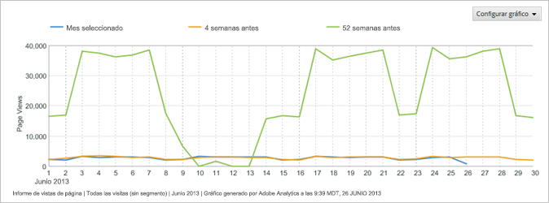

   **[!UICONTROL Línea continua]**: se utiliza este tipo de gráfico con el [!UICONTROL informe de detalle de vídeo]. Muestra la cantidad de porcentajes de las vistas de los segmentos específicos de un vídeo. El aumento en las vistas de un segmento específico del vídeo indica que los visitantes retrocedieron y vieron esa sección del vídeo varias veces. Si se utilizan porcentajes, el porcentaje mostrado en el gráfico es un porcentaje de todos los segmentos vistos y no un porcentaje de los visitantes que vieron el segmento. Por ejemplo, en el gráfico, la suma de todos los segmentos del informe es de 39. La cantidad de vistas del segmento de 0 a 10 segundos es de 10. Por lo tanto, el porcentaje de vistas del segmento es de aproximadamente el 26 por ciento.

   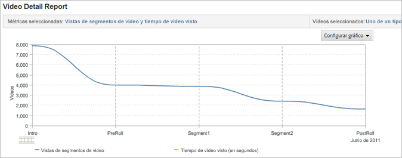

   **[!UICONTROL Área]**: el gráfico de área es similar al de líneas de tendencias, con la diferencia de que se llena el área cubierta debajo de las líneas. Debe estar viendo un informe de tendencias para mostrar el gráfico de área.

   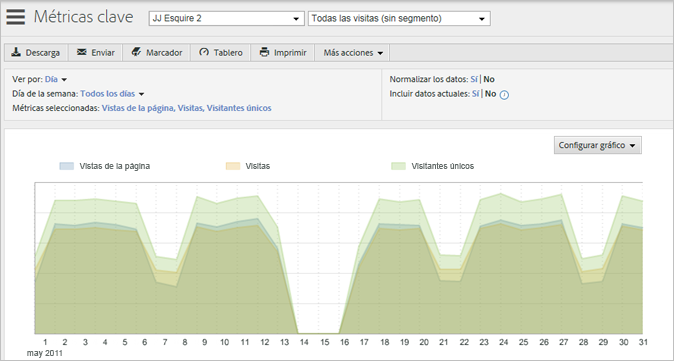

   **[!UICONTROL Área apilada]**: los gráficos de áreas apiladas son útiles cuando se ve la tendencia de una cantidad de productos o de campañas a través del tiempo. Por ejemplo, si se ve la tendencia de los cinco productos principales que muestran ingresos, rápidamente se puede observar cuál es el total de ingresos que dichos productos aportan en un lapso de tiempo. La vista se puede precisar con un filtro de búsqueda que incluya o excluya productos específicos.

   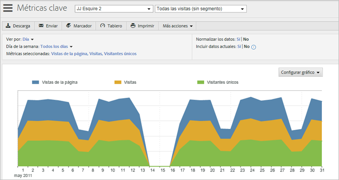

   **[!UICONTROL Barras verticales]**: el gráfico de barras verticales muestra los porcentajes relativos de las métricas de informes.

   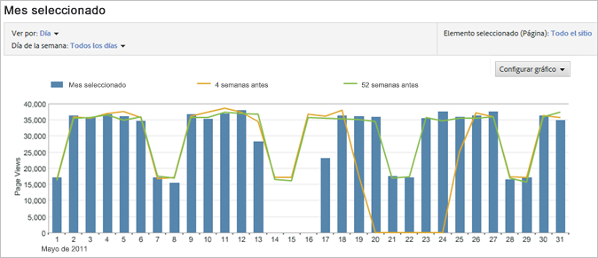

   **[!UICONTROL Barras apiladas verticales]**: al apilar artículos similares se puede obtener una vista rápida de la influencia total de un artículo. Por ejemplo, en un [!UICONTROL informe Campaña] se pueden apilar métricas de éxito similares y ver qué campaña está generando la mayoría del éxito total. El apilamiento facilita encontrar las campañas que no sean las de más alto rendimiento en una métrica pero que son las de más alto rendimiento en una combinación de métricas.

   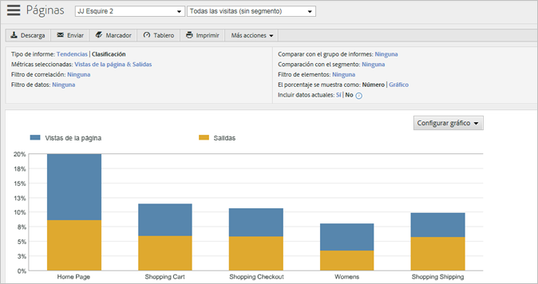

   **[!UICONTROL Barras horizontales]**: el gráfico de barras horizontales es similar al gráfico de barras verticales pero las columnas están horizontales.

   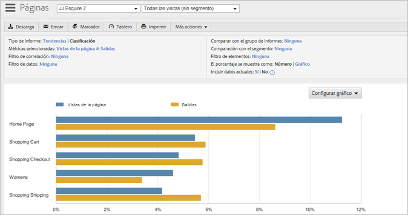

   **[!UICONTROL Barras horizontales apiladas]**: el gráfico de barras horizontales apiladas es similar al gráfico de barras verticales pero las columnas están horizontales.

   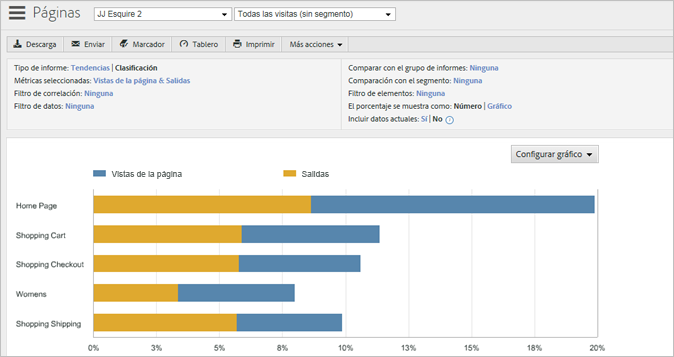

   **[!UICONTROL Gráfico circular]**: el gráfico circular muestra los porcentajes del valor de las métricas más importantes en relación mutua y muestra el porcentaje de las métricas seleccionadas en relación al total. Puede mostrar el gráfico circular para los informes de clasificación.

   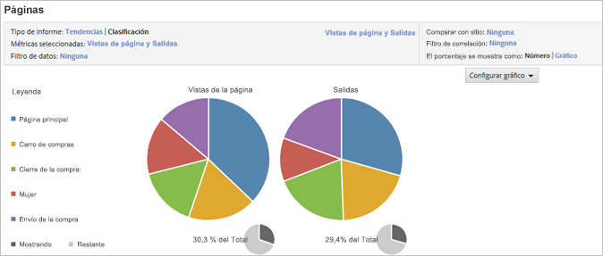

   **[!UICONTROL Diagrama de puntos]**: el gráfico de diagrama de puntos muestra una visualización de puntos de las métricas que se seleccionan en relación mutua. Los gráficos de diagrama de puntos le permiten visualizar información en dos dimensiones, para que pueda identificar qué artículos son periféricos.

   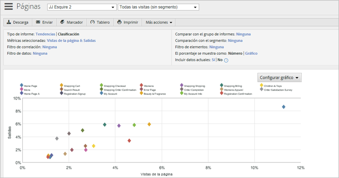

   **[!UICONTROL Burbujas]**: el gráfico de burbujas muestra una visualización de burbujas de las métricas que se seleccionan relacionadas entre sí. La ubicación de las burbujas muestra las relaciones entre las métricas en los ejes horizontal y vertical, aunque el tamaño de las burbujas representa la métrica de informe más importante. Los gráficos de burbujas le permiten visualizar información en dos dimensiones, para que pueda identificar qué artículos son periféricos.

   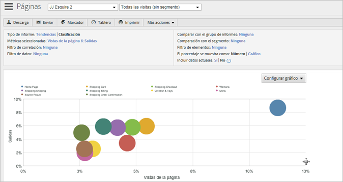

