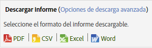
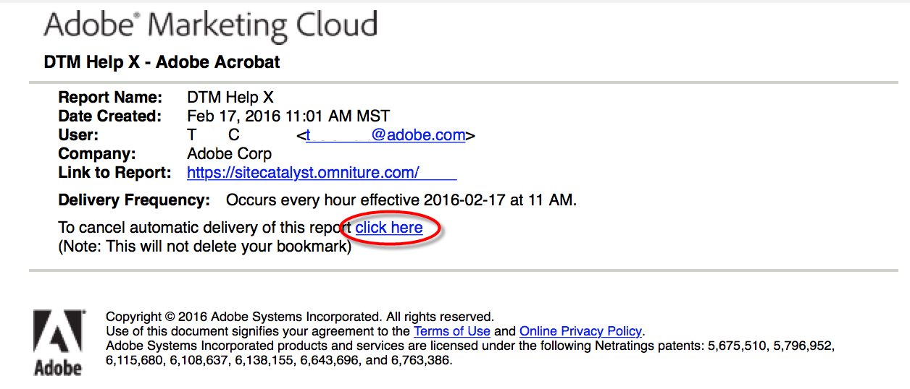

# Programación y distribución del informe

Información sobre cómo programar, descargar y distribuir informes.

Al programar un informe para su envío a una aplicación de Adobe Analytics, se pueden utilizar las herramientas de programación y distribución para ver qué archivos se han enviado automáticamente y así modificar o finalizar los envíos.

Debido a las diferencias en los mecanismos y las plataformas de procesamiento, los varios tipos de informes descargables y programados disponibles en Adobe Analytics tienen diferentes limitaciones con relación al número máximo de filas que pueden procesar en una única solicitud. Estos son los límites de cada uno:

* Word, CSV, Excel, HTML y PDF: el mismo número de filas visibles en el informe. De forma predeterminada, este límite es 50 filas, pero se puede aumentar hasta 200. Los informes de desglose tienen un límite estricto de 50 filas.
* Data Extract: 50 000 filas
* Data Warehouse: sin límite

Estas limitaciones son para los informes individuales programados y descargados; los tableros se limitan a la cantidad de espacio disponible en un informe breve.

>[!NOTE]
>
>La “Hora de envío”/“Hora del día” introducida por el usuario especifica la hora en que el informe debe comenzar a procesarse, no la hora en que se enviará. El tiempo real en que el informe se enviará se basa principalmente en el tiempo que tarda en procesar (los informes complejos y grandes tardan más en procesarse que los más simples). Por ejemplo: si un informe tarda 15 minutos en procesarse, el tiempo de entrega real será al menos 15 minutos después del “Tiempo de entrega” /“Hora del día” especificado originalmente.
>Además, hay otros factores que pueden aumentar aún más la demora antes de que se presente el informe:
>
> * **Ejecución de varias programaciones diferentes del mismo tipo al mismo tiempo** (por ejemplo, muchos paneles, etc.) puede sobrecargar el sistema. El sistema de programación solo permite ejecutar al mismo tiempo unos pocos informes (5-10) de cualquier tipo, por lo que cuando se programen más de 5-10 al mismo tiempo, algunos tendrán que esperar a que otros informes finalicen antes de que puedan comenzar a procesarse. Este problema se puede mitigar programando los informes de una empresa en horas escalonadas durante el día o la hora, en lugar de hacerlo simultáneamente.
> * Además del tipo de informe específico (paneles, etc.), los informes también esperarán si la empresa tiene **más de 15 y 20 informes de cualquier tipo programados a la vez (en todos los diferentes tipos de informes)**. Esto se puede mitigar escalonando los tiempos de programación en lugar de tener varios ejecutándose al mismo tiempo.
> * **Los problemas en los servicios descendentes** en los que se basa el planificador también pueden afectar al envío de informes. Por ejemplo: si utiliza las API de forma independiente para ejecutar informes y rellenar la cola de solicitudes de API, los informes programados pueden entregarse más despacio mientras solicita ese recurso.
> * **La latencia del grupo de informes** (un retraso en la recopilación de datos) también puede retrasar algunos informes programados.

## Enviar un informe {#task_27642CD33D484FD0BF59EBD159EEF52C}

Instrucciones sobre cómo descargar y enviar por correo electrónico informes en diversos formatos, y sobre cómo programar un informe para su envío.

1. Ejecute un informe y, a continuación, haga clic en **[!UICONTROL Más]** > **[!UICONTROL Enviar]**.
1. Especifique las opciones de envío:

   | Opción | Descripción |
   |--- |--- |
   | Formato | Seleccione PDF o HTML. |
   | Enviar a | Suministrar una dirección de correo electrónico para recibir el informe. |
   | Asunto | Asunto del correo electrónico. |
   | Programación | Seleccionar para enviar el informe inmediatamente o con un intervalo distinto. |

1. Haga clic en **[!UICONTROL Opciones de envío avanzadas]** para especificar un programa de envío.

| Opción | Descripción |
|--- |--- |
| Nombre del archivo del informe | Especifica el nombre del informe. El formato predeterminado es `<report name> for <suite> - <report date range>` Para especificar un nombre personalizado, seleccione [!UICONTROL Personalizar]. |
| Formato del informe | Le permite especificar formatos PDF, CSV, Excel, HTML, Word o Móvil para el envío. Si selecciona CSV, también puede especificar la codificación para CSV:<ul><li>Shift-JIS: codificación de caracteres japoneses.</li><li>EUC-JP: código Unix ampliado, principalmente para japonés, coreano y chino simplificado.</li></ul> |
| Contenido del informe | <ul><li>Número de filas de la tabla: especifica el número de filas que desea que sean visibles en la tabla del informe que está enviando.</li><li>Idioma para el encabezado y pie de página: especifica el idioma del encabezado y el pie de página.</li><li>Comentarios: especifica el texto que aparece al comienzo del informe.</li></ul> |
| Enviar el archivo de firma digital | Al solicitar un informe como, por ejemplo, uno con marcadores o solicitudes de Data Warehouse, puede solicitar una firma de datos. La firma digital de Adobe no restringe el acceso a la información, pero el propósito del archivo de firma digital (.sig) es verificar la validez del archivo de informes enviado. Si utiliza la firma digital, los destinatarios del informe pueden verificar si el archivo proviene de Adobe y si no ha sido alterado. |
| Destino del informe | <ul><li>Correo electrónico: permite configurar las direcciones de correo electrónico, la línea de asunto y las notas.</li><li>FTP: permite configurar FTP, incluso el host, el puerto, el directorio, el nombre de usuario y la contraseña.</li></ul> |

1. Haga clic en **[!UICONTROL Opciones de programación]**.

| Opción | Descripción |
|--- |--- |
| Enviar informe ahora | Envía el informe inmediatamente. |
| Programar después | Muestra las opciones para especificar un intervalo de tiempo y las opciones de envío. |
| Intervalo de tiempo del informe | **Fijo**: evita que la fecha avance con el transcurso del tiempo. **Móvil**: permite que la fecha avance con el transcurso del tiempo. Algunas consideraciones:<ul><li>Si selecciona Móvil tanto para la fecha de inicio como para la de finalización y selecciona un informe diario del día anterior, recibirá un mensaje de correo electrónico todos los días con el informe del día anterior.</li><li>Si selecciona Fijo para la fecha de inicio y móvil para la fecha de finalización, recibirá un informe del día anterior el primer día. El segundo día recibirá un informe de los dos días anteriores, el tercer día recibirá un informe de los tres días anteriores y así sucesivamente.</li><li>Si selecciona Fijo tanto para la fecha de inicio como para la de finalización, recibirá un informe idéntico para los días precisos que haya especificado.</li><li>No se puede seleccionar una fecha de inicio móvil y una de finalización fija.</li></ul> |
| Frecuencia de envío | <ul><li>**Por hora**: envía un mensaje de correo electrónico cada hora, cada dos horas o a cualquier otro intervalo de horas.</li><li>**Diario**: envía un mensaje de correo electrónico todos los días, cada dos días, cada tres días o a cualquier otro intervalo de días. También es posible que se lo envíe cada día laborable.</li><li>**Semanal**: envía un mensaje de correo electrónico todas las semanas, cada dos semanas, cada tres semanas o a cualquier otro intervalo de semanas. También se puede especificar qué día de la semana enviarlo.</li><li>**Mensualmente**: especifica el intervalo en cantidad de meses y se puede también seleccionar el día del mes en que ha de enviarse o el día de una determinada semana del mes.</li><li>**Anualmente**: especifica el día del año en que ha de enviarse el informe o bien puede enviarse un día de la semana de cualquier semana del año.</li><li>**Hora del día**: se aplica al huso horario conectado al grupo de informes seleccionado.</li></ul> |
| Opciones de finalización de envío | <ul><li>**Sin fin**: especifica sin fin.</li><li>**Finalizar después de ocurrencias `value` **: especifica el número de ocurrencias antes de finalizar el envío.</li><li>**Finalizar el**: permite especificar una fecha determinada. Si desea que los datos se procesen en la misma fecha que los datos del informe, el informe contendrá solamente los datos que se hayan incluido en la base de datos en el momento en el que se envíe el informe. Puesto que el procesamiento completo de un día puede llevar hasta 24 horas, es posible que no estén disponibles los datos completos al tiempo de enviar el informe. Para obtener los datos completos, siempre fije el tiempo de procesamiento en 24 horas después del final del período de informe.</li></ul> |

## Imprimir un informe {#task_0F7CF6D6ED54462CAE4A793E271AF7E5}

Instrucciones sobre cómo imprimir un informe.

1. Ejecutar un informe.
1. Haga clic en **[!UICONTROL Más]** > **[!UICONTROL Imprimir]**.  

## Descarga de un informe usando opciones avanzadas {#task_43660107A1C9485D92981CD75B562577}

Descargue información detallada sobre un informe concreto en los formatos PDF, CSV, Excel o Raw Data Export.

1. En **[!UICONTROL Analytics]** > **[!UICONTROL Informes]**, seleccione un informe para verlo.
1. Haga clic en **[!UICONTROL Descargar]**.

   

1. Seleccione el formato que desee para el informe:

   * **[!UICONTROL PDF]**: especifica que el informe se descargará en formato de Adobe PDF, lo cual le permite compartir el informe con otros usuarios que podrán abrirlo sin importar el sistema informático que estén utilizando.
   * **[!UICONTROL CSV]**: especifica que el informe se descargará en formato [!DNL .csv] (formato de valores separados por comas).
   * **[!UICONTROL Excel]**: especifica que el informe se descargará en formato de Microsoft Excel, lo cual le permite compartir el informe con otros usuarios que podrán abrirlo en un programa de hojas de cálculo.
   * **[!UICONTROL Word]**: especifica que el informe se descargará en formato Microsoft Word.

   >[!NOTE]
   >
   >Si utiliza uno de los formatos de exportación sin procesar para descargar un informe y el nombre de la página está en blanco, puede que Adobe Analytics no haya tenido tiempo suficiente para procesar los datos. Descargue el informe más tarde.

## Administrar informes programados {#task_C17677C543454FF2B06D10EA5652DFBC}

Información sobre cómo administrar los informes programados.

En el [!UICONTROL Administrador de programación de informes], puede editar y eliminar los envíos periódicos de informes. Puede crear programas de entregas que envíen los informes por correo electrónico o por FTP a una dirección especificada. Puede configurar los programas a fin de que los informes se envíen automáticamente a intervalos especificados por un periodo de tiempo o indefinidamente, o bien para que se detenga el envío de un informe recurrente.

El [!UICONTROL Administrador de programación de informes] muestra los artículos que ha creado un usuario en particular. Si la cuenta del usuario está desactivada en la aplicación, se detienen todos los envíos programados.

1. Para acceder al administrador, haga clic en **[!UICONTROL Analytics]** > **[!UICONTROL Componentes]** > **[!UICONTROL Informes programados]**.

## Compartir un vínculo a un informe {#task_9711DDE9E140451B8C914EC5513E21EC}

Instrucciones sobre cómo compartir un informe generando un vínculo de informe (una dirección URL) para enviarlo a otro usuario.

Cuando el destinatario hace clic en el vínculo, el sistema solicita las credenciales de inicio de sesión (nombre de la empresa, nombre de usuario y contraseña). Después de iniciar sesión, el destinatario se muestra en el informe generado por el usuario original. Se aplican restricciones de permiso estándar.

**Para compartir un vínculo del informe**

1. Ejecutar un informe.
1. Haga clic en **[!UICONTROL Más]** > **[!UICONTROL Vínculo a este informe]**.

## Cancelación de la suscripción de informes programados {#concept_6B48360F935740B6851BA85D32DEF637}

Puede cancelar la suscripción de informes programados. Dejará de recibir el informe aunque se vuelva a agregar su nombre de usuario en el informe programado.

>[!IMPORTANT]
>
>Para volver a recibir el informe, se debe crear una nueva programación.

Para cancelar una suscripción de un informe programado:

1. Acceda el correo electrónico con el vínculo al informe cuya suscripción desea cancelar.

   

1. Haga en el vínculo **[!UICONTROL haga clic aquí]** junto a **[!UICONTROL Para cancelar el envío automático de este informe]**.

1. Confirme que desea cancelar el envío del informe.

   >[!NOTE]
   >
   >Este flujo de trabajo es el mismo tanto si usted es el programador de informes como si es el destinatario del informe.

Al cancelar la suscripción de un informe no se cancela el informe programado.

Para cancelar un informe programado, vaya al Administrador de programación y haga clic en la X roja junto al nombre de informe. [Más...](/help/analyze/reports-analytics/scheduling.md#task_C17677C543454FF2B06D10EA5652DFBC)
