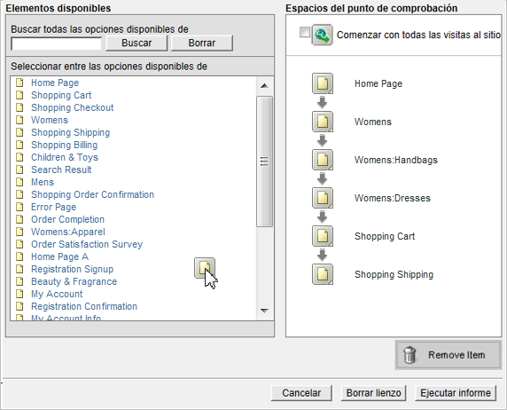
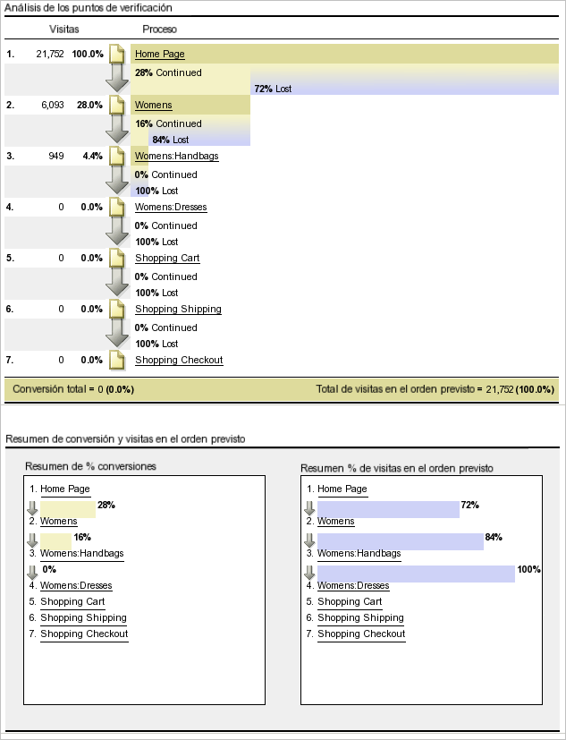
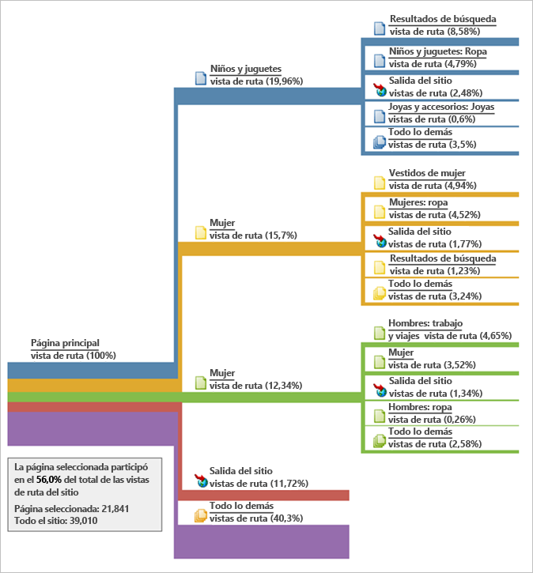
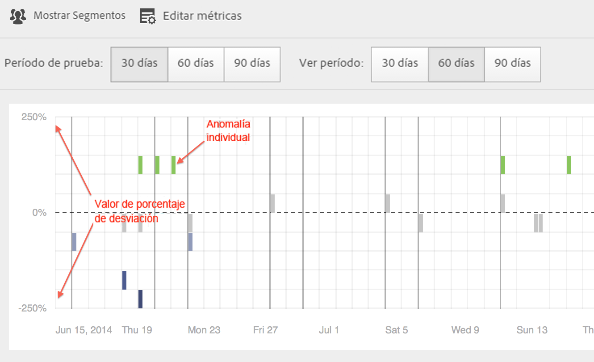
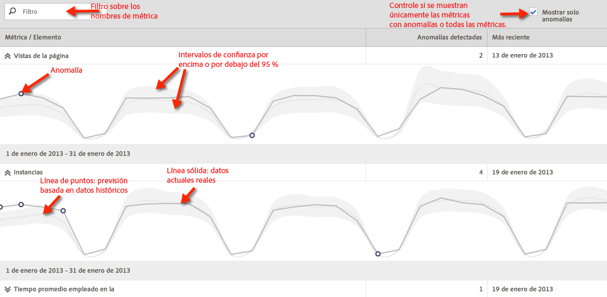
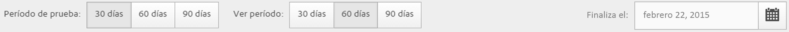
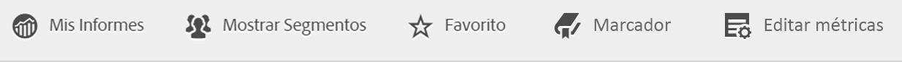
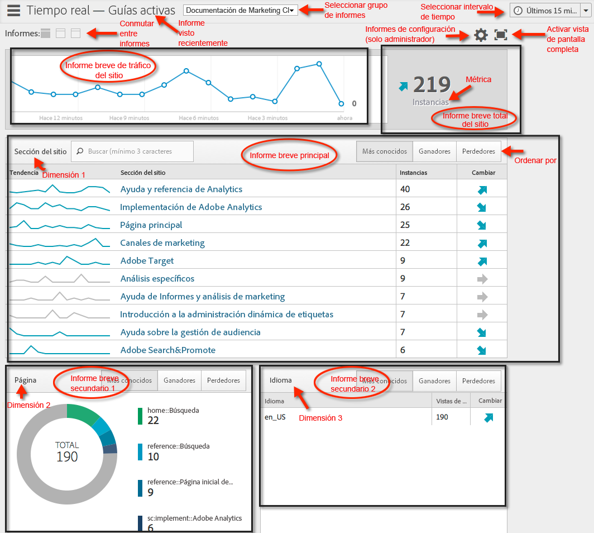
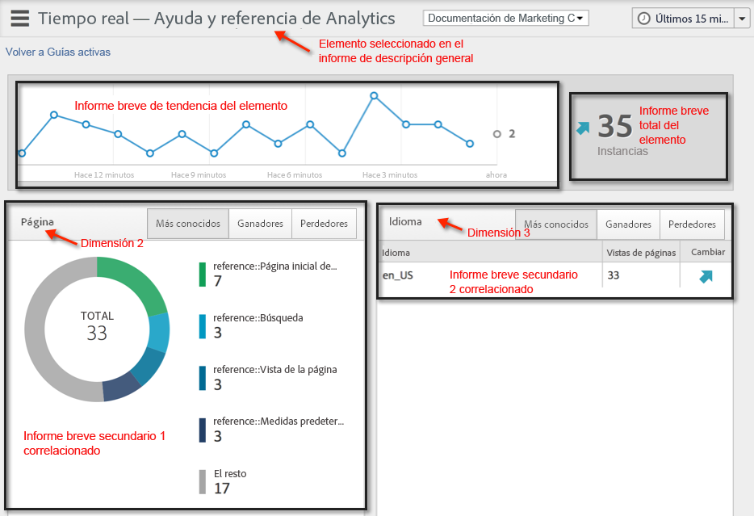

# Ejecutar diferentes tipos de informes

Pasos para ejecutar los distintos tipos de informes.

## Ejecutar un informe de clasificación {#task_C570BA4A213F4F2EB7B30E012934BE7D}

En los informes de clasificación, la tabla muestra las clasificaciones de las páginas del informe en relación con la métrica, según un número o un porcentaje. Los informes de clasificación pueden mostrar varias métricas a la vez.

<!-- 

t_reports_ranked.xml

 -->

1. Genere un informe, como por ejemplo un [!UICONTROL informe Páginas] (**[!UICONTROL Informes]** > **[!UICONTROL Contenido del sitio]** > **[!UICONTROL Páginas]**).
1. En el encabezado del informe, haga clic en **[!UICONTROL Clasificación]**.
1. Para clasificar el informe, haga clic en un encabezado de columna de la tabla.

   Los informes de clasificación pueden tener hasta 200 artículos enumerados en la tabla (como productos, categorías, páginas web, etc.) y diez métricas (ingresos, pedidos, vistas, etc.).

## Ejecutar un informe de tendencias {#task_F03B4E760B9E4EA29FC3F654E6316887}

Los informes de tendencias muestran las métricas en el transcurso del tiempo. Utilice este tipo de informe cuando desee ver cómo se comporta un segmento desde un periodo de tiempo hasta el siguiente.

<!-- 

t_reports_trended.xml

 -->

La mayoría de los informes de tráfico y conversión tienen una vista de tendencia disponible. Si utiliza el [!UICONTROL Calendario], puede exhibir la mejora para cualquier desglose de periodo de tiempo, incluyendo los días del mes, semanas del año, semanas del trimestre, meses del año, etc. Los informes de tendencias muestran las tendencias para una métrica sencilla (ingresos, pedidos, vistas, etc.) de hasta cinco artículos (como productos, categorías, páginas Web, etc.).

**Para ejecutar un informe de tendencias**

1. Ejecute un informe de conversión o tráfico, como por ejemplo **[!UICONTROL Informes]** > **[!UICONTROL Contenido del sitio]** > **[!UICONTROL Páginas]**.
1. En **[!UICONTROL Tipo de informe]**, haga clic en **[!UICONTROL Tendencias]**.

## Ejecutar un informe de canales de conversión {#task_B926A74AA6A641138C2986C1635120CB}

Los informes de canal de conversión muestran el porcentaje de visitantes que han avanzado por una serie de eventos para realizar una acción deseada. Por ejemplo, puede ver cuántos visitantes han pasado desde la visita a la página web, a añadir artículos al carro y finalmente han comprado un artículo. Este informe además muestra cuántos visitantes se han quedado por el camino.

<!-- 

t_reports_conversion_funnel.xml

 -->

Para ejecutar este informe, seleccione un informe, como por ejemplo un informe Páginas (**[!UICONTROL Informes]** > **[!UICONTROL Campañas]** > **[!UICONTROL Código de seguimiento]** > **[!UICONTROL Canal de conversión de campañas]**).

Consulte [Informes de conversión](https://docs.adobe.com/content/help/es-ES/analytics/components/dimensions/evar.html) para ver una descripción.

## Ejecutar un informe de visitas en el orden previsto {#task_8FD97C8260464F9DA731A93DB8F80184}

El [!UICONTROL informe de visitas en el orden previsto] muestra el número de visitantes que visitaron una secuencia especificada previamente de páginas. También muestra la tasa de conversión y de visitas en el orden previsto entre cada paso.

<!-- 

t_reports_fallout.xml

 -->

Consulte el nuevo panel de [Análisis de visitas en el orden previsto](https://docs.adobe.com/content/help/es-ES/analytics/analyze/analysis-workspace/visualizations/fallout/fallout-flow.html) de Analysis Workspace.

1. En [!UICONTROL Adobe Analytics], haga clic en **[!UICONTROL Informes]** > **[!UICONTROL Rutas]** > **[!UICONTROL Páginas]** > **[!UICONTROL Visita en el orden previsto]**.
1. En la página [!UICONTROL Informe de visitas en el orden previsto], haga clic en **[!UICONTROL Iniciar Report Builder para visitas en el orden previsto]**.

   

1. En la página [!UICONTROL Definir puntos de comprobación], especifique los puntos de comprobación que desee utilizar para el informe.
1. Haga clic en **[!UICONTROL Ejecutar informe]**.

   

>[!MORELIKETHIS]
>
>* [Descripción del informe de visitas en el orden previsto](https://docs.adobe.com/content/help/es-ES/analytics/analyze/analysis-workspace/visualizations/fallout/fallout-flow.html)

## Ejecutar un informe de flujo de página {#task_133E8B87C3F04DA0A42D10CBA499305B}

Los informes de flujo de página muestran el orden en el que los visitantes acceden a las páginas y navegan a través del sitio. Este informe ayuda a dar respuesta

Consulte la nueva [Visualización de flujo](https://docs.adobe.com/content/help/es-ES/analytics/analyze/analysis-workspace/visualizations/fallout/fallout-flow.html) en Analysis Workspace.

Ejecute un informe de [Rutas](https://docs.adobe.com/content/help/es-ES/analytics/analyze/analysis-workspace/visualizations/flow/flow.html).

Por ejemplo, haga clic en **[!UICONTROL Informes]** > **[!UICONTROL Rutas]** > **[!UICONTROL Páginas]** > **[!UICONTROL Flujo de página siguiente]**.

Lea este informe de izquierda a derecha, empezando por la página seleccionada. A las páginas que se visitaron después de la página seleccionada se las ilustra como una rama que se extiende hacia la derecha.

El porcentaje de cada página posterior que se visitó aparece al lado del nombre de la página. El ancho de la línea que se conecta con las páginas siguientes ilustra dicho porcentaje relativo.

**[!UICONTROL Vistas de ruta]**: indica el número de veces que se visualizó una página, cuando se está limitado a las rutas visualizadas.

Por ejemplo, si la página Política de privacidad puede tener un total de 10 000 vistas, pero sólo 500 se produjeron inmediatamente después de la Página principal. Es por ello que se utiliza el término vista de ruta.

El porcentaje relativo se describe mediante el ancho relativo de la línea. De forma predeterminada, este informe muestra cinco ramas de segundo nivel y cinco ramas de tercer nivel. Puede ampliar el número de ramas para visualizar hasta diez ramas de segundo nivel y cinco ramas de tercer nivel. Al hacer esto, se aumenta la altura del informe y lo más seguro es que deba desplazarse para ver el gráfico completo.

## Ejecutar un informe de canales {#task_2BBF6FACD48F479E8B2EE458919941CB}

Puede seleccionar eventos de éxito y añadirlos a un informe [!UICONTROL Canal de conversión de compra] o a un informe [!UICONTROL Canal de conversión de producto].

<!-- 

t_reports_funnel.xml

 -->

1. Haga clic en **[!UICONTROL Informes]** > **[!UICONTROL Productos]** > [Canal de conversión de productos](https://docs.adobe.com/content/help/es-ES/analytics/analyze/reports-analytics/t-running-report-types.html).

## Ejecutar un informe de canal de marketing {#task_64ADED5CC75248319E06E3E029B47F78}

La elaboración de informes de canal de marketing ofrece un informe con información general sobre la asignación del canal de primer y último toque, con métricas estándar de informes como ingresos, pedidos y costos. Estos informes permiten analizar cuántos ingresos genera cada canal.

<!-- 

t_reports_marketing_channel.xml

 -->

Consulte el sistema de ayuda de [Canal de mercadotecnia](/help/components/c-marketing-channels/analyze-mc.md) para obtener más información.

## Ejecutar un informe de detección de anomalías {#task_4808C96327354D789C075823F5C3A049}

Describe cómo interpretar los gráficos de métricas individuales y de resumen en la detección de anomalías.

<!-- 

t_anomaly_view.xml

 -->

Consulte las nuevas funciones de [Detección de anomalías y Análisis de contribución](https://docs.adobe.com/content/help/es-ES/analytics/analyze/analysis-workspace/virtual-analyst/anomaly-detection/anomaly-detection.html) en Analysis Workspace.

**[!UICONTROL Informes]** > **[!UICONTROL Métricas del sitio]** > **[!UICONTROL Detección de anomalías]**.

>[!NOTE]
>
>También puede ejecutar la Detección de anomalías desde proyectos de Analysis Workspace. [Más...](https://docs.adobe.com/content/help/es-ES/analytics/analyze/analysis-workspace/virtual-analyst/anomaly-detection/anomaly-detection.html)

Si desea más información sobre la configuración de la detección de anomalías, consulte la [Guía de referencia](https://docs.adobe.com/content/help/es-ES/analytics/analyze/reports-analytics/getting-started.html#Setting_up_Anomaly_Detection).

La detección de anomalías muestra dos tipos de gráficos: un gráfico de resumen y gráficos de las métricas individuales. Los gráficos de métricas individuales solo se muestran si al menos se ha detectado una anomalía para esa métrica.

<table id="table_88163CD8FC164342855D90D01F9C581A"> 
 <thead> 
  <tr> 
   <th colname="col1" class="entry"> 
Tipo de gráfico 
 </th> 
   <th colname="col2" class="entry"> 
Qué hace 
 </th> 
  </tr> 
 </thead>
 <tbody> 
  <tr> 
   <td colname="col1"> 
Gráfico de resumen 
 
 
 </td> 
   <td colname="col2"> 
 
     <ul id="ul_D26DA3024CD7468291369F549557B28A"> 
      <li id="li_1C22B6E02FFB479FB71EFAD89EB37A4E">Cada cuadro representa una anomalía, con el seguimiento diario que corresponde a la métrica a continuación. </li> 
      <li id="li_8FC587D3FF4E452D83263CC7A10B6675">El verde indica anomalías por encima de la línea de tendencia, el azul indica que está por debajo de la línea de tendencia. </li> 
      <li id="li_25135AB691BF443599AF2A3A60E2E71A">Indica la intensidad de la anomalía: cuanto mayor sea la anomalía, más oscuro será el color del punto de datos y más lejos estará de la línea de tendencia. </li> 
      <li id="li_0C42AFA8897D420D8AB1A5D0F65B3B3A">Al hacer clic en anomalías individuales, aparece automáticamente el cuadro de métricas individuales de esa anomalía (debajo del cuadro de resumen) en la parte superior. </li> 
      <li id="li_85C0F426952547B5A75D6BD31DE19CA5">Los valores de porcentaje de desvío (a la izquierda del gráfico) se calculan de la forma siguiente: 
       <ul id="ul_BEC0A88BFFAC4CF78BC9885FEB749694"> 
        <li id="li_1BAB2F50482745B69937DFAF1E09982E">Si el límite superior y el valor esperado son el mismo, el porcentaje de desviación es 100 % </li> 
        <li id="li_CA48064F5788448C8646CCE196161237">De lo contrario, el porcentaje de desviación es ((valor actual - valor de límite superior) / (valor de límite superior - valor esperado)) * 100 </li> 
        <li id="li_4090357A0D214BC7B1C3DE0615875554">Si el límite inferior y el valor esperado son el mismo, el porcentaje de desviación es -100% </li> 
        <li id="li_EF694E1A4E874ECD94E1E8F7302E494F">De lo contrario, el porcentaje de desviación es ((valor de límite inferior - valor actual) / (valor actual - valor de límite inferior)) * -100 </li> 
       </ul> </li> 
      <li id="li_5C05EF7023484CC993E96D63E842B65C">Al hacer clic en Mostrar segmentos, aparece el carril del segmento que permite aplicar segmentos a un informe de detección de anomalías. <a href="https://docs.adobe.com/content/help/es-ES/analytics/components/segmentation/seg-home.html"  > Más información</a> sobre segmentación. </li> 
      <li id="li_1B41CABF13D1407886C68EE3BC201E60">Al hacer clic en Editar métricas, puede seleccionar y deseleccionar métricas para las cuales desea detectar anomalías. </li> 
     </ul> 
 </td> 
  </tr> 
  <tr> 
   <td colname="col1"> 
Gráfico de métrica individual 
 
 
 </td> 
   <td colname="col2"> 
 
     <ul id="ul_739C5687013743A29B63089FDA763F45"> 
      <li id="li_456A0BDA4D4E46CE9CC1C3DBAA1E2220">Muestra los puntos de datos anómalos para métricas de la tendencia individuales (incluidas las métricas calculadas) como puntos. </li> 
      <li id="li_89FD847C65F04F48BCA7CD38D0EC51CD">Muestra la anomalía más reciente arriba y, a continuación, las clasifica por número de anomalías. </li> 
      <li id="li_98B97A9706DE4455B8D8850904CBDE03">Muestra una línea sólida para indicar los datos actuales que se están recopilando actualmente. Esto se compara con la previsión y el margen de errores para derivar si los puntos de datos son anómalos. </li> 
      <li id="li_0EEA38DDDC344BF3879430E67D74EB72">Muestra una línea de puntos que representa una previsión basada en datos históricos (por ejemplo, del periodo de prueba). </li> 
      <li id="li_035BD2725D004AEDB630BF8DFF4DA4F3">Muestra intervalos/límites de confianza del 95 % inferiores y superiores en tono gris. </li> 
      <li id="li_021A3D1F2EDB4319B9B39620EF1C038A">Le permite ampliar y reducir informes individuales si hace clic en las flechas dobles arriba o abajo junto al nombre de la métrica. </li> 
      <li id="li_722E4B9FC21047AC96D7B143197E293D">Cambia el orden en el que aparecen los gráficos de métricas al reaccionar a una exploración en profundidad del informe de resumen (consulte lo anterior) </li> 
      <li id="li_A2441169B185475AA68A64F81E6E40B8">Le permite filtrar los gráficos mediante términos de búsqueda como "página" para todas las métricas relacionadas con páginas. </li> 
      <li id="li_F1BBBFCA8E2A43C29658E4FCAA36C904">Le permite mostrar todas las métricas que haya definido o solo las que contienen anomalías. </li> 
     </ul> 
 </td> 
  </tr> 
 </tbody> 
</table>

## Configuración de la detección de anomalías {#task_AF347B34F56E44A6AE70E019B6EB2F08}

Pasos para seleccionar los grupos de informes, métricas y periodos de prueba/vista para la detección de anomalías.

<!-- 

t_anomaly_config.xml

 -->

La detección de anomalías se configura de forma independiente para cada grupo de informes.

1. Vaya a **[!UICONTROL Analytics > Informes > Métricas del sitio > Detección de anomalías]**.
1. Seleccione el grupo de informes para el cual desee realizar un seguimiento de la detección de anomalías diaria. Para mostrar una lista de grupos de informes, haga clic en el menú desplegable selector de grupos de informes.
1. Para seleccionar las métricas y/o definir las métricas filtradas, haga clic en **[!UICONTROL Editar métricas]** en la esquina superior derecha de la pantalla:  .

   Puede elegir las métricas de la lista (incluidas las métricas calculadas) de todas las métricas o de una lista de métricas con seguimiento. También puede filtrar por términos concretos para limitar la lista. 1. Una vez que se haya generado el informe, defina el **[!UICONTROL periodo de prueba]** y la opción **[!UICONTROL Ver periodo]** para detectar anomalías. (Piense en el periodo de prueba como un &quot;periodo de aprendizaje&quot; para el algoritmo).

   

   Tenga en cuenta que:

* El periodo de prueba finaliza justo antes de que empiece el periodo de vista.
* La opción predeterminada para ambos es de 30 días y puede ampliarlo a 60 o 90 días.
* Si amplía el periodo de prueba sus datos se sitúan en un contexto mayor y puede reducir el tamaño de una anomalía.

   El informe de métricas de detección de anomalías se actualiza cada vez que cambia un parámetro.
1. (Opcional) Aplique segmentos al informe haciendo clic en **[!UICONTROL Mostrar segmentos]** y seleccionando uno o más segmentos existentes o creando un nuevo segmento y aplicándolo.

   

   Consulte la [guía de segmentación de Analytics](https://docs.adobe.com/content/help/es-ES/analytics/components/segmentation/seg-home.html) para obtener más información sobre cómo crear y administrar segmentos. 1. (Opcional) Marque como favorito o añada un marcador al informe.
1. (Opcional) Cambiar la fecha de finalización del periodo de vista. La opción predeterminada es ayer.
1. Ahora puede empezar a interpretar el informe. [Visualización de gráficos de detección de anomalías](/help/analyze/reports-analytics/t-running-report-types.md#task_4808C96327354D789C075823F5C3A049).

## Ejecutar un informe en tiempo real {#task_5D25929C918E40B18965222FA94176B0}

Describe cómo ver e interpretar los informes en tiempo real.

<!-- 

reports_realtime.xml

 -->

**[!UICONTROL Informes > Métrica del sitio > Tiempo real]**.

Los informes en tiempo real ofrecen dos informes principales: un informe de descripción general y un informe detallado. Cada uno consiste en diversos informes breves.

Si desea más información sobre la configuración de informes en tiempo real, consulte la [Guía de referencia de Analytics](https://docs.adobe.com/content/help/es-ES/analytics/landing/home.html#RealTime_Reports_Configuration).

1. Eche un vistazo al informe de **[!UICONTROL Información general]** y a sus componentes:  

   <table id="choicetable_8586BECF55E843B2B5CD41205567EA32"> 
   <thead class="chhead sthead"> 
   <th class="choptionhd"> Componente de la interfaz de usuario </th> 
   <th class="chdeschd"> Descripción </th> 
   </thead> 
   <tr class="chrow strow"> 
   <td class="choption"><strong>Seleccionar grupo de informes</strong></td> 
   <td class="chdesc stentry"> Muestra el grupo de informes para abarca este informe en tiempo real. Para cambiar el grupo de informes, consulte la <a href="https://docs.adobe.com/content/help/es-ES/analytics/admin/admin-tools/real-time-reports/t-realtime-admin.html"  >Configuración de informes en tiempo real </a>. </td> 
   </tr> 
   <tr class="chrow strow"> 
   <td class="choption"><strong>Conmutar entre informes</strong></td> 
   <td class="chdesc stentry"> Le permite conmutar entre los informes que haya configurado (un máximo de 3). </td> 
   </tr> 
   <tr class="chrow strow"> 
   <td class="choption"><strong>Seleccionar intervalo de tiempo</strong></td> 
   <td class="chdesc stentry"> Le permite elegir el intervalo de tiempo general a usar en todos los informes cortos en el informe. </td> 
   </tr> 
   <tr class="chrow strow"> 
   <td class="choption"><strong>Configurar informes</strong></td> 
   <td class="chdesc stentry"> Este vínculo de icono de engranaje solo es visible si tiene derechos de administrador. Si hace clic le lleva al administrador de grupos de informes en Herramientas del administrador &gt; Grupos de informes &gt; Editar la configuración &gt; Tiempo real  . </td> 
   </tr> 
   <tr class="chrow strow"> 
   <td class="choption"><strong>Ver pantalla completa</strong></td> 
   <td class="chdesc stentry"> El icono de ver pantalla completa solo es visible si su monitor tiene una proporción de aspecto específica (16:9 o 16:10) y si su explorador es compatible. Tenga en cuenta que no puede interactuar con la pantalla mientras esté en modo pantalla completa (pulse Esc para salir). El modo pantalla completa no agota el tiempo. </td> 
   </tr> 
   <tr class="chrow strow"> 
   <td class="choption"><strong>Informe breve del tráfico del sitio</strong></td> 
   <td class="chdesc stentry"> Los datos de la línea de tendencia azul muestran el tráfico total de todo el sitio. El eje X usa etiquetas literales (Hace 15 minutos, Hace 10 minutos) excepto para el valor actual, el cual se muestra como expresión en tiempo real. </td> 
   </tr> 
   <tr class="chrow strow"> 
   <td class="choption"><strong>Informe breve del total del sitio</strong></td> 
   <td class="chdesc stentry"> Presenta un recuento del total del sitio para la métrica seleccionada de los informes en tiempo real de los últimos N minutos. "N" se puede configurar mediante el selector de intervalo de tiempo. 
El color de la flecha y su dirección se basan en el siguiente algoritmo: 
      <ul id="ul_9F40CEA33798467393CB1266BB36D500"> 
      <li id="li_CCD01A44F912487DA5681EA50113643C">Aumento significativo (flecha arriba): &gt; 100 % </li> 
      <li id="li_7402491A9A614851B7F2AE0C77BD9A97">Aumento (flecha arriba a la derecha): entre 5 % y 100 % </li> 
      <li id="li_BCA79C08B5714D4B9315068112C66107"> Estable (flecha derecha): entre 5 % y -5 % </li> 
      <li id="li_234ECBD7D83A4AE680E4A70BF288681F"> Pérdida (flecha abajo a la derecha): entre -5 % y -100 % </li> 
      <li id="li_10C5EA8803604C1CA714D3DB27478B31"> Pérdida significativa (flecha abajo): &lt; -100 % </li> 
      </ul> 
 
Si se generan informes del total del sitio en "instancias", estas instancias reflejan la dimensión del informe breve primario. Si ya existe un nombre específico para la instancia (como "Vistas de página"), el total del sitio indica este nombre. 
 </td> 
   </tr> 
   <tr class="chrow strow"> 
   <td class="choption"><strong>Informe breve principal</strong></td> 
   <td class="chdesc stentry"> Informe de la dimensión principal del informe en tiempo real y de su métrica. Presenta una línea de tendencia de este elemento para el intervalo de tiempo seleccionado. El total de la métrica representa la suma de toda la línea de tendencia. La flecha indica si el elemento está aumentando significativamente, aumentando, estable, perdiendo o perdiendo significativamente. </td> 
   </tr> 
   <tr class="chrow strow"> 
   <td class="choption"><strong>Diálogo de búsqueda</strong></td> 
   <td class="chdesc stentry"> La búsqueda influye en todos los informes breves. La búsqueda se mantiene mientras ve el informe. </td> 
   </tr> 
   <tr class="chrow strow"> 
   <td class="choption"><strong>Ordenar por... Más popular/Ganadores/Perdedores</strong></td> 
   <td class="chdesc stentry"> Puede conmutar el orden entre Más popular (predeterminado), Ganadores (las dimensiones que muestran el mayor crecimiento) y Perdedores (las dimensiones que están en trayectoria descendente). 
Esta es la fórmula que se utiliza para determinar los ganadores y los perdedores: Tiempo real busca la muestra más temprana y la anterior a la muestra más reciente y realiza un sencillo cálculo de “% de cambio”. De modo que si se selecciona “Últimos 15 minutos” y n representa el minuto actual, n-1 se compara con n-15. Tiempo real actualmente no realiza ninguna ponderación. El minuto actual se ignora porque no está completo y probablemente produciría un cambio de porcentaje falso. 
 
Esta formula se mantiene entre todas las métricas utilizadas en el informe en tiempo real. 
 </td> 
   </tr> 
   <tr class="chrow strow"> 
   <td class="choption"><strong>Informe breve 1 secundario</strong></td> 
   <td class="chdesc stentry"> Presenta los informes en tiempo real para la dimensión del segundo informe aprovisionado y la métrica. 
El informe breve 1 secundario muestra las 4 categorías principales, la quinta es una suma de los valores restantes. Para cada categoría, se proporciona la vista en bruto total de esa categoría. Además, se muestra el total de todas las categorías en el centro. 
 
 Si pasa el ratón por encima de una sección se destaca la categoría asociada y muestra la línea de tendencia de la categoría debajo de la rosca. 
 
 Si pasa el ratón por encima de un elemento de línea se destaca el elemento de línea y la sección asociada y muestra la línea de tendencia de la categoría debajo de la rosca. 
 </td> 
   </tr> 
   <tr class="chrow strow"> 
   <td class="choption"><strong>Informe breve 2 secundario</strong></td> 
   <td class="chdesc stentry"> Presenta los informes en tiempo real para la dimensión del tercer informe aprovisionado y la métrica. Si pasa el ratón por encima de la etiqueta del elemento, se desliza la etiqueta a la derecha y muestra una línea de tendencia para el elemento sobre el que ha colocado el puntero. </td> 
   </tr> 
   </table>

1. Haga clic en un elemento de la lista en el Informe breve principal para iniciar la vista **[!UICONTROL Detalles]** para dicho elemento de lista:  

   | **Informe breve de tendencia del elemento** | Presenta la línea de tendencia del elemento que se ha seleccionado en el informe de descripción general de los últimos N minutos. N se puede configurar mediante el selector de intervalo de tiempo. |
   |---|---|
   | **Informe breve total del elemento** | Presenta un recuento de la métrica total del elemento que se ha seleccionado en el informe de descripción general de los últimos N minutos. N se puede configurar mediante el selector de intervalo de tiempo. |
   | **Informe breve 1 secundario correlacionado** | Este informe breve es muy similar al informe breve 1 secundario. La única diferencia es la fuente de datos utilizada para completar el informe: en este ejemplo, muestra la correlación (o desglose) entre una página específica (la que ha seleccionado en el informe breve principal del informe de descripción general) y las instancias vistas. |
   | **Informe breve 2 secundario correlacionado** | Este informe breve es muy similar al informe breve 2 secundario. La única diferencia es la fuente de datos utilizada para completar el informe: en este ejemplo, muestra la correlación (o desglose) entre una página específica (la que ha seleccionado en el informe breve principal del informe de descripción general) y la dimensión del idioma. |
