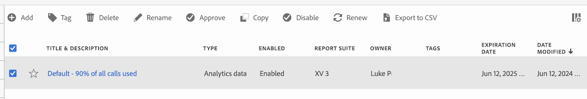

# Administración de alertas

Puede filtrar, etiquetar, eliminar, cambiar el nombre, copiar, habilitar, deshabilitar, renovar y exportar alertas desde una interfaz de administración central de [!UICONTROL Alerts]. Para administrar alertas:

* Seleccione **[!UICONTROL Componentes]** en la interfaz principal y luego seleccione **[!UICONTROL Alertas]**.

El Administrador de alertas está estructurado como [Administrador de segmentos](/help/components/segmentation/segmentation-workflow/seg-manage.md) y [Administrador de métricas calculadas](/help/components/calculated-metrics/workflow/cm-manager.md).

## Administrador de alertas

El Administrador de alertas tiene los siguientes elementos de interfaz:

### Lista de alertas

La lista de alertas ➊ muestra todas las alertas que posee, las alertas cuyo ámbito se ha asignado a todos sus proyectos y las alertas que se han compartido con usted. La lista tiene las siguientes columnas:

| Columna | Descripción |
|---|---|
|  | Seleccione para favorecer a  o para anular la preferencia de  sobre una alerta. |
| **[!UICONTROL Título y descripción]** | Para editar la alerta, seleccione el vínculo del título, que abre el [Generador de alertas](alert-builder.md#alert-builder). |
| **[!UICONTROL Tipo]** | El tipo de alerta: una alerta de datos de Adobe Analytics o una alerta de uso de llamadas al servidor. |
| **[!UICONTROL Habilitado]** | La alerta está habilitada o deshabilitada. |
| **[!UICONTROL Grupo de informes]** | Los grupos de informes a los que se aplica esta alerta. |
| **[!UICONTROL Propietario]** | El propietario de la alerta. Si no es el administrador, solo verá las alertas que le pertenecen o las que se han compartido con usted. |
| **[!UICONTROL Etiquetas]** | Las etiquetas de esta alerta. |
| **[!UICONTROL Fecha de caducidad]** | La fecha y hora en que la alerta está configurada para caducar. |
| **[!UICONTROL Fecha de modificación]** | La fecha y la hora de la última modificación de la alerta. |

<!-- 

When "Last used" column is added, add this information as the description: Shows the date when the alert was last used. 
This information can help you determine whether a component is valuable to users in your organization, where it is used, and if it needs to be deleted or modified.

Consider the following when viewing this column:
<ul><li>This information does not include usage from the API, Report Builder, or Data Warehouse.</li><li>For some components, this column might not contain data if the component was last used prior to September 2023.</li></ul>

-->

Usa  para especificar qué columnas deseas mostrar.

### Barra de acciones

Puede realizar acciones con las alertas mediante la barra de acciones ➋. La barra de acciones contiene las siguientes acciones:

| Icono | Acción | Descripción |
|:---:|---|---|
|  | **[!UICONTROL Agregue]** | Agregue otra alerta con el [Generador de alertas](alert-builder.md#alert-builder). |
|  | [!UICONTROL *Buscar por título*] | Cuando no se selecciona ninguna alerta en la lista, buscar alertas mediante este campo de búsqueda. |
|  | **[!UICONTROL Etiqueta]** | Etiquetar las alertas seleccionadas. En el cuadro de diálogo **[!UICONTROL Alerta de etiqueta]**, seleccione o anule la selección de las etiquetas de las alertas seleccionadas. Seleccione **[!UICONTROL Guardar]** para guardar las etiquetas de las alertas seleccionadas. |
|  | **[!UICONTROL Eliminar]** | Eliminar las alertas seleccionadas. Se te pedirá una confirmación. |
|  | **[!UICONTROL Cambiar el nombre]** | Cambiar el nombre de una alerta seleccionada. Cuando se selecciona, puede cambiar el nombre de la alerta en línea. |
|  | **[!UICONTROL Copiar]** | Copiar la alerta seleccionada. Las nuevas alertas se crean con el mismo nombre y sufijo `(Copy)`. |
|  | **[!UICONTROL Habilitar]** o **[!UICONTROL Deshabilitar]** | Activar o desactivar las alertas seleccionadas. |
|  | **[!UICONTROL Renovar]** | Renueva la fecha de caducidad de la alerta. La fecha de caducidad se extiende 1 año a partir del día en que seleccione esta opción, independientemente de la fecha de caducidad original. |
|  | **[!UICONTROL Exportar a CSV]** | Exportar las alertas a un archivo de `Alerts List.csv`. |

### Barra de filtro activa

La barra de filtros ➌ muestra los filtros activos aplicados desde el panel de filtros a la lista de alertas (si existe). Puedes quitar rápidamente un filtro con . Si se especifica más de un filtro, puedes quitar todos los filtros usando **[!UICONTROL Quitar todos]**.

### Panel Filtro

Puede filtrar la lista de alertas con el panel izquierdo  **[!UICONTROL Filtro]** ➍. El panel Filtro muestra el tipo de filtro y el número de alertas que respetan el filtro específico.

1. Selecciona  para abrir el panel Filtros. Si necesita más espacio para la lista Alertas, puede seleccionar  una vez más para cerrar el panel.
1. Seleccione filtros de cualquiera de las secciones de filtros disponibles.

#### Sección de filtro de etiquetas

{{tagfiltersection}}

#### Sección de filtro del grupo de informes

{{reportsuitefiltersection}}

#### Sección de filtro Propietarios

{{ownerfiltersection}}

#### Sección de filtro Estado habilitado

{{enabledstatusfiltersection}}

#### Sección de filtro Tipo

{{typefiltersection}}

#### Sección de filtro Otros filtros

{{otherfiltersfiltersection}}

## Editar alertas

Puede editar una alerta

* En la lista [[!UICONTROL Alerta]](#alerts-list), seleccione el título de la alerta.

Utiliza el [Generador de alertas](alert-builder.md#alert-builder) para editar la alerta.

## Solución de problemas de una alerta

Cuando solucione un problema con una alerta, proporcione el número JID (ID de instancia de trabajo) al Soporte de Adobe. El número JID se encuentra en la parte inferior de la notificación de alerta por correo electrónico que recibe.

<!--

# Manage alerts

You can manage existing alerts in the Alerts manager. You can perform various management tasks on alerts, such as tagging, renaming, deleting, and more.

The Alerts manager is structured very much like the [Segment Manager](/help/components/segmentation/segmentation-workflow/seg-manage.md) and the [Calculated Metric Manager](/help/components/calculated-metrics/calcmetric-workflow/cm-manager.md).

 

## Create alerts

To create alerts from the Alerts manager:

1. Select **[!UICONTROL Components]** > **[!UICONTROL Alerts]** to access the Alerts manager in Adobe Analytics.

   

1. Select [!UICONTROL **Add**] (or [!UICONTROL **Create new alert**] if you don't have any existing alerts).

1. Select the alert type that corresponds to the alert that you want to create:

   * [!UICONTROL **Analytics data alert**]: An alert to notify you when abnormal events occur in your data. 

     If you select this option, continue with [Create alerts](/help/components/alerts/alert-builder.md) for more details about creating alerts.

   * [!UICONTROL **Server call usage alert**]: An alert to notify you of the risk or occurrence of an overage in your server call consumption and commitment data. 

     If you select this option, continue with [Server call usage alerts](/help/admin/tools/server-call-usage/scu-alerts.md).

     >[!NOTE]
     >
     >You must be an Analytics administrator or a user with the Server call usage permission in order to have access to server call usage. 

## Manage existing alerts

You can perform various actions on existing alerts, such as tagging, renaming, deleting, and so forth.

To manage existing alerts in the Alerts manager:

1. Select **[!UICONTROL Components]** > **[!UICONTROL Alerts]** to access the Alerts manager in Adobe Analytics.

   

1. Select one or more alerts that you want to manage.

   

1. In the action bar, select any of the following options:

   | Action | Function | 
   |---------|----------|
   | [!UICONTROL **Tag**] | Apply a tag to an alert. This helps you to organize alerts for ease of use. | 
   | [!UICONTROL **Delete**] | Deletes the alert. | 
   | [!UICONTROL **Rename**] | Renames the alert. |
   | [!UICONTROL **Approve**] | Mark the alert as Approved. |
   | [!UICONTROL **Copy**] | Creates a copy (duplicate) of the alert. |
   | [!UICONTROL **Disable**] | Disables an alert that is currently enabled. |
   | [!UICONTROL **Enable**] | Enables an alert that is currently disabled. |
   | [!UICONTROL **Renew**] | Renews the alert expiration date. This extends the  expiration date to be 1 year from the day you selected this option, regardless of the original expiration date. |
   | [!UICONTROL **Export to CSV**] | Exports the alert to a .CSV file. |

## Edit an alert

To edit an existing alert:

1. Select **[!UICONTROL Components]** > **[!UICONTROL Alerts]** to access the Alerts manager in Adobe Analytics.

   

1. Select the alert name in the [!UICONTROL **Title and description**] column.

1. Edit the alert as desired. 

   Following are some of the things you can do when editing an alert:

   * Add alerts to other report suites
   * Add or modify the description
   * Modify the time granularity
   * Modify the recipients 
   * Modify the expiration date
   * Modify the metrics and filters

1. Select [!UICONTROL **Save**].

## Configure columns 

You can configure the information displayed for each alert in the Alerts manager by configuring the columns that are displayed.

To configure the visible columns in the Alerts manager:

1. In Adobe Analytics, select the **[!UICONTROL Components]** tab, then select **[!UICONTROL Alerts]**. 

1. In the Alert manager, select the **Customize columns** icon , then select the columns that you want to be displayed in the Alerts manager.

   The following columns are available:

   | Column title  | Description |
   |---|---|
   | Title and description | These values are provided in the Alert builder. To edit the title and description, select the title link to open the Alert builder.  |
   | Favorites  | Displays star icons next to each alert, allowing you to mark alerts as favorites. |
   | Type | Shows whether the alert is an Analytics data alert or a Server call usage alert. |
   | Enabled | Shows whether the alert is currently enabled or disabled. | 
   | Report suite | Indicates in which report suite the alert was last saved.  |
   | Owner | Indicates who owns the alert. As a non-admin, you can see only alerts you own or those that were shared with you.  |
   | Tags | Shows tags that were applied to the alert, either by you or by people who shared the alert with you.  |
   | Expiration date | Shows the date and time when the alert is set to expire. |
   | Date modified | Indicates the date when the alert was last modified.  |

   {style="table-layout:auto"}
   
   
    When "Last used" column is added, add this information as the description: Shows the date when the alert was last used. 
This information can help you determine whether a component is valuable to users in your organization, where it is used, and if it needs to be deleted or modified.

Consider the following when viewing this column:
<ul><li>This information does not include usage from the API, Report Builder, or Data Warehouse.</li><li>For some components, this column might not contain data if the component was last used prior to September 2023.</li></ul> 
   
-->

