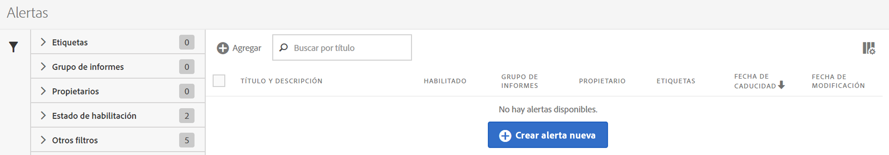
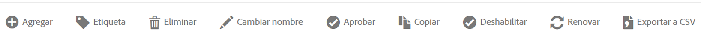

# Administrador de alertas

El Administrador de alertas (**[!UICONTROL Analytics]** > **[!UICONTROL Componentes]** > **[!UICONTROL Alertas]**) tiene una estructura muy similar al [Administrador de segmentos](https://docs.adobe.com/content/help/es-ES/analytics/components/segmentation/segmentation-workflow/seg-manage.html) y al [Administrador de métricas calculadas](https://docs.adobe.com/content/help/es-ES/analytics/components/calculated-metrics/calcmetric-workflow/cm-manager.html), y le permite hacer lo siguiente:

* Acceda al Generador de alertas haciendo clic en **[!UICONTROL + Añadir]**.
* Etiquetar alertas. Esto permite organizarlas para facilitar su uso.
* Eliminar alertas.
* Cambiar el nombre de alertas.
* Aprobar alertas.
* Copiar alertas.
* Habilitar/deshabilitar alertas.
* **Renovar** una fecha de caducidad para la alerta. Es posible renovar una o más alertas seleccionándolas y haciendo clic en **[!UICONTROL Renovar]**. Esto hace que su fecha de caducidad pase a ser 1 año desde el día en que se hace clic en **[!UICONTROL Renovar]**, fuera cual fuera la fecha de caducidad original.
* Exportar una alerta a un archivo .CSV.
* Editar alertas haciendo doble clic en su título.
* Buscar alertas.
* Añadir alertas a otros grupos de informes.
* Especificar/cambiar el propietario de una alerta.
* Añadir otros filtros.
* Definir una **fecha de caducidad** para la alerta.
