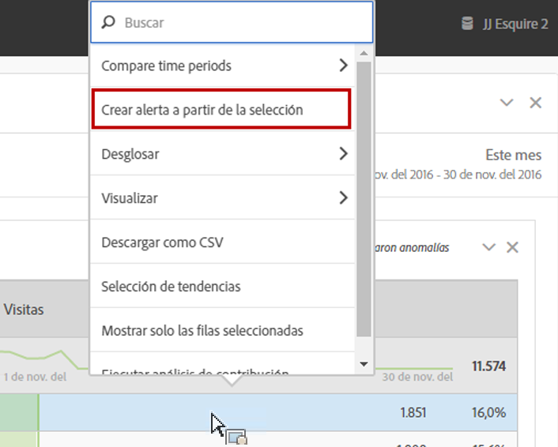
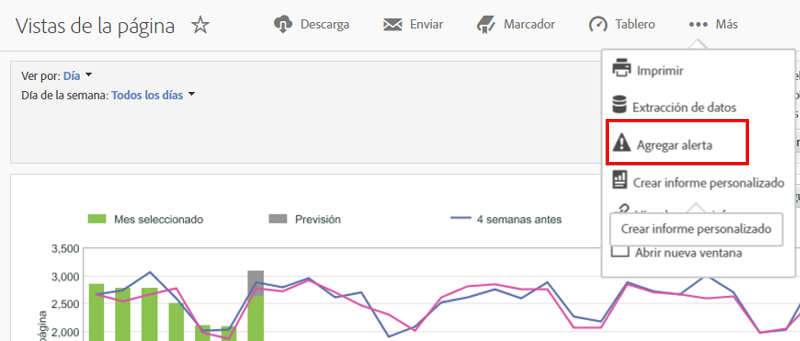

# Alertas inteligentes

El nuevo sistema Alertas inteligentes permite un control más granular sobre las alertas e integra la detección de anomalías en el sistema de alerta.

## Información general {#section_6AC8CA81DEA94E99B0F192B60D0FDF03}

>[!IMPORTANT]
>
>Las alertas inteligentes están disponibles solo para los clientes de Adobe [!DNL Analytics] Prime y Adobe [!DNL Analytics] Ultimate.

El nuevo Generador de alertas y el Administrador de alertas reemplazan la funcionalidad de alertas existente en Adobe [!DNL Analytics]. Las alertas inteligentes le permiten

* Generar alertas en función de anomalías (umbrales del 90 %, 95 %, 99 %, 99,75 % y 99,9 %; cambio de %; por encima/por debajo).
* Obtener una vista previa de la frecuencia con la que se activará una alerta.
* Enviar alertas por correo electrónico o SMS con vínculos a proyectos de Analysis Workspace autogenerados.
* Crear alertas “apiladas” que capturan varias métricas en una sola alerta.

Los componentes del nuevo sistema de alerta incluyen: Generador de alertas, Administrador de alertas, Vista previa de alertas y un mejor acceso en contexto para la creación de alertas. La interfaz de usuario del sistema de alertas anterior ya no estará disponible, pero las alertas se migrarán. Algunas de las funcionalidades de alerta heredadas [ya no estarán disponibles](https://docs.adobe.com/content/help/es-ES/analytics/analyze/reports-analytics/alerts.html).

Hay cuatro formas en las que puede acceder al Generador de alertas:

* Mediante el acceso directo siguiente en Analysis Workspace:

   `ctrl (or cmd) + shift + a`
* Seleccione directamente el Generador de alertas: **[!UICONTROL Workspace]** > **[!UICONTROL Componentes]** > **[!UICONTROL Alerta nueva]** .
* Seleccione uno o más elementos de línea de la tabla improvisada, haga clic con el botón derecho y seleccione **[!UICONTROL Crear alerta a partir de la selección]**. De esta forma se abrirá el Generador de alertas, que se rellenará con las métricas y filtros adecuados aplicados a partir de la tabla. A continuación, puede editar la alerta si fuera necesario.

   

* Desde un informe de [!UICONTROL Reports &amp; Analytics], vaya a **[!UICONTROL Más]** > **[!UICONTROL Agregar alerta]**. De esta forma se abrirá el nuevo Generador de alertas, que se rellenará con las métricas y filtros adecuados aplicados a partir del informe. A continuación, puede editar la alerta si fuera necesario.

   

## Preguntas más frecuentes: Cómo se calculan y activan las alertas {#section_1F3B1DAF21784306953B49AAD4C3DCAB}

Los porcentajes de umbral son desviaciones estándar. Por ejemplo, 95 % = 2 desviaciones estándar y 99 % = 3 desviaciones estándar. En función de la granularidad de tiempo que seleccione, se emplean [distintos modelos](/help/analyze/analysis-workspace/virtual-analyst/c-anomaly-detection/statistics-anomaly-detection.md) para calcular cuánto se aleja (cuántas desviaciones estándar tiene) cada punto de datos respecto a la norma. Si establece un umbral más bajo (por ejemplo, 90 %), obtendrá más anomalías que con otro más alto (99 %). Los umbrales 99,75 % y 99,99 % se introdujeron específicamente para la granularidad horaria, de modo que no se activen tantas anomalías.

<table id="table_B3AA85E1DE3543DCA34966A52E3CE4AB"> 
 <thead> 
  <tr> 
   <th colname="col1" class="entry"> Pregunta </th> 
   <th colname="col2" class="entry"> Respuesta </th> 
  </tr> 
 </thead>
 <tbody> 
  <tr> 
   <td colname="col1"> 
<b>P: ¿Hasta dónde se remonta la detección de anomalías de una alerta para determinar anomalías de datos?</b> 
 </td> 
   <td colname="col2"> 
El periodo de aprendizaje varía en función de la granularidad seleccionada. Consulte Técnicas estadísticas utilizadas en la <a href="/help/analyze/analysis-workspace/virtual-analyst/c-anomaly-detection/statistics-anomaly-detection.md">detección de anomalías</a> para obtener más información. Aquí tiene un resumen: 
 
    <ul id="ul_4F8C2A41F06C498DBF5E7AE5DE803773"> 
     <li id="li_E246091A3F1E484C8444AF4052FCA784">Mensual = 15 meses + el mismo intervalo del año anterior </li> 
     <li id="li_CC014FB38AE1492B9647E990C29BFB3C">Semanal = 15 semanas + el mismo intervalo del año anterior </li> 
     <li id="li_2517EE2097534324BE9C1B54CD181A62">Diaria = 35 días + el mismo intervalo del año anterior </li> 
     <li id="li_710BC8B009354542AA4962A59A646099">Horaria = 336 horas </li> 
    </ul> </td> 
  </tr> 
  <tr> 
   <td colname="col1"> 
<b>P: Si quiero que se me alerte en caso solo de un descenso o solo de un pico en el comportamiento, ¿puedo utilizar la función de anomalías o es preciso emplear un valor absoluto?</b> 
 </td> 
   <td colname="col2"> 
Utilizar un valor absoluto seguiría activando alertas tanto en los descensos como en los picos. No es posible aislar las alertas para diferenciar descensos y picos. 
 </td> 
  </tr> 
  <tr> 
   <td colname="col1"> 
<b>P: ¿Puedo configurar las alertas para que se activen solo durante determinadas horas del día (por ejemplo, en horario laboral o fuera del horario laboral)? </b> 
 </td> 
   <td colname="col2"> 
En estos momentos, no. 
 </td> 
  </tr> 
  <tr> 
   <td colname="col1"> 
<b>P: ¿Se puede obtener una tabla de los “valores esperados” que forman la línea de puntos, o hay alguna forma de saber cuáles son esos valores? </b> 
 </td> 
   <td colname="col2"> 
No en Workspace, pero es posible en el Report Builder (consulte este vídeo acerca de <a href="https://docs.adobe.com/content/help/es-ES/analytics-learn/tutorials/exporting/report-builder/anomaly-detection-in-report-builder.html"  >Detección de anomalías en el Report Builder </a>). 
 
Tenga en cuenta que el Report Builder emplea métodos de detección de anomalías menos sofisticados. Utiliza un periodo de formación de 30 días fijo, con un intervalo fijo del 95 %. 
 </td> 
  </tr> 
 </tbody> 
</table>
