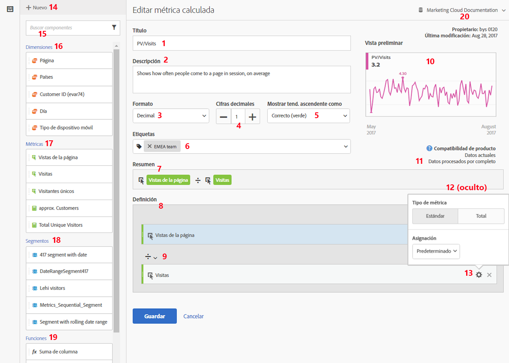
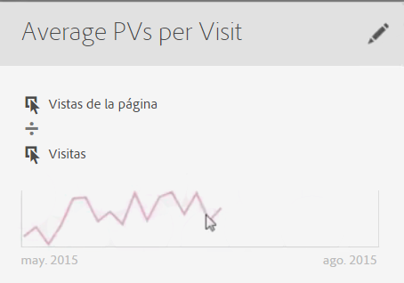

# Crear métricas

El Creador de métricas calculadas proporciona un lienzo en el que arrastrar y soltar dimensiones, métricas, segmentos y funciones para crear métricas personalizadas basadas en lógica de jerarquía de contenedor, reglas y operadores. Esta herramienta de desarrollo integrada le permite crear y guardar métricas calculadas simples o métricas calculadas avanzadas complejas.

Existen varias formas de acceder al Creador de métricas calculadas:

* In Analysis Workspace, open a project and click  **[!UICONTROL + New]** &gt; **[!UICONTROL Create Metric]** .
* In [!DNL Analytics], go to **[!UICONTROL Components]** &gt; **[!UICONTROL Calculated Metrics]**.

* Click **[!UICONTROL + Add]** at the top of the [Calculated Metric Manager](../../../../../components/c-calcmetrics/c-workflow/cm-workflow/cm-manager.md#concept_BA6815CB06D842D5825766396B691653), or

* Go to **[!UICONTROL Analytics]** &gt; **[!UICONTROL Reports]**, open any report and click the Metrics icon   to bring up the Metrics rail, then click **[!UICONTROL Add]**.

## Componentes de la interfaz de usuario {#section_9382AEEBA4244DD6A9F6C1DD3F6D076B}

<table id="table_60A82936321047D1A335331BF83B0972"> 
 <thead> 
  <tr> 
   <th colname="col2" class="entry"> Campo </th> 
   <th colname="col3" class="entry"> Descripción </th> 
  </tr> 
 </thead>
 <tbody> 
  <tr> 
   <td colname="col2">  Título  </td> 
   <td colname="col3"> 
Es obligatorio nombrar la métrica. No puede guardar la métrica a menos que tenga un nombre. 
 </td> 
  </tr> 
  <tr> 
   <td colname="col2">  Descripción  </td> 
   <td colname="col3"> 
Proporciónele una descripción descriptiva que indique para qué se utiliza y para distinguirla de métricas similares. 
 
La descripción también aparece en el informe. Se recomienda NO añadir la fórmula en la descripción; en su lugar, describa para qué se debe o no utilizar la métrica. (La fórmula se genera a medida que crea la métrica, debajo del encabezado del Resumen. Como resultado, no hay necesidad de agregar la fórmula a la descripción). 
 </td> 
  </tr> 
  <tr> 
   <td colname="col2">  Formato  </td> 
   <td colname="col3"> 
Las opciones incluyen Decimal, Hora, Porcentaje y Moneda. 
 </td> 
  </tr> 
  <tr> 
   <td colname="col2">  Lugares decimales  </td> 
   <td colname="col3"> 
Muestra cuántos lugares decimales se mostrarán en el informe. El número máximo de lugares decimales que puede especificar es 10. 
 </td> 
  </tr> 
  <tr> 
   <td colname="col2">  Mostrar tendencia ascendente como...  </td> 
   <td colname="col3"> 
Este ajuste de polaridad de métrica muestra si [! DNL Analytics] debe considerar una tendencia ascendente en la métrica como buena (verde) o mala (rojo). Como resultado, el gráfico del informe se mostrará en rojo o en verde cuando vaya hacia arriba. 
 </td> 
  </tr> 
  <tr> 
   <td colname="col2">  Etiquetas  </td> 
   <td colname="col3"> 
Etiquetar es una buena forma de organizar las métricas. Todos los usuarios pueden crear etiquetas y aplicar una o más a una métrica. Sin embargo, solo verá las etiquetas de los segmentos que sean suyos o que se hayan compartido con usted. ¿Qué tipo de etiquetas debería crear? A continuación encontrará una serie de sugerencias para crear etiquetas útiles: 
     <ul id="ul_9A6CE5F179424687A39F2D5C1A953258"> 
      <li id="li_A8815F2D8D284874AD701A7B103D82A3">Etiquetas basadas en <b>nombres de equipos</b>, como Marketing social o Marketing móvil. </li> 
      <li id="li_A51A4515A541488E9D90296A955E9F4F">Etiquetas de <b>proyectos</b> (etiquetas de análisis), como análisis de páginas de entrada. </li> 
      <li id="li_B4605470A7094026AC168420B64BBCC3">Etiquetas de <b>categorías</b>: para hombres, geografía. </li> 
      <li id="li_B6EAB0F2A96C41209C4EC97B9E64390B">Etiquetas de <b>flujo de trabajo</b>: pendiente de aprobación, conservado para (una unidad empresarial específica). </li> 
     </ul> 
 </td> 
  </tr> 
  <tr> 
   <td colname="col2">  Resumen  </td> 
   <td colname="col3"> 
La fórmula de Resumen se actualiza cada vez que realice cambios en la definición de la métrica. Esta fórmula también se muestra en el carril de métrica a la izquierda, al pasar el ratón por encima de una métrica y hacer clic en el icono . 
 </td> 
  </tr> 
  <tr> 
   <td colname="col2">  Definición  </td> 
   <td colname="col3"> 
Aquí es donde arrastra las métricas/métricas calculadas, segmentos o funciones para crear la métrica calculada. 
 
 
     <ul id="ul_B13401A266354DC594C6176025DB61CB"> 
      <li id="li_01776C32C7C5440AA1F847096CBED92B">Si arrastra una métrica calculada, ampliará su definición de métrica automáticamente. </li> 
      <li id="li_A483D352522E4572AB43042473053359">Puede anidar definiciones en contenedores. Sin embargo, a diferencia de los contenedores de segmento, estos contenedores funcionan como una expresión matemática y determinan el orden de las operaciones. </li> 
     </ul> 
 </td> 
  </tr> 
  <tr> 
   <td colname="col2">  Operador  </td> 
   <td colname="col3"> 
Dividido entre (  ) es el operador predeterminado, además de los operadores +, - y x. 
 </td> 
  </tr> 
  <tr> 
   <td colname="col2">  Vista previa  </td> 
   <td colname="col3"> 
Proporciona una lectura rápida de cualquier posible error. La vista previa abarca los últimos 90 días. Esta es una forma de calibrar inicialmente si ha seleccionado los componentes adecuados para su métrica. Un resultado inesperado significaría que debe volver a revisar la definición de la métrica. 
 </td> 
  </tr> 
  <tr> 
   <td colname="col2">  Compatibilidad del producto  </td> 
   <td colname="col3"> 
La compatibilidad del producto le muestra si la métrica es compatible con los <a href="https://marketing.adobe.com/resources/help/en_US/reference/data_latency.html" format="https" scope="external">Datos actuales</a>, con los Datos completamente procesados o solo con los informes del Canal de marketing (asignación de primer toque). 
Nota: Datos actuales no es compatible con todas las métricas. Las métricas que contienen segmentos o funciones no son compatibles con los datos actuales. <a href="../../../../../components/c-calcmetrics/cm-compatibility.md#concept_906480DEBEEC4D279BBBBD4CE7DFE70C" format="dita" scope="local">Más...</a> 
 
 </td> 
  </tr> 
  <tr> 
   <td colname="col2">  Agregar  </td> 
   <td colname="col3"> 
Puede añadir contenedores y números estáticos a la definición de todos los tipos de métricas calculadas. Para obtener métricas calculadas avanzadas, también puede añadir segmentos y funciones. 
 
 
     <ul id="ul_607C1B303F334062BC620317667DE490"> 
      <li id="li_53462789B8AF4F1AA9B45565D37CF22B">Los contenedores funcionan como una expresión matemática y determinan el orden de las operaciones. Así, cualquier cosa que se encuentre en un contenedor se procesará antes de la operación siguiente. </li> 
      <li id="li_401A9E0D8B3B468990289DBF66A06F63">Al arrastrar un segmento a un contenedor, se segmenta todo lo que se encuentra en dicho contenedor (solo métricas calculadas avanzadas). </li> 
      <li id="li_F191B200D7A944F9ADC0573A9A82A6DA">Puede apilar múltiples segmentos en un contenedor. </li> 
     </ul> 
 </td> 
  </tr> 
  <tr> 
   <td colname="col2"> Icono de engranaje (Tipo de métrica, Atribución ) </td> 
   <td colname="col3"> 
Selecting the gear icon next to a metric lets you specify the <a href="../../../../../components/c-calcmetrics/c-workflow/cm-workflow/c-build-metrics/m-metric-type-alloc.md#concept_B7A1FCFEFA9D4C4883208ACE8C9C8E5E" format="dita" scope="local"> metric type and attribution models </a>. 
 </td> 
  </tr> 
  <tr> 
   <td colname="col2">  + Nuevo  </td> 
   <td colname="col3"> 
Le permite crear un nuevo componente, como un nuevo segmento (que le dirige al <a href="https://marketing.adobe.com/resources/help/en_US/analytics/segment/seg_build_ui.html" format="https" scope="external">creador de segmentos</a>). 
 </td> 
  </tr> 
  <tr> 
   <td colname="col2"> 
Buscar componentes 
 </td> 
   <td colname="col3"> 
En esta barra de búsqueda puede buscar dimensiones, métricas, segmentos (solo métricas calculadas avanzadas) y funciones (solo métricas calculadas avanzadas). 
 </td> 
  </tr> 
  <tr> 
   <td colname="col2"> 
Lista de dimensiones 
 </td> 
   <td colname="col3"> 
En lugar de salir del creador de métricas calculadas para generar un segmento simple (en el creador de segmentos), como “Página = Página principal”, puede arrastrar Página y seleccionar Página principal directamente en el creador de métricas calculadas. 
 
Esto conlleva un flujo de trabajo mucho más simplificado en lo relativo a la creación de métricas calculadas segmentadas. 
 </td> 
  </tr> 
  <tr> 
   <td colname="col2"> 
Lista de métricas 
 </td> 
   <td colname="col3"> 
Las métricas se dividen en 3 categorías: 
 
    <ul id="ul_7BF50F4964EF45858FBA1634FBFA45CF"> 
     <li id="li_90F2312927A6499CA1CE04F8FFC912CF">Métricas estándar ( ) </li> 
     <li id="li_A3F59083E79B4AC780D6F8CEDFFD20C9">Métricas calculadas ( ) </li> 
     <li id="li_8735E76637ED4C3F983731A66E04C93E">Plantillas de métricas (), al final de la lista. </li> 
    </ul> 
Cuando pasa el ratón por encima de una métrica, puede ver el icono de información a su derecha: . Si hace clic en este icono, le proporcionará la siguiente información: 
 
    <ul id="ul_DF35DDB9FBFA40C8A93FA0F2286A0BBE"> 
     <li id="li_4215AA9BF93F4C8B941002A7A4D2F50B">La fórmula de cómo se calcula. </li> 
     <li id="li_6A8E39EB6DCE4377B0B594B6D4FC0294">Una vista previa de la tendencia de la métrica. </li> 
     <li id="li_44C1595E4BE64ED69D1DB3BB6655ED55">Un icono de edición (lápiz) en la parte superior derecha que le conducirá al Generador de métricas calculadas donde puede editar esta métrica calculada. </li> 
    </ul> 
 
 </td> 
  </tr> 
  <tr> 
   <td colname="col2"> 
Lista de segmentos 
 </td> 
   <td colname="col3"> 
(Solo métricas calculadas avanzadas) Como administrador, en esta lista se muestran todos los segmentos creados en su empresa de inicio de sesión. Si es un usuario no administrador, en esta lista se muestran los segmentos que le pertenecen y los que han compartido con usted. <a href="https://marketing.adobe.com/resources/help/en_US/analytics/segment/seg_rights.html" format="https" scope="external">Más...</a> 
 </td> 
  </tr> 
  <tr> 
   <td colname="col2"> 
Lista de funciones 
 </td> 
   <td colname="col3"> 
(Solo métricas calculadas avanzadas) Las funciones se dividen en dos listas: <a href="../../../../../components/c-calcmetrics/cm-reference/cm-functions.md#concept_E3022D5EEEE145B69A23438BAF7016B2" format="dita" scope="local"> Básico </a> (utilizado con más frecuencia) y <a href="../../../../../components/c-calcmetrics/cm-reference/cm-adv-functions.md#concept_A5FB9127D70F4E1AA02D1ACBF4F54174" format="dita" scope="local"> Avanzado </a>. 
 </td> 
  </tr> 
  <tr> 
   <td colname="col2"> 
Selector de grupos de informes 
 </td> 
   <td colname="col3"> 
Le permite cambiar a un grupo de informes distinto. 
 </td> 
  </tr> 
 </tbody> 
</table>

