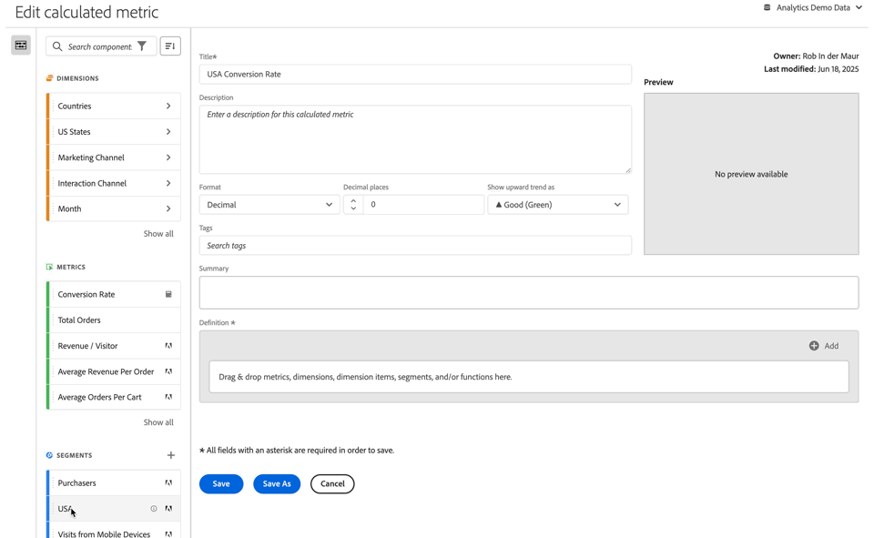

# Crear métricas calculadas {#build-metrics}

Adobe Analytics proporciona un lienzo para arrastrar y soltar dimensiones, métricas, segmentos y funciones para crear métricas personalizadas basadas en lógica de jerarquía de contenedores, reglas y operadores. Esta herramienta de desarrollo integrada le permite crear y guardar métricas calculadas simples o complejas.

Puede usar el creador de métricas calculadas para crear o editar métricas calculadas. Cuando se crean de esta manera, las métricas calculadas están disponibles en la lista de componentes y, a continuación, se pueden utilizar en proyectos de toda la organización. También puede crear rápidamente una métrica calculada que esté disponible solamente para el proyecto en el que se creó, tal como se describe en [Crear métricas calculadas para un solo proyecto](/help/analyze/analysis-workspace/components/apply-create-metrics.md#create-calculated-metrics-for-a-single-project) en [Métricas](/help/analyze/analysis-workspace/components/apply-create-metrics.md).

[Crear una métrica calculada](../cm-workflow.md) describe las diferentes opciones disponibles para crear una nueva métrica calculada.

## Áreas del creador de métricas calculadas

El cuadro de diálogo **[!UICONTROL Generador de métricas calculadas]** se usa para crear anotaciones nuevas o editar las existentes. El cuadro de diálogo se titula **[!UICONTROL Nueva métrica calculada]** o **[!UICONTROL Editar métrica calculada]** para las anotaciones que cree o administre desde el administrador de [[!UICONTROL Métricas calculadas]](../cm-manager.md).

>[!BEGINTABS]

>[!TAB Generador de métricas calculadas]

>[!TAB Crear o editar métricas calculadas]

>[!ENDTABS]

1. Especifica los siguientes detalles ( es obligatorio):

   | Elemento | Descripción |
   | --- | --- |
   | **[!UICONTROL Grupo de informes]** | Puede seleccionar el grupo de informes para la métrica calculada.  La métrica calculada que defina estará disponible en los proyectos de Workspace en función del grupo de informes seleccionado. |
   | **[!UICONTROL Métrica solo de proyecto]** | Aparece un cuadro de información en la parte superior de este cuadro de diálogo cuando edita una métrica calculada que se creó para un solo proyecto, como se describe en [Crear métricas calculadas para un solo proyecto](/help/analyze/analysis-workspace/components/apply-create-metrics.md#create-calculated-metrics-for-a-single-project). 
Si desea que esta métrica calculada esté disponible para todos los proyectos, seleccione la opción **[!UICONTROL Poner esta métrica a disposición de todos los proyectos y agregarla a la lista de componentes]**.
 |
   | **[!UICONTROL Título]**  | Asigne una métrica calculada, como por ejemplo `Conversion Rate`. |
   | **[!UICONTROL Descripción]** | Proporcione una descripción para el segmento, por ejemplo, `Calculated metric to define the conversion rate.`. No es necesario describir la fórmula para la métrica calculada, dado que la fórmula ya está disponible automáticamente en [!UICONTROL Resumen]. |
   | **[!UICONTROL Formato]** | Seleccione un formato para la métrica calculada: puede elegir entre **[!UICONTROL Decimal]**, **[!UICONTROL Hora]**, **[!UICONTROL Porcentaje]** y **[!UICONTROL Moneda]**. |
   | **[!UICONTROL Cifras decimales]** | Especifique el número de decimales para el formato seleccionado. Solo se habilita cuando el formato seleccionado es Decimal, Moneda y Porcentaje. |
   | **[!UICONTROL Mostrar tend ascendente como]** | Especifique si una tendencia al alza de la métrica calculada se muestra como ▲ **[!UICONTROL Buena (verde)]** o como ▼ **[!UICONTROL Mala (rojo)]**. |
   | **[!UICONTROL Moneda]** | Especifique la moneda de la métrica calculada. Solo se habilita cuando el formato seleccionado es Moneda. |
   | **[!UICONTROL Etiquetas]** | Organice la métrica calculada creando o aplicando una o varias etiquetas. Empiece a escribir para buscar las etiquetas existentes que puede seleccionar. O presione **[!UICONTROL Entrar]** para agregar una etiqueta nueva. Selecciona  para quitar una etiqueta. |
   | **[!UICONTROL Vista previa]** | La vista previa abarca los últimos 90 días y es una forma de medir si ha definido la métrica correctamente. |
   | **[!UICONTROL Resumen]** | Muestra un resumen de la definición de la métrica calculada.  Por ejemplo:  **[!UICONTROL Pedidos totales]**   **[!UICONTROL Sesiones]**. |
   | **[!UICONTROL Definición]**  | Defina su segmento con el [Generador de definiciones](#definition-builder). |

1. Para comprobar si la definición de la métrica calculada es correcta, use la **[!UICONTROL Vista previa]** actualizada constantemente de los resultados de la métrica calculada. La **[!UICONTROL vista previa]** abarca los últimos 90 días y evalúa la definición de su métrica calculada de manera continua.

   La **[!UICONTROL compatibilidad del producto]** indica la compatibilidad de la métrica calculada con las funcionalidades de Adobe Analytics. Consulte [Compatibilidad de la métrica](/help/components/c-calcmetrics/cm-compatibility.md) para obtener más información.

1. Seleccione lo siguiente:
   * Selecciona **[!UICONTROL Guardar]** para guardar la métrica calculada.
   * **[!UICONTROL Guardar como]** para guardar una copia de la métrica calculada.
   * **[!UICONTROL Cancelar]** para cancelar los cambios realizados en una anotación o cancelar la creación de una nueva métrica calculada.

## Generador de definiciones

Utilice el generador de definiciones para arrastrar y soltar dimensiones, métricas, segmentos y funciones para crear métricas personalizadas basadas en lógica de jerarquía de contenedor, reglas y operadores. En esa construcción, puede utilizar métricas estándar, métricas definidas por Adobe, métricas calculadas, segmentos, dimensiones y funciones. Todos estos componentes están disponibles en el panel de componentes del generador de métricas calculadas. Además, puede utilizar operadores y contenedores en la definición.

Solo las métricas se definen como componentes singulares en el área **[!UICONTROL Definición]**. Todos los demás componentes se definen como un contenedor, métricas de ajuste u otros contenedores. Consulte [Detalles de conexión](#containers) para obtener más información.

### Métricas

Para añadir una métrica:

* Arrastre y suelte un componente  **[!UICONTROL Métricas]** del panel de componentes en **[!UICONTROL Arrastre y suelte aquí métricas, dimensiones, elementos de dimensión, filtros o funciones]**. Puede usar  en la barra de componentes para buscar componentes específicos.

Cuando se utiliza una métrica calculada como parte de la definición, la métrica calculada se expande.

Para reemplazar una métrica:

1. Seleccione  en un componente de métrica en el área de **[!UICONTROL Definición]**.
1. En el cuadro de diálogo emergente puede definir el tipo de métrica y un modelo de atribución. Consulte [Tipo de métrica y atribución](m-metric-type-alloc.md)

Para eliminar una métrica:

* Seleccione  en la métrica.

### Operadores

Los operadores permiten especificar el operador entre componentes o contenedores. Los operadores aparecen automáticamente entre

* dos o más métricas en un contenedor,
* dos o más contenedores en un contenedor,
* una o más métricas y uno o más contenedores en un contenedor.

Puede seleccionar:

| Símbolo | Operador |
|:---:|---|
|  | Dividir (predeterminado) |
|  | Multiplicar |
|  | Restar |
|  | Agregar |

### Número estático

Puede añadir un número estático a la definición de métrica calculada. Para añadir un número estático:

* Seleccione  **[!UICONTROL Añadir]** desde un contenedor.
* Seleccione **[!UICONTROL Número estático]**. Aparece un contenedor de número estático.
* Seleccione [!UICONTROL *Haga clic para añadir un valor*] y escriba un valor.

### Contenedores

Las dimensiones, los segmentos y las funciones se añaden como contenedores a una definición de métrica calculada. También puede añadir un contenedor genérico. Los contenedores funcionan como una expresión matemática y determinan el orden de las operaciones. Cualquier elemento dentro de un contenedor se procesa antes que el siguiente componente o contenedor.

#### Contenedor de segmentos

Utiliza el concepto de contenedor de segmentos para crear una [métrica segmentada](metrics-with-segments.md). Puede construir un contenedor de segmentos utilizando un segmento o un segmento que cree a partir de una dimensión.

* Para añadir un contenedor de segmentos a partir de una dimensión:

   1. Arrastre y suelte un componente  **[!UICONTROL Dimensiones]** del panel de componentes hasta **[!UICONTROL Arrastrar y soltar aquí métricas, dimensiones, elementos de dimensión, segmentos o funciones]**. Puede utilizar la  en la barra de componentes para buscar componentes específicos.
   1. En la ventana emergente **[!UICONTROL Crear segmento a partir de la dimensión]**, defina la condición del segmento. Seleccione en la lista de operadores y seleccione o introduzca un valor. Por ejemplo, **[!UICONTROL Mes]** **[!UICONTROL es igual a]**  `Sep 2024`.
   1. Seleccione **[!UICONTROL Listo]**. Se ha añadido un contenedor de segmentos a la **[!UICONTROL Definición]**.

* Para añadir un contenedor de segmentos desde un filtro, puede utilizar:

   * Arrastre y suelte un componente  **[!UICONTROL Segmentos]** del panel de componentes hasta **[!UICONTROL Arrastrar y soltar aquí métricas, dimensiones, elementos de dimensión, segmentos o funciones]**. Puede utilizar la  en la barra de componentes para buscar segmentos específicos.
Se añade automáticamente un contenedor de segmentos a la **[!UICONTROL Definición]**, con el nombre del segmento.

   * Arrastre y suelte el componente  **[!UICONTROL Segmento]** del panel de componentes en un contenedor genérico. El contenedor se modifica para convertirse en un contenedor de segmentos.

   * Seleccione  **[!UICONTROL Añadir]** desde un contenedor:

      1. Seleccione **[!UICONTROL Segmento]**. Se ha añadido un contenedor de segmentos a la **[!UICONTROL Definición]**.
      1. En el nuevo contenedor de segmento, seleccione un segmento en el menú desplegable [!UICONTROL *Seleccionar...*].

  >[!TIP]
  >
  >Puede añadir más de un segmento a un contenedor.

  Los segmentos del contenedor reciben el nombre del componente de segmento. Por ejemplo,  **[!UICONTROL Sesiones web]**. Seleccione  para mostrar una ventana emergente con más detalles sobre el segmento. En la ventana emergente, seleccione  para editar la definición del segmento.

Para quitar un segmento de un contenedor:

* Seleccione  junto al nombre del segmento.

Consulte [Métricas segmentadas](metrics-with-segments.md) para obtener más detalles y ejemplos.

#### Contenedor de funciones

Para añadir un contenedor de funciones, puede utilizar:

* Arrastrar y soltar:

   1. Arrastre y suelte un componente  **[!UICONTROL Funciones]** del panel de componentes hasta **[!UICONTROL Arrastrar y soltar aquí métricas, dimensiones, elementos de dimensión, filtros o funciones]**. Puede utilizar la  en la barra de componentes para buscar funciones específicas.
   1. Se añade automáticamente un contenedor de funciones a la **[!UICONTROL Definición]** utilizando el nombre de la función.

* Seleccione  **[!UICONTROL Añadir]** desde un contenedor:

   1. Seleccione **[!UICONTROL Función]**.
   1. En el contenedor, seleccione una función en el menú desplegable [!UICONTROL *Seleccionar...*].

El contenedor de funciones recibe el nombre del componente de funciones. Por ejemplo,  **[!UICONTROL SQUARE ROOT (métrica)]**. Seleccione  para mostrar una ventana emergente con más detalles sobre la función. Seleccione **[!UICONTROL Más información]** para obtener más información sobre la función.

Consulte [Uso de funciones](cm-using-functions.md) para obtener detalles sobre cómo utilizar funciones y qué funciones están disponibles para crear una métrica calculada.

#### Contenedor genérico

Para añadir un contenedor genérico:

* Seleccione  **[!UICONTROL Añadir]** desde un contenedor
* Seleccione **[!UICONTROL Contenedor]**. Se añade un nuevo contenedor genérico vacío a la **[!UICONTROL Definición]**. Puede utilizar un contenedor genérico para anidar o crear una jerarquía en la definición de la métrica calculada.

#### Eliminación de un contenedor

Para eliminar un contenedor, seleccione  en el nivel de contenedor.

>[!MORELIKETHIS]
>
>[Uso de funciones](cm-using-functions.md)
>>[Segmentos](/help/components/segmentation/seg-overview.md)
>

<!--

Adobe Analytics provides a canvas to drag and drop dimensions, metrics, segments, and functions to create custom metrics based on container hierarchy logic, rules, and operators. This integrated development tool lets you build and save simple or complex calculated metrics.

## Begin building a calculated metric

You can use the calculated metric builder to create or edit calculated metrics. When created in this way, calculated metrics are available in the component list and can then be used in projects throughout your organization. Alternatively, you can quickly create a calculated metric that is available only for the project where it was created, as described in [Create calculated metrics for a single project](/help/analyze/analysis-workspace/components/apply-create-metrics.md#create-calculated-metrics-for-a-single-project) in [Metrics](/help/analyze/analysis-workspace/components/apply-create-metrics.md).

Access the calculated metric builder to begin creating a calculated metric that is available in the component list. 

1. Access the calculated metric builder in any of the follows ways:

   * In Analysis Workspace, open a project, then select **[!UICONTROL Components]** > **[!UICONTROL Create metric]**.
   * In Analysis Workspace, open a project, then select the **Plus** icon next to the [!UICONTROL **Metrics**] section in the left rail.
   * In [!DNL Adobe Analytics], go to **[!UICONTROL Components]** > **[!UICONTROL Calculated metrics]**, then select **[!UICONTROL + Add]** at the top of the Calculated metrics page.

1. Continue with [Areas of the calculated metric builder](#areas-of-the-calculated-metrics-builder).

## Areas of the Calculated metrics builder

The following image and accompanying table explain some of the main areas and features of the Calculated metrics builder.

| Location in image  | Name and function  |
|---|---|
| 1 | **Title:** Naming the metric is mandatory. You cannot save the metric unless it is named.  |
| 2 | **Description:** Give it a user-friendly description to show what it's used for and to distinguish it from similar ones. 
The description also appears within a report. It's best NOT to put the formula into the description - instead, describe what this metric should and should not be used for. (The formula is generated as you build the metric, underneath the Summary heading. As a result, there is no need to add the formula to the description.) 
  |
| 3 | **Format:** Choices include Decimal, Time, Percent, and Currency.  |
| 4 | **Decimal Places:** Shows how many decimal places will be shown in the report. The maximum number of decimal places you can specify is 10.  |
| 5| **Show Upward Trend As:** This metric polarity setting shows whether Analytics should consider an upward trend in the metric as good (green) or bad (red). As a result, the report's graph will show as green or red when it's going up.  |
| 6 | **Tags:** Tagging is a good way to organize metrics. All users can create tags and apply one or more tags to a metric. However, you can see tags only for those segments that you own or that have been shared with you. What kinds of tags should you create? Here are some suggestions for useful tags:<ul><li>**Team names**, such as Social Marketing, Mobile Marketing.</li><li>**Projects** (analysis tags), such as Entry-page analysis.</li><li>**Categories**, such as Women's; Geography.</li><li>**Workflows**, such as To be approved; Curated for (a specific business unit)</li></ul> |
| 7 | **Summary:** 
The Summary formula updates anytime you make a change to the metric definition. This formula also shows up in the metrics rail on the left when you hover over a metric and click the  icon. 
  |
| 8 | **Definition:** This is where you drag in metrics/calculated metrics, segments, and/or functions to build the calculated metric. <ul><li>If you drag in a calculated metric, it will expand its metric definition automatically. </li> <li>You can nest definitions with containers. However, unlike segment containers, these containers function like a math expression and determine the order of operations. </li> </ul>  |
| 9 | **Operator:** Divided by (  ) is the default operator, plus there are the +, -, and x operators. |
| 10 | **Preview:** Provides a quick read on any possible errors. The preview covers the last 90 days. This is a way of initially gauging whether you have selected the right components for your metric. An unexpected result would mean you need to take a second look at the metric definition.  |
| 11 | **Product compatibility:** Product compatibility shows you whether the metric is compatible with <a href="https://experienceleague.adobe.com/docs/analytics/analyze/reports-analytics/current-data.html?lang=es"  > Current Data </a>, with Fully Processed Data, or only with Marketing Channel reports (first-touch allocation). 
Note:  Current Data does not support all metrics. Metrics that contain segments or functions are not compatible with current data. <a href="/help/components/c-calcmetrics/cm-compatibility.md"  > More... </a> 
 
  |
| 12 | **Add:** For all types of calculated metrics, you can add containers and static numbers to the definition. For advanced calculated metrics, you can also add segments and functions. <ul><li>Containers function like a math expression and determine the order of operations. So anything in a container will get processed before the next operation.</li><li>Dragging a segment onto a container segments everything in that container. (Advanced calculated metrics only)</li><li>You can stack multiple segments in a container.</li></ul> |
| 13 | **Gear icon (Metric Type, Attribution):** Selecting the gear icon next to a metric lets you specify the <a href="/help/components/c-calcmetrics/c-workflow/cm-workflow/c-build-metrics/m-metric-type-alloc.md"  > metric type and attribution models </a>. |
| 14 | **New:** Lets you create a new component, such as a new segment (which takes you to the <a href="/help/components/segmentation/segmentation-workflow/seg-build.md"  > Segment Builder </a>.) |
| 15 | **Search Components:** This search bar lets you search for dimensions, metrics, segments (advanced calculated metrics only), and functions (advanced calculated metrics only). |
| 16 | **List of Dimensions:** Rather than leaving the Calculated Metric Builder in order to build a simple segment (in the Segment Builder), e.g. "Page = Homepage", you can drag in Page and select Homepage directly from the Calculated Metric Builder.
This results in a much more streamlined workflow for creating segmented calculated metrics.
 |
| 17 | **List of Metrics:** Metrics come in 3 categories: <ul> <li>Standard metrics () </li><li>Calculated metrics ( ) </li><li id="li_8735E76637ED4C3F983731A66E04C93E">Metrics templates ( ) - at the bottom of the list. </li> </ul> 
When you hover over a metric, you can see the Info icon to the right of it: . Clicking this icon gives you the following information: 
<ul> <li>The formula of how it is calculated. </li><li>A preview trend of the metric. </li><li>An edit (pencil) icon  at the top right that will take you to the Calculated Metrics Builder where you can edit this calculated metric. </li></ul> |
| 18 | **List of Segments:** (Advanced calculated metrics only) As an Admin, this list shows all segments created in your login company. If you are a non-Admin user, this list shows segments you own and those shared with you. <a href="https://experienceleague.adobe.com/docs/analytics/components/segmentation/segment-reference/seg-rights.html?lang=es"  > More... </a> |
| 19 | **List of Functions:** (Advanced calculated metrics only) Functions are divided into two lists: <a href="/help/components/c-calcmetrics/cm-reference/cm-functions.md"  > Basic </a> (used most often) and <a href="/help/components/c-calcmetrics/cm-reference/cm-adv-functions.md"  > Advanced </a>. |
| 20 | **Report Suite selector:** Lets you switch to a different report suite. |

{style="table-layout:auto"}

-->
