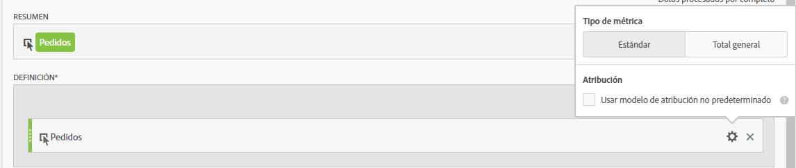
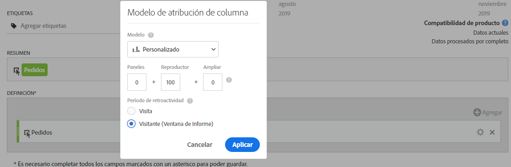
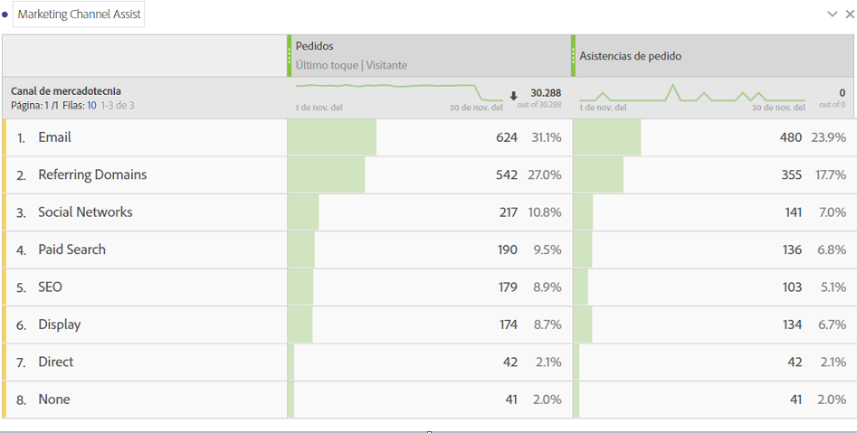

# Métrica de ayudas para pedidos

Explica cómo crear una métrica que muestre los canales de marketing asistidos al realizar pedidos. Esto puede adaptarse a cualquier otro evento de éxito o dimensión que resulte de interés.

1. En el Generador de métricas calculadas, asigne el nombre “Pedidos asistidos” a la métrica.
1. En el lienzo Definición, arrastre una métrica de Pedidos. A continuación, para ajustar el modelo de atribución mediante el engranaje de configuración, active la casilla **[!UICONTROL Usar modelos de atribución no predeterminados]**.

   

1. Seleccione **[!UICONTROL Personalizado]** como el modelo de atribución. Cambie las ponderaciones a 0 (inicial), 100 (reproductor) y 0 (más próximo).

   

1. Guarde la métrica.
1. Cree una tabla de forma libre en Analysis Workspace con la dimensión Canal de marketing, Pedidos y la nueva métrica Pedidos asistidos.

   

Esta es una forma sencilla de indicar los canales de marketing asistidos al realizar pedidos. Como alternativa, desde una tabla de forma libre, puede hacer clic con el botón derecho en cualquier métrica y ajustar el modelo de atribución directamente desde la tabla.
