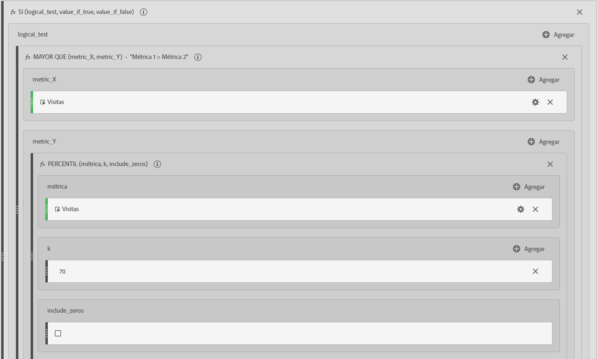
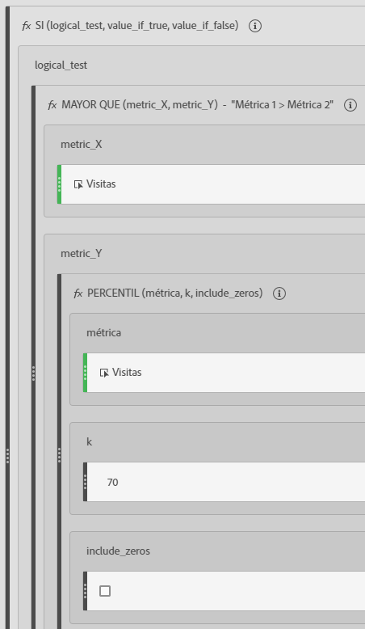

# Métricas filtradas y ponderadas

Muestra ejemplos de métricas filtradas y ponderadas.

## Frecuencia de rebotes filtrados {#section_D42F2452E4464948934063EB6F2DAAB4}

Esta sencilla métrica filtrada muestra la frecuencia de rebotes únicamente para aquellas páginas con más de 100 visitas:

Tenga en cuenta que esta fórmula depende de un plazo de tiempo constante. Si ejecuta un informe para un solo día, vale la pena observar cualquier página con más de 20 visitas. Si la ejecuta para un mes, es posible que desee el filtro para incluir más visitas.

## Frecuencia de rebotes filtrados con percentil {#section_4F3E6D33A1FD438A932FA662B3510552}

Este filtro muestra la frecuencia de rebotes para el principal 30 por ciento de las páginas, cuando se clasifica por visitas.

## Métrica ponderada {#section_F2D16B14569948289CF1310F9E6E3FC2}

Suponga que desea clasificar por la tasa de devoluciones en general, pero las páginas con un mayor número de visitas deben estar en una posición superior de la lista. Puede crear una frecuencia de rebotes ponderada similar a esta:

