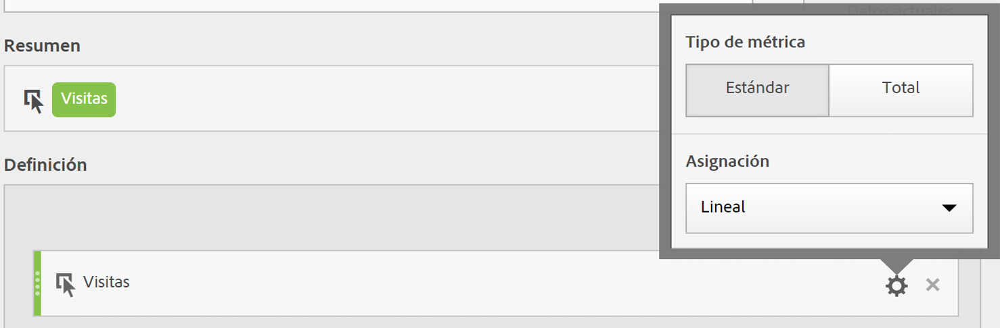

# Tipo de métrica y atribución

Si selecciona el icono de engranaje junto a una métrica, puede especificar el tipo de métrica y el modelo de atribución.

## Tipo de métrica

| Tipo de métrica | Definición |
|---|---|
| Estándar | Estas métricas son las mismas métricas utilizadas en los informes de [!DNL Analytics] estándares. Si una fórmula consiste en una única métrica estándar, muestra datos idénticos a los de su métrica no calculada homóloga. Las métricas estándar son útiles para crear métricas calculadas específicas para cada elemento de línea individual. Por ejemplo, [Pedidos] / [Visitas] toma pedidos de ese elemento de línea en concreto y lo divide por el número de visitas de ese elemento de línea específico. |
| Total | Utilice el total para el periodo de generación de informes de cada elemento de línea. Si una fórmula consiste en una única métrica total, muestra el mismo número total en cada elemento de línea. Las métricas totales son útiles para crear métricas calculadas que se comparan con los datos totales del sitio. Por ejemplo, [Pedidos] / [Visitas totales] muestra la proporción de pedidos en comparación con TODAS las visitas de su sitio, no solo las visitas de una línea en concreto. |

## Modelo de atribución de columnas

>[!IMPORTANT]
>
>En julio de 2018, [!DNL Analytics] introdujo [Attribution IQ](https://docs.adobe.com/content/help/es-ES/analytics/analyze/analysis-workspace/attribution/models.html), que revisaba la forma en que se evalúan los modelos de asignación en las métricas calculadas. Como parte de este cambio, las métricas calculadas que usan un modelo de asignación no predeterminado se migraron a los nuevos modelos de atribución mejorados:
>
>* Para obtener una lista completa de todos los modelos de atribución no predeterminados y ventanas retroactivas, consulte la documentación de [Attribution IQ](https://docs.adobe.com/content/help/es-ES/analytics/analyze/analysis-workspace/attribution/models.html).
>* Los modelos de asignación “Último toque del canal de marketing” y “Primer toque del canal de marketing” se migrarán a los nuevos modelos de atribución “Último toque” y “Primer toque”, respectivamente. Tenga en cuenta que “Canales de marketing” no dejará de utilizarse, pues únicamente se retirarán los dos modelos de asignación que aparecen en las métricas calculadas.
>* Además, corregiremos la forma de calcular la asignación lineal. Para los clientes que usan métricas calculadas con modelos de asignación “Lineal”, los informes pueden cambiar ligeramente para reflejar el nuevo modelo de atribución corregido. Este cambio para métricas calculadas se reflejará en Analysis Workspace, Reports &amp; Analytics, API de informes, Report Builder y Ad Hoc Analysis. Para obtener más información, consulte **Funcionamiento de la asignación lineal (a partir del 19 de julio de 2018)**.
>

## Funcionamiento de la asignación lineal (a partir del 19 de julio de 2018)

En julio de 2018, Adobe cambió la forma en que se generan los informes de asignación lineal para métricas calculadas. Este cambio afecta a Analysis Workspace, Ad Hoc Analysis, Reports &amp; Analytics, Report Builder, Activity Map y las API de informes. Este cambio afecta principalmente a las eVars y otras dimensiones que tienen persistencia. Tenga en cuenta que estos cambios solo se aplicaron en las métricas calculadas y no afectan a otros informes con asignación lineal (como el informe Páginas de Reports &amp; Analytics). Los otros informes que usan la asignación lineal seguirán usando el método existente.

El ejemplo siguiente ilustra de qué forma cambiarán las métricas calculadas con la asignación lineal en los informes:

|  | Visita 1 | Visita 2 | Visita 3 | Visita 4 | Visita 5 | Visita 6 | Visita 7 |
|--- |--- |--- |--- |--- |--- |--- |--- |
| Datos recibidos | PROMOCIÓN A | - | PROMOCIÓN A | PROMOCIÓN B | - | PROMOCIÓN C | $10 |
| eVar de último toque | PROMOCIÓN A | PROMOCIÓN A | PROMOCIÓN A | PROMOCIÓN B | PROMOCIÓN B | PROMOCIÓN C | $10 |
| eVar de primer toque | PROMOCIÓN A | PROMOCIÓN A | PROMOCIÓN A | PROMOCIÓN A | PROMOCIÓN A | PROMOCIÓN A | $10 |
| Prop de ejemplo | PROMOCIÓN A | - | PROMOCIÓN A | PROMOCIÓN B | - | PROMOCIÓN C | $10 |

En este ejemplo, los valores A, B y C se han enviado a una variable en las visitas 1, 3, 4 y 6 antes de realizarse una compra de 10 USD en la visita 7. En la segunda fila, estos valores persisten a lo largo de las visitas con base en una visita de último toque. La tercera fila ilustra una persistencia de visita de primer toque. Finalmente, la última fila ilustra de qué forma se registrarán los datos para una prop que no tiene persistencia.

## Diferencias entre el funcionamiento de la asignación lineal en Reports &amp; Analytics y Workspace

Hay algunas diferencias en el funcionamiento de la atribución lineal entre estas dos herramientas:

* En Reports &amp; Analytics, la atribución lineal (procesada) siempre se basa en visitas, mientras que en Workspace puede basarse en visitas o visitantes.
* En Reports &amp; Analytics, si no se pasa ningún valor en la primera visita individual de una visita, el valor (inicial) persistiría a partir de la visita anterior. Este NO es el caso en Workspace (Attribution IQ). Si no se pasa ningún valor en la primera visita individual de una visita, entonces “Ninguno” es el valor inicial.

## Funcionamiento de la asignación lineal antes de julio de 2018

Antes del 19 de julio de 2018, la atribución lineal se calculaba después de producirse la persistencia de primer toque o de último toque. Esto quiere decir que, para la última eVar de toque anterior, 10 $ se distribuirían de esta forma: A = 10 * (3/6) = 5 $, B = 10 * (2/6) = 3,33 $, C = 10 * (1/6) = 1,67 $.

Para la eVar de primer toque anterior, los 10 $ se asignarían a A. Para la prop: A = 10 * (2/4) = 5 $, B = 10 * (1/4) = 2,50 $ y C = 10 * (1/4) = 2,50 $. Para resumir el funcionamiento anterior de la asignación lineal:

| Valores | eVar de último toque actual | eVar de primer toque actual | Prop actual |
|---|---|---|---|
| PROMOCIÓN A | 5,00 USD | 10,00 USD | 5,00 USD |
| PROMOCIÓN B | 3,33 USD | 0 USD | 2,50 USD |
| PROMOCIÓN C | 1,67 USD | 0 USD | 2,50 USD |
| Total | 10,00 USD | 10,00 USD | 10,00 USD |

**Resumen del funcionamiento de la asignación lineal a partir del 19 de julio de 2018**

Después del 19 de julio, corregimos este comportamiento en las métricas calculadas. En lugar de usar los valores persistidos basados en el último o el primer toque, ahora [!DNL Analytics] usará solo los valores pasados (la primera fila de la tabla superior). De este modo, la configuración de la asignación de dimensiones ya no tendrá ningún impacto en la forma de calcular la asignación lineal (lo que significa que props y eVars se tratarán del mismo modo) y los resultados reflejarán lo que se haya transferido originalmente, en lugar de los valores de primer o último toque que puedan haber persistido. Es decir, en los tres casos, A = 10 * (2/4) = 5 USD, B = 10 * (1/4) = 2,50 USD, and C = 10 * (1/4) = 2,50 USD.

| Valores | eVar de último toque nueva | eVar de primer toque nueva | Prop nueva |
|---|---|---|---|
| PROMOCIÓN A | 5,00 USD | 5,00 USD | 5,00 USD |
| PROMOCIÓN B | 2,50 USD | 2,50 USD | 2,50 USD |
| PROMOCIÓN C | 2,50 USD | 2,50 USD | 2,50 USD |
| Total | 10,00 USD | 10,00 USD | 10,00 USD |

