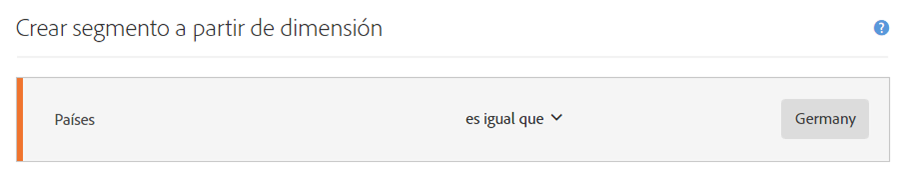
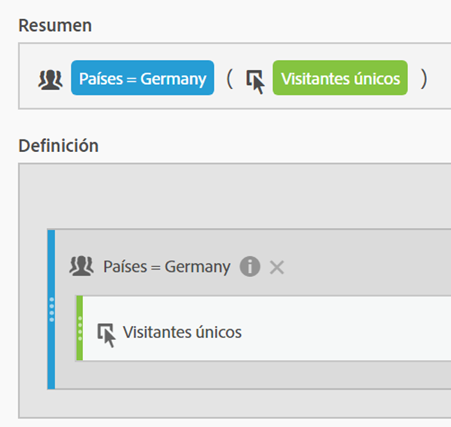
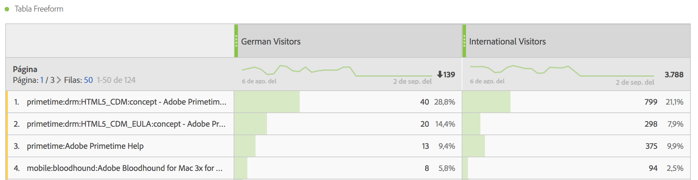
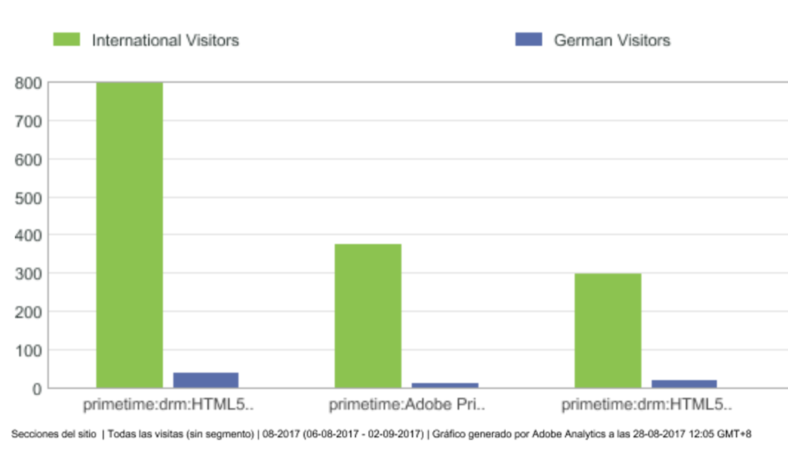
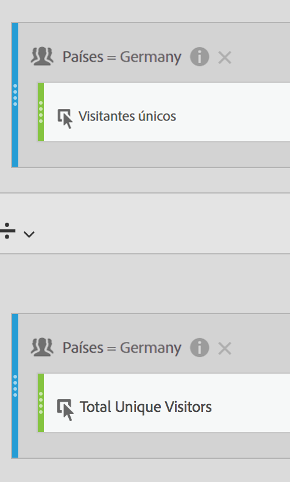
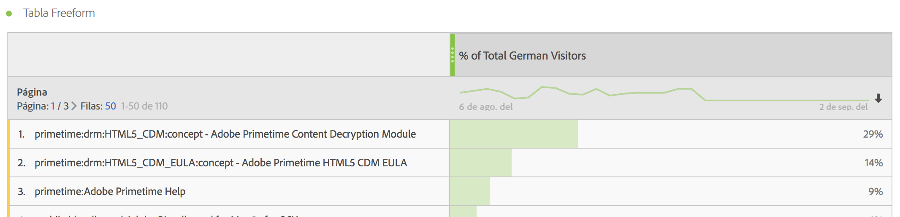
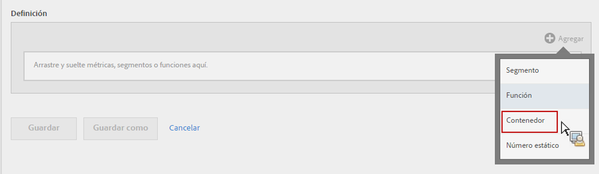
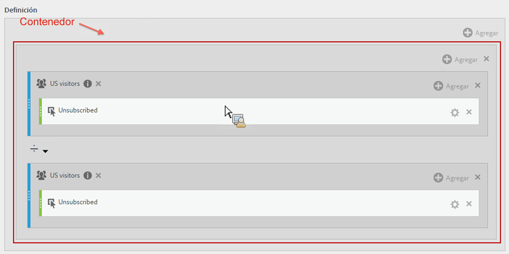
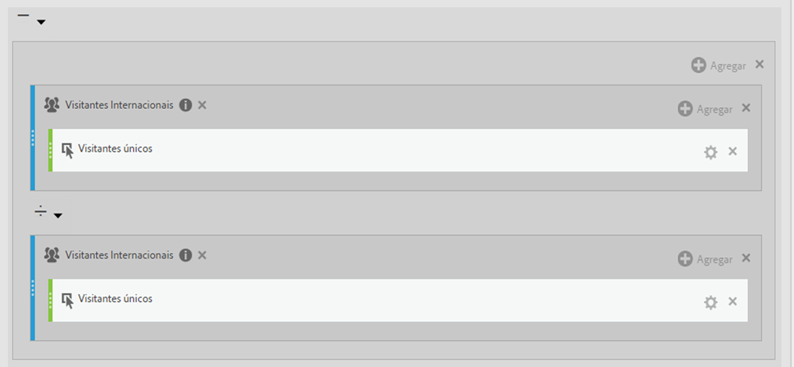

# Métricas segmentadas

La segmentación de una métrica individual le permite realizar comparaciones de métricas dentro del mismo informe. (Solo métricas derivadas)

## Comparar segmentos {#section_29A6E0070F084BFDB6228FA9CE106F48}

Digamos que desea comparar distintos aspectos de los segmentos de &quot;Visitantes de EE. UU.&quot; para aquellos de un segmento en &quot;Visitantes internacionales&quot;. Puede crear métricas que le proporcionarán información como:

* ¿De qué forma se compara el contenido de navegación ente los dos grupos? (Otro ejemplo sería: ¿De qué forma se compara la tasa de conversión entre los dos segmentos?)
* Como un porcentaje de visitantes totales, ¿cuántos visitantes de los EE. UU. navegan por ciertas páginas en comparación con los visitantes internacionales?
* ¿Cuáles son las principales diferencias en términos de a qué contenido se accede desde estos segmentos diferentes?

Vamos a ver la primera pregunta: ¿de qué forma se compara el contenido de navegación ente los dos grupos?

1. Si no tiene ningún segmento comparable, cree un segmento interno en el creador de métricas calculadas que se llame “Visitantes alemanes”, en el que la opción “Países” sea “Alemania”. Arrastre la dimensión de países al lienzo de definición y seleccione que el valor sea Alemania:

   

   >[!NOTE]
   >
   >También puede llevar a cabo esta acción en el [Generador de segmentos](/help/components/segmentation/segmentation-workflow/seg-build.md), pero hemos simplificado el flujo de trabajo al establecer que las dimensiones estén disponibles en el creador de métricas calculadas.

   >[!NOTE]
   >
   >La opción “Interno” implica que el segmento no esté visible en la lista **[!UICONTROL Segmentos]** del carril de la izquierda. Sin embargo, puede hacerlo público si pasa el ratón por el icono “i”, que se sitúa junto a ella, y hace clic en **[!UICONTROL Hacer público]**.

1. Si no tiene ningún segmento comparable, cree un segmento que se llame “Visitantes internacionales” en el que “Países” no sea igual a “Alemania”.
1. Cree y guarde una métrica llamada “Visitantes de Alemania” arrastrando el segmento de Alemania al lienzo Definición y la métrica de Visitantes únicos dentro de este:

   

1. Repita el paso 3 con el segmento de Visitantes internacionales y la métrica de Visitantes únicos para crear una métrica de Visitantes internacionales.
1. En Analysis Workspace, arrastre la dimensión **[!UICONTROL Página]** a una tabla de formato libre y, luego, las dos métricas calculadas nuevas en paralelo en la parte superior:

   

1. O también, en [!UICONTROL Reports &amp; Analytics], abra el informe [!UICONTROL Páginas] y haga clic en **[!UICONTROL Mostrar métricas]** y, luego, aplique las nuevas métricas segmentadas de Visitantes de EE. UU. y Visitantes internacionales para ver cómo se compara la exploración del contenido.

   

## Comparar porcentajes de totales {#section_846CB89725F04388AE0352DB20189EE8}

Puede introducir otro nivel de consulta al comparar el comportamiento de exploración de visitantes en porcentajes normalizados. Para ello, cree dos métricas: “% de visitantes de Alemania totales” y “% de visitantes internacionales totales”.

1. Coloque el segmento de Visitantes de Alemania (o internacionales) en el lienzo.
1. Coloque otro segmento de Visitantes de Alemania (o internacionales) a continuación. Sin embargo, en esta ocasión, haga clic en el icono de configuración (el engranaje) para seleccionar “Total” como Tipo de métrica. El formato debe ser “Porcentaje”. El operador debe ser “dividido por”. Al final, tendrá esta definición de métrica:

   

1. Aplique esta métrica a su proyecto:

   

## Comparar diferencias en porcentajes (mediante Contenedores) {#section_13D6353259B74C09B37BA6378A501938}

Si desea ver las principales diferencias entre el comportamiento de exploración de EE. UU. e Internacional de un vistazo, puede crear otra métrica que reste los porcentajes entre sí. Para ello, puede utilizar la función de Contenedor que funciona de forma efectiva como paréntesis rodeando 2 conjuntos de métricas.

1. En el lienzo de [!UICONTROL Definición] haga clic en **[!UICONTROL Agregar]** > **[!UICONTROL Contenedor]**:

   

1. Coloque la métrica de &quot;% de visitantes de EE. UU. totales&quot; que ha creado anteriormente en el primer contenedor; se amplía hasta su definición completa:

   

1. Cree otro contenedor a continuación y coloque la métrica &quot;% de visitantes internacionales totales&quot; en él.
1. Cambie el operador entre los 2 contenedores a un signo de resta (-).

   

1. Guarde la métrica (asegúrese de que le ha dado un nombre similar a &quot;Diferencia en % entre EE. UU y internacionales&quot;).
1. Cuando se aplica a su informe, puede observar fácilmente dónde se encuentran las principales diferencias en porcentajes y puede clasificar el informe de forma correspondiente.

   

