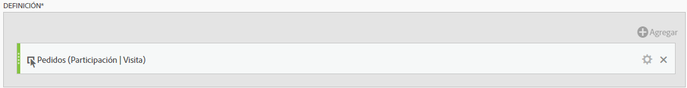
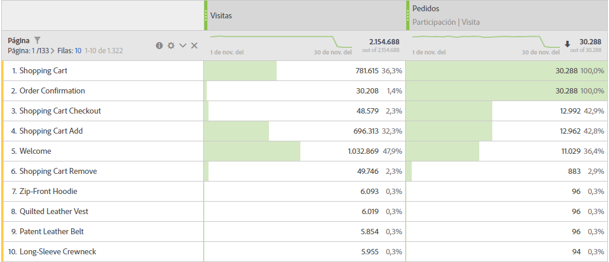

# Métrica de participación

Este es un sencillo caso de uso: Usted es propietario de contenido y desea ver qué páginas han contribuido a las visitas que han participado en un pedido. A continuación se muestra cómo:

>[!NOTE]
>
>Solía hacerlo a través de las Herramientas de administración. Aún puede habilitar métricas de participación en Herramientas de administración, pero solo para los eventos personalizados 1-100.

Veamos un caso de uso sencillo. Usted es el propietario de cierto contenido y quiere averiguar las páginas que han contribuido a obtener visitas que contenían un registro por correo electrónico. He aquí cómo:

1. Cree una nueva métrica en el Creador de métricas calculadas.
1. Arrastre el evento de éxito "Pedidos" al lienzo Definición.
1. Cambie el modelo [de atribución](../../../../../components/c-calcmetrics/c-workflow/cm-workflow/c-build-metrics/m-metric-type-alloc.md#concept_B7A1FCFEFA9D4C4883208ACE8C9C8E5E) de ese evento a **[!UICONTROL Participación]** en el engranaje **[!UICONTROL Configuración]** . Seleccione **[!UICONTROL Retroceder visita]** . La definición debería tener un aspecto parecido al siguiente:

   

1. Guarde la métrica.
1. Utilice la métrica calculada en un **[!UICONTROL informe Páginas]** .

   

1. (Opcional) Comparta la métrica con otros usuarios de su organización.

