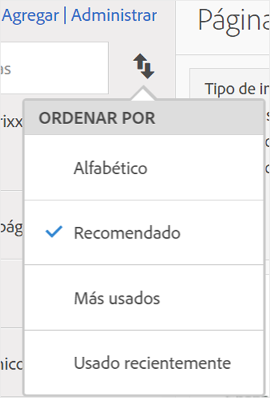

# Buscar métricas

Describe las dos formas principales de encontrar sus métricas: clasificación y filtrado.

## Clasificación {#section_89F9C4D515084F5796F2A54D468BF6C8}

Cuando abra un informe y haga clic en el icono Métricas  que encontrará a la izquierda para que se muestre el carril Métricas, verá cuatro opciones de clasificación en la lista desplegable **Clasificar por]del Selector de métricas:[!UICONTROL **

| Opción | Cuándo utilizarla |
|---|---|
| Alfabético | Útil cuando sabe el nombre. |
| Recomendado | Métricas comunes que se utilizan en el informe: esto se recopila en segundo plano a partir de las métricas que suelen utilizar los usuarios con este informe. |
| Más utilizadas | Resulta útil cuando es un usuario sin experiencia y necesita ver qué se utiliza normalmente en el informe. |
| Más recientes | Resulta útil si trabaja en un proyecto y utiliza el mismo grupo de métricas una y otra vez. |

## Filtrado: selección avanzada {#section_33818CC048C04F098703AC229693F8CA}

Tras abrir un informe y hacer clic en el icono Métricas, haga clic en **[!UICONTROL Administrar]**. A continuación, haga clic en el icono Filtrar. Puede filtrar de varias formas.

<table id="table_269081BC9DF54FFDA4E949FFC7488F42"> 
 <thead> 
  <tr> 
   <th colname="col1" class="entry"> Si desea </th> 
   <th colname="col2" class="entry"> Clasificar por </th> 
  </tr>
 </thead>
 <tbody> 
  <tr> 
   <td colname="col1"> Mostrar todas las métricas de este grupo de informes. </td> 
   <td colname="col2"> Otros filtros &gt; Mostrar todo </td> 
  </tr> 
  <tr> 
   <td colname="col1"> Mostrar solo las métricas que tiene. </td> 
   <td colname="col2"> Otros filtros &gt; Míos </td> 
  </tr> 
  <tr> 
   <td colname="col1"> Mostrar métricas compartidas conmigo por otra persona. </td> 
   <td colname="col2">O Propietarios o bien 
 Otros filtros &gt; Compartidos conmigo 
 </td> 
  </tr> 
  <tr> 
   <td colname="col1"> Mostrar únicamente las métricas que han sido aprobadas por la empresa. </td> 
   <td colname="col2"> Aprobado </td> 
  </tr> 
  <tr> 
   <td colname="col1"> Filtrar las métricas de un proyecto en el que esté trabajando. </td> 
   <td colname="col2">Una de las etiquetas. </td> 
  </tr> 
 </tbody> 
</table>

