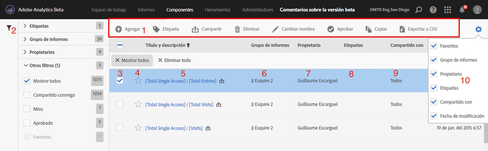

# Administrador de métricas calculadas

El Administrador de métricas calculadas ofrece numerosas maneras de conservar las métricas, como compartir, filtrar, etiquetar, aprobar, copiar, eliminar y marcar como favoritos.

El Administrador de métricas calculadas muestra todos los segmentos que posee y que han compartido con usted. Los usuarios con nivel de administrador pueden ver todas las métricas personalizadas de la organización. En esta introducción se presentan la interfaz de usuario y las capacidades del Administrador de métricas calculadas. Acceda a ella

* Going to **[!UICONTROL Analytics]** &gt; **[!UICONTROL Components]** in the left navigation. A continuación, haga clic en **[!UICONTROL Métricas calculadas]**.

| Función de la interfaz de usuario | Descripción |
|---|---|
| Barra de herramientas de administración de métricas calculadas | Cuando marque una métrica, aparecerá esta barra de herramientas. Puede realizar la mayoría de las tareas de gestión desde esta barra de herramientas. |
| Mostrar/ocultar filtros | Al hacer clic en mostrar filtros aparece el menú de filtros. Puede filtrar por Etiquetas, Grupos de informes, Propietarios, Mostrar todo (solo para administradores), Compartido conmigo, Mío, Favoritos y Aprobado. |
| Casillas de verificación | Marque una métrica personalizada para administrarla. |
| Favoritos | Si hace clic en la estrella que aparece junto a una métrica, esta se pondrá de color amarillo y la métrica se marcará como favorita. |
| Títulos y descripciones de segmentos | Incluido en el Creador de métricas calculadas. Para editar el título y la descripción, haga clic en el vínculo del título. Se le redirigirá al Creador de métricas calculadas. |
| Grupos de informes | Esta columna indica en qué grupo de informes se guardó por última vez la métrica. |
| Propietario | Indica quién es el propietario de la métrica personalizada. Si no es el administrador, solo podrá ver las métricas que le pertenecen o que compartieron con usted. |
| Etiquetas | Muestra las etiquetas que se aplicaron a la métrica, tanto por su parte como por parte de las personas que compartieron el segmento con usted. |
| Compartido con | Enumera las personas o grupos (solo administrador) o todos (solo administrador) con los que compartió el segmento. |
| Selector de columnas | Le permite seleccionar o deseleccionar columnas en el Administrador de métricas calculadas para que pueda personalizar la vista. |
| Icono compartido (no mostrado) | Indica que usted compartió esta métrica personalizada con otra persona o que la han compartido con usted. |
| Icono aprobado (no mostrado) | Indica que un administrador ha aprobado esta métrica personalizada. |