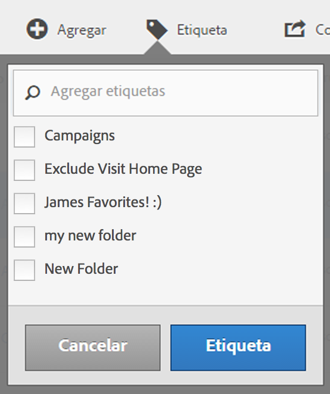

# Etiquetar métricas calculadas

En el Administrador de métricas calculadas, el etiquetado de segmentos le permite organizarlos.

Todos los usuarios pueden crear etiquetas para métricas calculadas y aplicar una o más a una métrica. Sin embargo, solo verá las etiquetas de las métricas calculadas que sean suyas o que se hayan compartido con usted. ¿Qué tipo de etiquetas debería crear? A continuación encontrará una serie de sugerencias para crear etiquetas útiles:

* Etiquetas basadas en **nombres de equipos**, como Marketing social o Marketing móvil.
* Etiquetas de **proyectos** (etiquetas de análisis), como análisis de páginas de entrada.
* Etiquetas de **categorías**: para hombres, geografía.
* Etiquetas de **flujo de trabajo**: pendiente de aprobación, conservado para (una unidad empresarial específica).

1. En el Administrador de métricas calculadas, marque la casilla que aparece junto a la métrica que desea etiquetar. Aparecerá la barra de herramientas de administración:
1. Haga clic en **[!UICONTROL Etiqueta]y:**

   * Seleccione una de las etiquetas existentes, o bien
   * Agregue un nuevo nombre de etiqueta en el cuadro de diálogo Agregar etiquetas/Buscar y pulse **[!UICONTROL Entrar]**.

      

1. Haga clic en **[!UICONTROL Etiqueta]de nuevo para etiquetar la métrica.**

La etiqueta debería aparecer en la columna de etiquetas. (Haga clic en el icono del engranaje en la esquina superior derecha para administrar las columnas.)

You can also filter on tags by going to **[!UICONTROL Show Filters]** &gt; **[!UICONTROL Tags]**.
