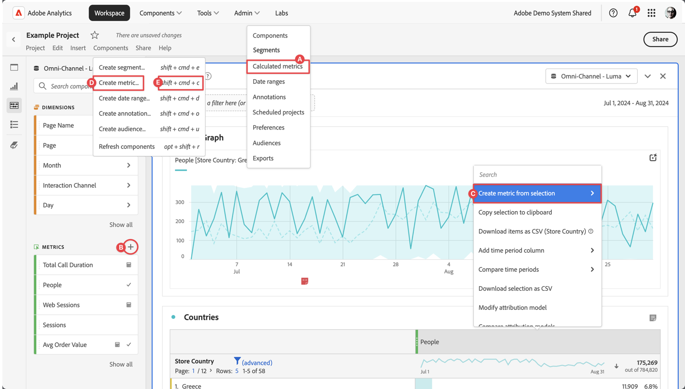

# Crear métricas calculadas

De forma predeterminada, solo los administradores pueden crear métricas calculadas. Los usuarios tienen derechos para ver las métricas calculadas, de forma similar a como ven otros componentes (como segmentos, anotaciones, etc.).

Puede crear una métrica calculada de las siguientes maneras:

* **A**. En la interfaz principal, seleccione **[!UICONTROL Componentes]** y seleccione **[!UICONTROL Métricas calculadas]**. Seleccione  [!UICONTROL **[!UICONTROL Add]**] del administrador de [[!UICONTROL métricas calculadas]](cm-manager.md).
* **B**. En un proyecto de Workspace, en el panel izquierdo Componentes, seleccione  en  **Métricas**.
* **C**. En un proyecto de Workspace, en el menú contextual del encabezado de la columna Métricas, seleccione **[!UICONTROL Crear métrica a partir de la selección]**. En el submenú, puede seleccionar una función o seleccionar **[!UICONTROL Abrir en el creador de métricas calculadas]**.  Si selecciona una función, la métrica calculada se define como métrica solo de proyecto. Cuando edite posteriormente esta métrica, a través de la ventana emergente [Información del componente](/help/analyze/analysis-workspace/components/use-components-in-workspace.md), verá una notificación en el [Creador de métricas calculadas](c-build-metrics/cm-build-metrics.md).
* **D**. En un proyecto de Workspace, seleccione **[!UICONTROL Componentes]** en el menú y seleccione **[!UICONTROL Crear métrica]**.
* **E**. En un proyecto de Workspace, use el acceso directo **[!UICONTROL mayús+cmd+c]** (macOS) o **[!UICONTROL mayús+ctrl+c]** (Windows).

Para definir la nueva métrica calculada, usa el [Creador de métricas calculadas](c-build-metrics/cm-build-metrics.md).

## Flujo de trabajo

Antes de crear métricas calculadas, tenga en cuenta cuidadosamente el siguiente flujo de trabajo:

| Tarea del flujo de trabajo | Descripción |
| --- | --- |
| Planificar métricas calculadas | Especialmente en el caso de las métricas que se “aprobarán” oficialmente, tiene sentido detallar qué métricas calculadas se utilizarán de forma generalizada y cómo se definirán. |
| [Generar](c-build-metrics/cm-build-metrics.md) métricas calculadas | Cree y edite métricas calculadas y métricas calculadas avanzadas para utilizarlas en componentes de [!DNL Analytics].  Consulte [ejemplos](c-build-metrics/cm-build-metrics.md) de cómo crear métricas calculadas. |
| [Etiquetar](cm-tagging.md) métricas calculadas | Etiquete métricas calculadas para que sea más fácil organizar y compartir. Consulte cómo planificar y asignar etiquetas para la organización y las búsquedas simples y avanzadas. |
| [Aprobar](cm-approving.md) métricas calculadas | Apruebe métricas calculadas para hacerlas canónicas. |
| Uso de métricas calculadas | Utilice las métricas calculadas en sus proyectos. |
| [Compartir](cm-sharing.md) métricas calculadas | Comparta sus métricas calculadas con otras personas, grupos u organizaciones. |
| [Filtrar](cm-filter.md) métricas calculadas | Filtre las métricas calculadas por etiquetas, propietarios y otros filtros (Mostrar todo, Míos, Compartidos conmigo, Favoritos y Aprobados). |
| Marcar métricas calculadas como [favoritos](cm-finding.md) | Marcar las métricas como favoritas es otra manera de organizarlas para que su uso sea más sencillo. |
