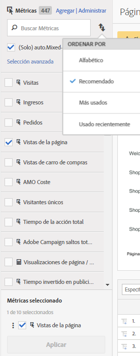

# Métricas calculadas y calculadas avanzadas (derivadas)

Las métricas calculadas y calculadas avanzadas (o derivadas) son métricas personalizadas que puede crear a partir de métricas existentes.

Nuestras herramientas de métricas calculadas ofrecen una forma muy flexible de crear, administrar y ajustar métricas. Como expertos en marketing, gestores de productos y analistas, les permite plantear preguntas acerca de los datos sin tener que cambiar su implementación de [!DNL Analytics] En cada paquete de [!DNL Analytics] están disponibles las siguientes métricas personalizadas:

* Adobe [!DNL Analytics] Foundation: calculadas
* [Adobe Analytics Select](https://www.adobe.com/es/data-analytics-cloud/analytics/select.html): calculadas + calculadas avanzadas
* [Adobe Analytics Prime](https://www.adobe.com/es/data-analytics-cloud/analytics/prime.html): calculadas + calculadas avanzadas
* [Adobe Analytics Ultimate](https://www.adobe.com/es/data-analytics-cloud/analytics/ultimate.html): calculadas + calculadas avanzadas

A continuación se muestra una comparación de las competencias de las métricas calculadas y las métricas calculadas avanzadas:

| Opciones del creador | Métricas calculadas | Métricas calculadas avanzadas (derivadas) |
|---|---|---|
| [Tipos de formato (decimal, tiempo, porcentaje, moneda)](/help/components/c-calcmetrics/c-workflow/cm-workflow/c-build-metrics/cm-build-metrics.md) | Sí | Sí |
| [Cambios de atribución (predeterminado, lineal, de participación, etc.)](/help/components/c-calcmetrics/c-workflow/cm-workflow/c-build-metrics/m-metric-type-alloc.md) | Sí | Sí |
| [Tipos de métrica (estándar, total)](/help/components/c-calcmetrics/c-workflow/cm-workflow/c-build-metrics/m-metric-type-alloc.md) | Sí | Sí |
| Operadores básicos (sumar, restar, multiplicar, dividir) | Sí | Sí |
| [Aplicar segmentos](/help/components/c-calcmetrics/c-workflow/cm-workflow/c-build-metrics/metrics-with-segments.md) | No | Sí |
| [Funciones básicas (recuento, valor absoluto, media, etc.)](/help/components/c-calcmetrics/cm-reference/cm-functions.md) | No | Sí |
| [Funciones avanzadas (regresión, si/entonces, unidad tipificada, etc.)](/help/components/c-calcmetrics/cm-reference/cm-adv-functions.md) | No | Sí |

## Competencias {#section_A0A5C275B68A4D628950BBB0B1EE631F}

Puede

* Cree métricas en [!UICONTROL Analysis Workspace], [!UICONTROL Reports &amp; Analytics], [!UICONTROL Report Builder], [!UICONTROL Detección de anomalías] y [!UICONTROL Análisis de contribución].
* Crear métricas segmentadas que se derivan del tiempo de ejecución de un informe, [sin tener que cambiar la implementación](https://youtu.be/CuQTm9RaUpY). Éstas pueden verse en el historial, ya que se basan en segmentos.
* Compartir métricas entre grupos de informes. Esto significa que todas las métricas de reciente creación se aplican a todos los grupos de informes en la misma empresa de inicio de sesión.
* (Solo métricas calculadas avanzadas) Segmentar métricas. Por ejemplo, puede crear una métrica para “Visitantes nuevos”, con un recuento de personas de las cuales sea la primera sesión.
* (Solo métricas calculadas avanzadas) Incorporar funciones estadísticas para ayudar a describir mejor los datos. Por ejemplo, puede contar el número de elementos de un informe o agregar el número de desviaciones estándar para cada elemento.

## Limitaciones {#section_CB878B02451541D68A68B508D4DBD19A}

Algunas funciones de [!DNL Analytics] permiten utilizar eventos, pero no métricas calculadas:

* [!UICONTROL Canalizaciones] en [!UICONTROL Reports &amp; Analytics]
* [!UICONTROL Secuelas] en [!UICONTROL Analysis Workspace]
* [!UICONTROL Análisis de cohortes] en Analysis Workspace
* [!UICONTROL Data Warehouse]
* [!UICONTROL Segmentos]
* [!UICONTROL Informes en tiempo real]
* [!UICONTROL Informes de datos actuales]
* [!DNL Analytics] for [!DNL Target]

## Herramientas {#section_D65E9C067E9C45E1A50DD30F50561BB2}

A continuación se describen brevemente las herramientas de [!UICONTROL Métricas calculadas]:

<table id="table_520AFE97DB514958ABE23FD3C9CE0ABD"> 
 <thead> 
  <tr> 
   <th colname="col1" class="entry"> Herramienta </th> 
   <th colname="col2" class="entry"> Competencias </th> 
  </tr>
 </thead>
 <tbody> 
  <tr> 
   <td colname="col1"><a href="/help/components/c-calcmetrics/c-workflow/cm-workflow/c-build-metrics/cm-build-metrics.md"  > Creador de métricas calculadas</a> </td> 
   <td colname="col2"> 
    <ul id="ul_E6F02AB9DF204C2F9A0AC92A31594B3E"> 
     <li id="li_A4A6E716374243A190C539A3F4A41C0C">Cree métricas calculadas avanzadas con modelos de asignación avanzados. </li> 
     <li id="li_C8C97BA4E227463E98077ABA5818FFC6">Añadir segmentos en línea a fórmulas métricas. </li> 
     <li id="li_8503D9E06A3C46569B5CDB4B90F72446">Comparar segmentos en el mismo informe. Por ejemplo, comparar los visitantes locales con los visitantes internacionales. </li> 
     <li id="li_4B528FDE1F96400DBA0D3276408FF919">Utilizar funciones estadísticas. </li> 
     <li id="li_C1162B1EA6784B8189A8A87E2B0DA79A">Proporcionar descripciones de métricas detalladas (mostrar qué hace, dónde utilizarla y para qué NO utilizarla). </li> 
     <li id="li_DEA13F5E8BF94AF1B311C467FE6E2A74">Copiar definiciones en métricas nuevas. </li> 
     <li id="li_8C21F55015D44910904202D2BF74221C">Proporcionar una vista previa de métricas en línea. </li> 
     <li id="li_3704F66C321C477F9D4F52E068C231BD">Establecer la polaridad de una métrica, lo cual indica si es bueno o malo que un evento personalizado predeterminado (métrica) vaya al alza. </li> 
     <li id="li_9D45319FA965476FB1C90DE8AA72BBD7">Etiquetar métricas. </li> 
    </ul> </td> 
  </tr> 
  <tr> 
   <td colname="col1"><a href="/help/components/c-calcmetrics/c-workflow/cm-workflow/cm-manager.md"  > Administrador de métricas calculadas</a> </td> 
   <td colname="col2"> 
    <ul id="ul_E4D20D5DD3904CC6A85785B5BD4C1B1E"> 
     <li id="li_E0B216BA1478406EB6212263DF71D85B">Compartir métricas con otros. </li> 
     <li id="li_96EB16FAF3454211AAEF78EA5B08927F">Aprobar y ajustar métricas. </li> 
     <li id="li_3ADBD2428EAC4B0AA61222D87C3AF2B7">Organizar (etiquetar) sus métricas para que los demás puedan encontrarlas. </li> 
     <li id="li_726F3C3390744E49BA63606FE196880E">Eliminar métricas. </li> 
     <li id="li_F306BA4FA8AF4A6E987BA62634659A2F">Cambiar el nombre de métricas. </li> 
    </ul> </td> 
  </tr> 
  <tr> 
   <td colname="col1"> Carril del selector de métricas </td> 
   <td colname="col2"> 
Reemplaza la ventana emergente Mostrar métricas en Reports &amp; Analytics. 
 
Le permite buscar y agregar o aplicar métricas en el informe. También puede cambiar el <a href="/help/components/c-calcmetrics/c-workflow/cm-workflow/cm-finding.md"  >orden de clasificación</a> (con las opciones de orden: alfabético, recomendado, más utilizados, más recientes). Además, puede filtrar Grupos de informes para mostrar únicamente las métricas creadas en un grupo de informes específico. 
 
Para acceder a este Selector de métricas, haga clic en el icono Métricas  que encontrará en el lateral izquierdo de un informe. Este es el aspecto del Selector de métricas: 
 
 
 </td> 
  </tr> 
  <tr> 
   <td colname="col1"><a href="https://www.adobe.io/apis/experiencecloud/analytics/docs.html#!AdobeDocs/analytics-2.0-apis/master/README.md"  > API para métricas calculadas</a> </td> 
   <td colname="col2"> 
Parte del conjunto de API de Adobe Analytics 2.0. 
 </td> 
  </tr> 
 </tbody> 
</table>

