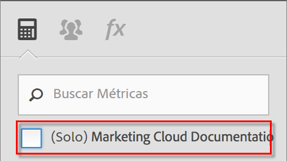

# Preguntas más frecuentes

These changes to the way calculated metrics work in [!DNL Analytics] may impact you.

[¿Cómo puedo acceder al Creador de métricas calculadas?](../../components/c-calcmetrics/cm-transition.md#section_D9AE9A0ACF824BACB5D05F0C2F7E9CA1)

[¿Cómo puedo acceder al Administrador de métricas calculadas?](../../components/c-calcmetrics/cm-transition.md#section_DD0BD13E9EC940268EBE8BC88241A152)

[¿Por qué veo tantas métricas calculadas con el mismo nombre?](../../components/c-calcmetrics/cm-transition.md#section_E15C5B6CCC58498CAEC3FBDA8988F0A1)

[¿Qué ha sucedido con mis Métricas calculadas globales?](../../components/c-calcmetrics/cm-transition.md#section_7351D4C7361F4ABAA1B43F8E89AAD211)

[¿Qué les ha sucedido a las Métricas calculadas globales que se compartieron entre Empresas de inicio de sesión?](../../components/c-calcmetrics/cm-transition.md#section_59E5CD948ED643AE9AD3D2E4277647F8)

[¿Qué les ha sucedido a las Métricas calculadas con una clasificación de Numérico o Numérico2?](../../components/c-calcmetrics/cm-transition.md#section_71AFE6C4A7CD4AA19AB3A9D3C41D115B)

[¿Qué les ha sucedido a las Métricas permanentes?](../../components/c-calcmetrics/cm-transition.md#section_AEDB02EF24584DAD8731BED9DDCE4F48)

[¿Qué pasa si necesito conocer Métricas calculadas en base a métricas de visitante únicas diarias/semanales/mensuales/trimestrales/anuales?](../../components/c-calcmetrics/cm-transition.md#section_E9A77EBB41CE4881B196CC1C282B2DF3)

[¿Qué sucede con las Métricas calculadas creadas o administradas con los antiguos métodos de API del grupo de informes?](../../components/c-calcmetrics/cm-transition.md#section_13ED1BAD02634674BDAEB479B060A4B6)

[¿Los datos actuales admiten todo tipo de Métricas calculadas?](../../components/c-calcmetrics/cm-transition.md#section_1DAA718BB8DB4413BAF8AD4B4FAAFFA2)

[¿Qué significa "No se ha introducido un nombre" conjuntamente con las métricas calculadas migradas?](../../components/c-calcmetrics/cm-transition.md#section_C90CBB72A67644F38D583301981F8D03)

[¿Qué les sucede a las métricas calculadas de un usuario si se elimina dicho usuario?](../../components/c-calcmetrics/cm-transition.md#section_42ED4C15830540879C4A161423690E5A)

[¿Por qué veo métricas calculadas "Desconocida" que no son válidas para otros grupos de informes a pesar de que pueden crearse y aplicarse a esos grupos de informes?](../../components/c-calcmetrics/cm-transition.md#section_6772818EFDED46E9B7095D64C3B77211)

[¿Por qué no se han guardado los cambios que he realizado en mis métricas calculadas antiguas?](../../components/c-calcmetrics/cm-transition.md#section_81CDEFCA1FD542579AF183DA1494EAF0)

[¿Por qué no aparecen mis métricas calculadas en el informe de Canales de marketing?](../../components/c-calcmetrics/cm-transition.md#section_FC350359A775433AB5F43C7CAB304D62)

[¿Por qué algunas métricas calculadas muestran fórmulas sin el paréntesis añadido?](../../components/c-calcmetrics/cm-transition.md#section_AC0D1E9714AD487F9A1C73359F518B5E)

[(Solo Ad Hoc Analysis) ¿Las métricas calculadas con definiciones de segmento en línea o incrustadas siguen siendo compatibles?](../../components/c-calcmetrics/cm-transition.md#section_B25C924A282F49388AB604E3D826F44C)

[(Solo en el Report Builder) ¿Por qué han desaparecido las métricas calculadas de mis solicitudes?](../../components/c-calcmetrics/cm-transition.md#section_DA4792FE5D7945218CD5E6328DE08E82)

[¿Cómo funcionan los Totales de métricas calculadas?](../../components/c-calcmetrics/cm-transition.md#section_57BA3A299C7948ABB82B0392A9B0F33E)

## ¿Cómo puedo acceder al Creador de métricas calculadas?{#section_D9AE9A0ACF824BACB5D05F0C2F7E9CA1}

* Haga clic en **[!UICONTROL + Agregar], en la parte superior del Administrador de métricas calculadas, o bien**
* En cualquier informe de Analytics, haga clic en el icono Métricas  que encontrará a la izquierda para que se muestre el carril Métricas y, a continuación, haga clic en **[!UICONTROL Agregar]**.

## ¿Cómo puedo acceder al Administrador de métricas calculadas?{#section_DD0BD13E9EC940268EBE8BC88241A152}

* Go to  **[!UICONTROL Analytics]** &gt; **[!UICONTROL Components]** in the left navigation. A continuación, haga clic en **[!UICONTROL Métricas calculadas]**.

* In any [!DNL Analytics] report, click the Metrics icon   to the left of a report to bring up the Metrics rail, then click **[!UICONTROL Manage]**.

## Why do I see so many Calculated Metrics with the same name? {#section_E15C5B6CCC58498CAEC3FBDA8988F0A1}

(Anteriormente, las métricas calculadas globales no eran propiedad de ningún usuario Administrador en concreto y eran visibles para todos los usuarios del grupo de informes. Las métricas se segregaban por grupo de informes. Si una métrica de un grupo de informes tenía el mismo nombre que una métrica en un grupo de informes diferente, simplemente aparecería a los usuarios como la misma métrica cuando se cambia entre grupos de informes.)

Ahora, las métricas ya no se separan por grupos de informes. Si una métrica de un grupo de informes tenía el mismo nombre que una métrica en un grupo de informes distinto, ambas serían visibles en el Creador de métricas calculadas, así como en el Selector de métricas y podrían aparecer como métricas duplicadas tanto si tienen la misma definición como si no.

You would see a number of calculated metrics with the same name (but created in different report suites) only if you unchecked the (Only `<report suite>`) checkbox as shown here:

**Qué debe hacer**

Considere la posibilidad de consolidar métricas calculadas con nombres y definiciones similares pero tenga cuidado a la hora de hacerlo. Puede marcar el grupo de informes de una métrica calculada en el Administrador de métricas calculadas para comprobar su grupo de informes original. También puede comprobar las definiciones de las métricas cuando elimine posibles duplicados para asegurarse de que está consolidando correctamente las métricas.

> [!NOTE] Aunque las métricas calculadas ya no están vinculadas a un grupo de informes específico y se pueden utilizar en cualquier grupo de informes que sea visible para la empresa de inicio de sesión, el grupo de informes en el que se creó la métrica calculada o que se guardó por última vez seguirá estando visible en el Administrador de métricas calculadas.

> [!NOTE] Incluso si se elimina una métrica calculada, cualquier informe de tablero o marcador que haga referencia a esa métrica seguirá funcionando.

## ¿Qué ha sucedido con mis Métricas calculadas globales?{#section_7351D4C7361F4ABAA1B43F8E89AAD211}

Anteriormente, un Administrador podía crear métricas calculadas (conocidas como “métricas calculadas globales” o “métricas calculadas de grupo de informes”) en un Grupo de informes a través de Herramientas de administración.

Las métricas calculadas globales ahora son propiedad del primer usuario Administrador en la lista de usuarios de Administradores de la empresa de inicio de sesión. Se compartirán con "Todos" de forma predeterminada. Este patrón sigue el mismo modelo de uso compartido y planes de migración que los segmentos.

**Qué debe hacer**

Nada. Sin embargo, el nuevo propietario Administrador debería tener cuidado al modificar o eliminar estas métricas calculadas porque se pueden utilizar en diversos informes con marcadores y paneles.

> [!NOTE] Incluso si se elimina una métrica calculada, cualquier informe de tablero o marcador que haga referencia a esa métrica seguirá funcionando.

## ¿Qué les ha sucedido a las Métricas calculadas globales que se compartieron entre Empresas de inicio de sesión?{#section_59E5CD948ED643AE9AD3D2E4277647F8}

Anteriormente, un Administrador podía crear métricas calculadas (conocidas como “métricas calculadas globales” o “métricas calculadas de grupo de informes”) en un Grupo de informes a través de Herramientas de administración. Estas métricas se podrían "compartir" después entre empresas de inicio de sesión agregando el grupo de informes a varias empresas de inicio de sesión).

Las métricas calculadas globales no ya no pueden compartirse entre empresas de inicio de sesión. Ya no están ligadas a un grupo de informes específico pero, en su lugar están ligadas una empresa de inicio de sesión específica. Las métricas calculadas que se compartieron entre empresas de inicio de sesión

* Se migraron a todas las empresas de inicio de sesión con acceso a ese grupo de informes.
* Predeterminado en "compartido con todos".
* Serán copias independientes de todas las demás empresas de inicio de sesión.

>[!NOTE]
>
>Si la métrica calculada se ha utilizado en un marcador, tablero, alerta o informe programado, la edición de la nueva copia NO afectará la antigua métrica calculada persistente.

## ¿Qué les ha sucedido a las Métricas calculadas con una clasificación de Numérico o Numérico2?{#section_71AFE6C4A7CD4AA19AB3A9D3C41D115B}

(Previously, calculated metrics with a Numeric or Numeric2 classification were only visible in [!UICONTROL Reports &amp; Analytics], [!UICONTROL Report Builder], and the APIs.)

Now, calculated metrics with a Numeric or Numeric2 classification will continue to be visible in [!UICONTROL Reports &amp; Analytics], [!UICONTROL Report Builder], and the APIs. Sin embargo, no serán compatibles con ningún informe al que se haya aplicado un segmento.

In addition, calculated metrics with a Numeric or Numeric2 classification will not be supported in the following components: [!UICONTROL Ad Hoc Analysis], [!UICONTROL Analysis Workspace], [!UICONTROL Real-Time] reports, [!UICONTROL Anomaly Detection], and [!UICONTROL Contribution Analysis]. Cuando cree u edite una métrica calculada con una clasificación de Numérico o Numérico2, verá una advertencia de compatibilidad indicando que la métrica calculada no es compatible con ciertas áreas del producto.

**Qué debe hacer**

Evitar la creación de métricas calculadas con clasificaciones de Numérico o Numérico2 si el uso previsto de la métrica es con un segmento o con cualquiera de los componentes no compatibles.

## ¿Qué les ha sucedido a las Métricas permanentes?{#section_AEDB02EF24584DAD8731BED9DDCE4F48}

Life-Time metrics (a.k.a. all-time metrics) are no longer supported and no longer visible in the [!UICONTROL Reports &amp; Analytics] UI or any other UI. La API de informe no puede consultarlas.

Cualquier marcador, tablero, informe programado o alerta que contuviera una métrica permanente seguirá ejecutándose sin esa métrica siempre que al menos haya otra métrica válida en el informe. Si la única métrica en el marcador, tablero, informe programado o alerta es una métrica permanente, el informe ya no se ejecutará.

## ¿Qué pasa si necesito conocer Métricas calculadas en base a métricas de visitante únicas diarias/semanales/mensuales/trimestrales/anuales?{#section_E9A77EBB41CE4881B196CC1C282B2DF3}

Calculated metrics based on Unique Visitor metrics will be visible in the following [!DNL Analytics] components: [!UICONTROL Reports &amp; Analytics], [!UICONTROL Report Builder], and Reporting API.

However, these metrics will not be supported in the following components: [!UICONTROL Segments], [!UICONTROL Analysis Workspace], [!UICONTROL Real-Time] reports, [!UICONTROL Anomaly Detection], and [!UICONTROL Contribution Analysis]. Cuando crea u edita una métrica calculada basada en métricas de Visitantes únicos, verá una advertencia de compatibilidad acerca de que la métrica no es compatible con ciertas áreas del producto.

Utilice una métrica base de Visitante único en un informe con un segmento. Puede crear una Métrica calculada basada en una métrica de Visitante único, sin embargo, esa métrica calculada no puede aplicarse en un informe con un segmento ni puede tener un segmento incrustado.

## What happens to Calculated Metrics created or managed with the old report suite API methods? {#section_13ED1BAD02634674BDAEB479B060A4B6}

Anteriormente, si guardaba una métrica calculada con el método API (1.3 o 1.4) ReportSuite.SaveCalculatedMetrics era lo mismo que crear o actualizar una métrica calculada en la Admin Console. Lo mismo sucede con ReportSuite.DeleteCalculatedMetrics. Además, la lista de métricas calculadas que se muestra en la Admin Console o cuando llama a ReportSuite.GetCalculatedMetrics es la misma.

Ahora, los métodos API (1.3 o 1.4) reportsuite calculatedmetrics seguirán guardando, eliminando y recuperando métricas calculadas con la tienda antigua. Las métricas calculadas existentes se migrarán y serán visibles en el nuevo Creador de métricas calculadas. **Las métricas calculadas nuevas creadas con los métodos API solo serán visibles en la API. Todavía se pueden utilizar en la API de generación de informes.**

**Qué debe hacer**

Si necesita utilizar tanto la API como el Creador de métricas calculadas, debería dejar de utilizar los métodos de API ReportSuite CalculatedMetrics y utilizar en su lugar los nuevos métodos de API CalculatedMetrics (Get, Save, Delete y GetFunctions).

## Does Current Data support all types of Calculated Metrics? {#section_1DAA718BB8DB4413BAF8AD4B4FAAFFA2}

Los datos actuales no admiten métricas calculadas que contengan segmentos o funciones estadísticas. Las únicas funciones que son compatibles son las funciones matemáticas básicas como la suma, resta, multiplicación, división y negación (-x).

## ¿Qué significa "No se ha introducido un nombre" conjuntamente con las métricas calculadas migradas?{#section_C90CBB72A67644F38D583301981F8D03}

"No se ha introducido un nombre" significa que no hay ningún nombre de métrica asociado con esta métrica migrada (simplemente una fórmula sin un nombre descriptivo).

## ¿Qué les sucede a las métricas calculadas de un usuario si se elimina dicho usuario?{#section_42ED4C15830540879C4A161423690E5A}

También se eliminará cualquier métrica calculada que haya creado este usuario. Sin embargo, las métricas calculadas eliminadas seguirán funcionando como parte de marcadores, tableros o informes programados guardados.

## ¿Por qué veo métricas calculadas "Desconocida" que no son válidas para otros grupos de informes a pesar de que pueden crearse y aplicarse a esos grupos de informes?{#section_6772818EFDED46E9B7095D64C3B77211}

La interfaz de usuario muestra "desconocida" si la métrica calculada contiene métricas o dimensiones base que no existen para el grupo de informes seleccionado.

## ¿Por qué no se han guardado los cambios que he realizado en mis métricas calculadas antiguas?{#section_81CDEFCA1FD542579AF183DA1494EAF0}

Esto puede deberse al momento en el que se realizó la migración a la nueva base de datos de métricas calculadas que se realizó entre el 15 de junio y el 18 de junio de 2015.

**Qué debe hacer**

Tendrá que repetir los cambios que ha realizado en sus métricas antiguas.

## ¿Por qué no aparecen mis métricas calculadas en el informe de Canales de marketing?{#section_FC350359A775433AB5F43C7CAB304D62}

(Anteriormente, todas las métricas calculadas se enumeraban en el selector de métricas en informes de Canales de marketing con la opción de primer o último toque).

Ahora, solo aquellas métricas calculadas que tienen su tipo de asignación establecido específicamente en primer toque o último toque en el Creador de métricas calculadas estarán disponibles en el selector de métricas en los informes de los Canales de marketing. Tenga en cuenta que cualquier métrica calculada que ya se haya aplicado en los informes del Canal de marketing seguirá aplicándose y funcionando como antes. Para crear una métrica calculada para Canales de marketing, haga clic en el icono de configuración en el creador de métricas y seleccione el tipo de asignación como Primer toque o Último toque. Recuerde que si lo hace, la métrica calculada será compatible únicamente con los informes de Canal de marketing y no se podrán utilizar en ningún otro informe.

## ¿Por qué algunas métricas calculadas muestran fórmulas sin el paréntesis añadido?{#section_AC0D1E9714AD487F9A1C73359F518B5E}

Durante la migración, Adobe ha eliminado los paréntesis superfluos de algunas fórmulas. Solo se han eliminado los paréntesis que no afectan a cómo se calcula la métrica. Esto no cambiará los datos, tan solo simplifica la fórmula.

## (Solo Ad Hoc Analysis) ¿Las métricas calculadas con definiciones de segmento en línea o incrustadas siguen siendo compatibles? {#section_B25C924A282F49388AB604E3D826F44C}

Antes, las métricas calculadas creadas en Ad Hoc Analysis podían contener definiciones de segmento en línea. Esto ya no es posible.

**Qué debe hacer**

Debe guardar explícitamente el segmento. Las métricas existentes calculadas con definiciones de segmento en línea seguirán ejecutándose correctamente y podrán verse desde Ad Hoc Analysis, pero no podrán guardarse sin guardar explícitamente el segmento.

## (Solo en el Report Builder) ¿Por qué han desaparecido las métricas calculadas de mis solicitudes? {#section_DA4792FE5D7945218CD5E6328DE08E82}

Si la solicitud se creó en la versión 5.2 y contiene métricas calculadas, estas métricas no serán visibles en la versión 5.1 (o en versiones anteriores). Esto es debido a que las métricas calculadas ahora utilizan ID globales (ID no específicas de grupos de informes).

**Qué debe hacer**

Debe actualizar a la versión 5.2 para poder ver estas métricas.

## ¿Cómo funcionan los Totales de métricas calculadas?{#section_57BA3A299C7948ABB82B0392A9B0F33E}

When [!UICONTROL Reports &amp; Analytics] shows a calculated metrics total in [!UICONTROL Reports &amp; Analytics], it's just applying the formula to the total. Por ejemplo, el total de la métrica calculada Pedidos/visita se obtiene de la división del total de pedidos entre el total de visitas. Sin embargo, en algunos casos el total de la métrica calculada no corresponde únicamente a la suma de los elementos de la línea, sino al total de un sitio.

Ejemplo 1. Visitantes por término de búsqueda: es posible que el mismo visitante haya buscado varios términos, así que, en este caso, el total de visitantes no equivale a la suma de los elementos de la línea.

Ejemplo 2. Visualizaciones de la página de productos: es posible que en el carrito haya varios productos, así que también habrá varias visualizaciones de página para el carrito. Para obtener más información sobre cómo comparar la suma de los elementos de la línea con los totales del informe, lea [este artículo de la base de conocimientos](https://helpx.adobe.com/analytics/kb/sum-line-items-different-from-total.html).
