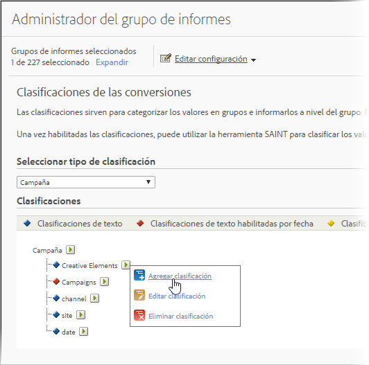

# Acerca de las clasificaciones

Las clasificaciones permiten aplicar categorías a los datos de variables de Analytics para mostrarlos de distintos modos cuando se generan los informes.

Vídeo con información general sobre las [Clasificaciones de Analytics](https://video.tv.adobe.com/v/16853/?captions=spa).

**[!UICONTROL Admin]** > **[!UICONTROL Report Suites]** > **[!UICONTROL Edit Settings]** > *`<Traffic or Conversion>`*

Al clasificar, se establece una relación entre la variable y los metadatos relacionados con esa variable. Las clasificaciones se utilizan con mayor frecuencia en campañas. Los datos recopilados mediante variables (eVars, props y eventos) se pueden resumir aplicando metadatos a los valores recopilados en las variables.

Una vez clasificado, cualquier informe que pueda generar con la variable clave también se puede generar con los atributos asociados. Por ejemplo, puede clasificar [!UICONTROL Product IDs] con atributos de producto adicionales, como nombre, color, tamaño, descripción y SKU del producto. El aumento de los datos de sistema de informes y análisis con atributos adicionales proporciona oportunidades de sistema de informes más profundas y complejas.

>[!IMPORTANT]
>
>Se ha eliminado de la base de código la posibilidad de importar clasificaciones numéricas 2 y fechas activadas. Este cambio entra en vigor con el lanzamiento de mantenimiento de junio de 2019. Si tiene columnas numéricas o con fecha habilitada en el archivo de importación, esas celdas serán omitidas sin aviso y cualquier otra información de ese archivo se importará como de costumbre. Las clasificaciones existentes se pueden exportar a través del flujo de trabajo de clasificación estándar y seguirán estando disponibles en los informes.

>[!NOTE]En la versión de mantenimiento de Analytics del 10 de mayo de 2018, Adobe empezó a limitar la funcionalidad de las clasificaciones numéricas y habilitadas por fecha. Estos tipos de clasificaciones se eliminaron de las interfaces del Administrador y del Importador de clasificaciones. No se pueden agregar nuevas clasificaciones numéricas ni con fecha habilitada. Las clasificaciones existentes se podrán seguir administrando (cargado y eliminado) a través del flujo de trabajo de clasificación estándar y permanecerán disponibles en los informes.

Una vez creadas las clasificaciones, pueden aprovecharse los nuevos atributos de datos en otros análisis e informes de Adobe Analytics.

**Ejemplo de códigos de seguimiento**

Supongamos que en lugar de ver campañas solo por el código de seguimiento, desea ver los resultados de campaña por motor de búsqueda, palabra clave y Canal de Campaña. En lugar de dedicar variables de conversión a cada una de ellas, puede crear tres clasificaciones de la variable de campaña para representar el motor de búsqueda, la palabra clave y el Canal de Campaña. Esta estrategia le permite ver los eventos de éxito del sitio según las cuatro variables, sin etiquetado adicional.

Sistema de informes y análisis incluye clasificaciones predefinidas para la variable de código de seguimiento, que oferta informes basados en clasificaciones llamados Elementos creativos y Campañas. Debe configurar las clasificaciones manualmente para todas las demás variables de tráfico y conversión.

Consulte Clasificaciones [de tráfico](/help/admin/admin/c-traffic-variables/traffic-classifications.md) y Clasificaciones [de conversión](https://marketing.adobe.com/resources/help/es_ES/reference/conversion_classifications.html).

La siguiente tabla describe los diferentes tipos de clasificaciones disponibles y los tipos de variables que las admiten. Consulte la información de  [Estructura general de archivos](/help/components/c-classifications2/c-classifications-importer/c-saint-data-files.md) antes de cargar archivos de datos.

<table id="table_279728C28D9C40EE832ACC9F211B5F17"> 
 <thead> 
  <tr> 
   <th colname="col1" class="entry"> 
TIPO 
 </th> 
   <th colname="col2" class="entry"> 
DISPONIBILIDAD 
 </th> 
   <th colname="col3" class="entry"> 
DESCRIPCIÓN 
 </th> 
  </tr> 
 </thead>
 <tbody> 
  <tr> 
   <td colname="col1"> 
  Texto 
 </td> 
   <td colname="col2"> 
Variables de tráfico y conversión 
 </td> 
   <td colname="col3"> 
Las clasificaciones de texto definen una categoría que le permite agrupar datos variables con fines de sistema de informes. 
 
Por ejemplo: si vende camisas, puede que desee categorizar las ventas de camisas (conversiones) por color, tamaño y estilo, para poder generar informes que le permitan ver las ventas de camisas organizadas por estas categorías. 
 </td> 
  </tr> 
  <tr> 
   <td colname="col1"> 
  Texto con fecha habilitada 
 
Nota: En la versión de mantenimiento de Analytics del 10 de mayo de 2018, Adobe empezó a limitar la funcionalidad de las clasificaciones habilitadas por fecha. Estos tipos de clasificaciones se eliminaron de las interfaces del Administrador y del Importador de clasificaciones. No es posible añadir nuevas clasificaciones habilitadas por fecha. Las clasificaciones existentes se podrán seguir administrando (cargado y eliminado) a través del flujo de trabajo de clasificación estándar y permanecerán disponibles en los informes. 
 </td> 
   <td colname="col2"> 
Variables de conversión 
 </td> 
   <td colname="col3"> 
Una clasificación de texto habilitada para la fecha permite asignar intervalos de fechas a una clasificación de texto. Esto suele utilizarse con clasificaciones de campañas para poder beneficiarse de la vista del gráfico de Gantt en el informe Campañas. 
 
Dentro del archivo de datos que rellena los datos de clasificación, puede incluir las fechas de la campaña real. 
 
Reports &amp; Analytics recopila códigos de seguimiento de campaña incluso cuando la fecha de finalización de una campaña ya ha transcurrido (aunque estos datos no aparecen asociados con la campaña). 
 </td> 
  </tr> 
  <tr> 
   <td colname="col1"> 
  Numéricos 
Nota: En la versión de mantenimiento de Analytics del 10 de mayo de 2018, Adobe empezó a limitar la funcionalidad de las clasificaciones numéricas. Estos tipos de clasificaciones se eliminaron de las interfaces del Administrador y del Importador de clasificaciones. No es posible añadir nuevas clasificaciones numéricas. Las clasificaciones existentes se podrán seguir administrando (cargado y eliminado) a través del flujo de trabajo de clasificación estándar y permanecerán disponibles en los informes. 
 
 </td> 
   <td colname="col2"> 
Variables de conversión 
 </td> 
   <td colname="col3"> 
Las clasificaciones numéricas le permiten aplicar valores numéricos fijados a los informes de Conversión. Estas clasificaciones aparecen como métricas en los informes. 
 
Cuando se considere la posibilidad de agregar una clasificación numérica, el valor numérico deberá fijarse sin sufrir modificaciones a lo largo del tiempo. 
 </td> 
  </tr> 
 </tbody> 
</table>

