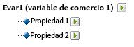
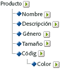

# Acerca de las subclasificaciones

Adobe Analytics admite modelos de clasificaciones de un solo nivel y de varios niveles. Las jerarquías de clasificación permiten aplicar una clasificación a otra.

>[!NOTE]
>
>La subclasificación se refiere a la capacidad para crear clasificaciones de clasificaciones. Sin embargo, no es lo mismo que la [!UICONTROL Jerarquía de clasificaciones] utilizada para crear informes de [!UICONTROL Jerarquía]. For more information about Classification hierarchies, see [Classification Hierarchies](classification-hierarchies.md).

<!-- 

Removed sub-classifications in rule builder. Preserve subclass files in project for future reference. 

 -->

<!-- 

c_single-level_classifications.xml

 -->

Por ejemplo:

Cada clasificación de este modelo es independiente y corresponde a un nuevo subinforme de la variable de informe seleccionada. Además, cada clasificación constituye una columna de datos en el archivo de datos, con el nombre de la clasificación como encabezado de la columna. Por ejemplo:

| CLAVE | PROPIEDAD 1 | PROPIEDAD 2 |
|---|---|---|
| 123 | ABC | A12B |
| 456 | DEF | C3D4 |

Para obtener más información sobre el archivo de datos, consulte [Archivos de datos de clasificación](../../components/c-classifications2/c-classifications-importer/c-saint-data-files.md#concept_EBA7669C546040BE8162ADACA3548735).

<!-- 

c_multiple-level_classifications.xml

 -->

Las clasificaciones de múltiples niveles están formadas por clasificaciones principales y secundarias. Por ejemplo:

**Clasificaciones principales:** una clasificación principal es toda clasificación que tenga asociada una clasificación secundaria. Una clasificación puede ser clasificación principal y secundaria a la vez. Las clasificaciones principales de nivel superior corresponden a clasificaciones de un solo nivel (Consulte [Clasificaciones de un solo nivel](../../components/c-classifications2/c-sub-classifications.md#concept_6B909B54221F4A9BAEA8E30594F06C49)).

**Clasificaciones secundarias:** una clasificación secundaria es toda clasificación que tenga otra clasificación como su principal en lugar de la variable. Las clasificaciones secundarias ofrecen información adicional sobre su clasificación principal. Por ejemplo, la clasificación [!UICONTROL Campañas] puede tener una clasificación secundaria de Propietario de la campaña. Las clasificaciones [!UICONTROL numéricas] también funcionan como métricas en los informes de clasificación.

Cada clasificación, ya sea principal o secundaria, constituye una columna de datos en el archivo de datos. Encabezamiento de columna de una clasificación secundaria utilizando el siguiente formato de convención de nombres:

`<parent_name>^<child_name>`

For more information about the data file format, see [Classification Data Files](../../components/c-classifications2/c-classifications-importer/c-saint-data-files.md#concept_EBA7669C546040BE8162ADACA3548735).

Por ejemplo:

| CLAVE | PROPIEDAD 1 | Propiedad 1 &amp; amp; Hat; Propiedad 1-1 | Propiedad 1 &amp; amp; Hat; Propiedad 1-2 | Propiedad 2 |
|---|---|---|---|---|
| 123 | ABC | Verde | Pequeño | A12B |
| 456 | DEF | Rojo | Grande | C3D4 |

Aunque la plantilla del archivo de una clasificación de múltiples niveles sea más compleja, el poder de estas clasificaciones es que los distintos niveles se pueden cargar como archivos por separado. Esta metodología puede utilizarse para reducir la cantidad de datos que deben cargarse periódicamente (diariamente, semanalmente, etc.) agrupando los datos en niveles de clasificación que cambian con el paso del tiempo en oposición a aquellos que no cambian.

>[!NOTE]
>
>If the [!UICONTROL Key] column in a data file is blank, Adobe automatically generates unique keys for each data row. Para evitar que se dañe el archivo al cargar un archivo de datos con datos de clasificación de segundo nivel o de nivel superior, rellene cada fila de la columna [!UICONTROL Clave] con un asterisco (*).

Consulte [Problemas comunes de carga de clasificaciones](https://marketing.adobe.com/resources/help/en_US/home/index.html#kb-common-saint-upload-issues) para obtener ayuda sobre la resolución de problemas.

<!-- 

c_classifications_example.xml

 -->

>[!NOTE]
Los datos de clasificación del producto están limitados a los atributos de datos directamente relacionados con el producto. (no se limitan en función de cómo se aplican categorías a los productos ni de cómo se venden en el sitio web). Los elementos de datos (como las categorías de venta, los nodos del explorador del sitio o los artículos de venta) no se consideran datos de clasificación del producto. Estos elementos se capturan en las variables de conversión de los informes.

Al cargar los archivos de datos correspondientes a esta clasificación de productos, puede cargar los datos de clasificación como un solo archivo o como varios archivos (ver más adelante). Si se separan el código de color en el archivo 1 y el nombre del color en el archivo 2, los datos del nombre del color (que ocupan pocas filas) solo deberán actualizarse cuando se creen nuevos códigos de color. Esto elimina el nombre del color (CODE &amp; amp; Hat; COLOR) del archivo 1 actualizado con mayor frecuencia, y reduce el tamaño y la complejidad del archivo al generar el archivo de datos.

## Clasificación del producto - Un archivo {#section_E8C5E031869C449F9B636F5EB3BFEC17}

| CLAVE | NOMBRE DEL PRODUCTO | DETALLES DEL PRODUCTO | SEXO | TAMAÑO | CÓDIGO | CÓDIGO y AMP; Hat; COLOR |
|---|---|---|---|---|---|---|
| 410390013 | Polo-SS | Polo para hombre, Manga corta (M, 01) | M | M | 01 | Piedra |
| 410390014 | Polo-SS | Polo para hombre, Manga corta (L, 03) | M | L | 03 | Jaspeado |
| 410390015 | Polo-LS | Polo para mujer, Manga larga (S,23) | F | S | 23 | Agua |

## Clasificación del producto - Múltiples archivos (Archivo 1) {#section_A99F7D0F145540069BA4EEC0597FF13F}

| CLAVE | NOMBRE DEL PRODUCTO | DETALLES DEL PRODUCTO | SEXO | TAMAÑO | CÓDIGO |
|---|---|---|---|---|---|
| 410390013 | Polo-SS | Polo para hombre, Manga corta (M, 01) | M | M | 01 |
| 410390014 | Polo-SS | Polo para hombre, Manga corta (L, 03) | M | L | 03 |
| 410390015 | Polo-LS | Polo para mujer, Manga larga (S,23) | F | S | 23 |

## Clasificación del producto - Múltiples archivos (Archivo 2) {#section_19ED95C33B174A9687E81714568D56A3}

| CLAVE | CÓDIGO | CÓDIGO y AMP; Hat; COLOR |
|---|---|---|
| * | 01 | Piedra |
| * | 03 | Jaspeado |
| * | 23 | Agua |
