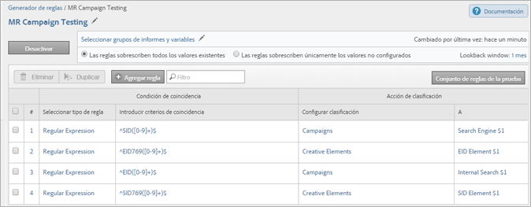
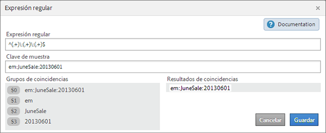

# Reglas de clasificación: definiciones

Definiciones de los elementos de la interfaz en las páginas del Generador de reglas de clasificación.

## Página Reglas {#section_4A5BF384EEEE4994B6DC888339833529}

Esta página muestra las reglas de un conjunto de reglas.

**Definiciones**

<table id="table_2B3A8BB7BDE14836ACA6A1D444B011CD"> 
 <thead> 
  <tr> 
   <th colname="col1" class="entry"> Elemento </th> 
   <th colname="col2" class="entry"> Descripción </th> 
  </tr> 
 </thead>
 <tbody> 
  <tr> 
   <td colname="col1"> 
Seleccionar grupos de informes y variables 
 </td> 
   <td colname="col2"> 
<b>Grupo de informes</b> 
 
Los grupos de informes a los que se aplica el conjunto de reglas. 
 
<b>Variable</b> 
 
Al crear un conjunto de reglas de clasificación solo puede aplicarse una variable. Si se desea crear varios conjuntos de reglas para una variable, debe aplicarse cada uno de estos conjuntos a varios grupos de informes. 
 
Nota: Solo puede usar las variables a las que tenga acceso en sus grupos de informes. Las variables se mostrarán en el panel Nuevo conjunto de reglas solo después de haber definido como mínimo una clasificación para la variable. 
 
For example, to make  Pages available as a variable to the rule set, ensure that the report suite has <a href="https://marketing.adobe.com/resources/help/en_US/reference/traffic_classifications.html" format="http" scope="external"> traffic classifications</a> implemented for  Page. 
 
 El usuario puede crear clasificaciones en variables desde Administradores &gt; Grupos de informes &gt; Tráfico &gt; Clasificaciones de tráfico (o Conversión &gt; Clasificaciones de las conversiones). A continuación, debe seleccionar la variable y hacer clic en Agregar clasificación. 
 
Consulte <a href="https://marketing.adobe.com/resources/help/en_US/reference/index.html?f=traffic_classification_admin" format="https" scope="external">Clasificaciones de tráfico</a> y <a href="https://marketing.adobe.com/resources/help/en_US/reference/index.html?f=conversion_classifications" format="https" scope="external">Clasificaciones de las conversiones</a> en la ayuda del administrador. 
 </td> 
  </tr> 
  <tr> 
   <td colname="col1"> 
 Activar 
 </td> 
   <td colname="col2"> 
Valida y activa una regla. Las reglas activas se procesan a diario y los datos de clasificación suelen examinarse de forma mensual. Las reglas comprueban automáticamente la existencia de nuevos valores y cargan las clasificaciones. 
 </td> 
  </tr> 
  <tr> 
   <td colname="col1"> 
 Desactivar 
 </td> 
   <td colname="col2"> 
Desactiva las reglas para editarlas y probarlas. 
 </td> 
  </tr> 
  <tr> 
   <td colname="col1"> 
Configurar grupos de informes y variables 
 </td> 
   <td colname="col2"> 
Muestra la página Grupos de informes disponibles, en la que puede seleccionar uno o más grupos de informes disponibles para usarlos para todos sus conjuntos de reglas. (Esta página también se muestra la primera vez que ejecuta el enerador de reglas de clasificación). 
 
Esta función sirve para ayudar a reducir el tiempo de carga del grupo de informes, en el caso de que tenga cientos de grupos de informes disponibles. 
 
The report suites you select here are made available at the rule level, when you click  Add Suites when creating a rule. 
 
Note: A report suite becomes available  only when the report suites have at least one classification defined for the variable in  Admin Tools. 
(See  Variable in <a href="../../../components/c-classifications2/crb/classification-rule-set.md#concept_CD3D510F5070486584F3BB535AE41524" format="dita" scope="local"> Classification Rule Sets</a> for an explanation about this prerequisite.) 
 
 </td> 
  </tr> 
  <tr> 
   <td colname="col1"> 
Las reglas sobrescriben los valores existentes 
 </td> 
   <td colname="col2"> 
 (Configuración predeterminada) Sobrescriba siempre las claves de clasificación existentes, incluidas las clasificaciones cargadas mediante el importador (SAINT). 
 </td> 
  </tr> 
  <tr> 
   <td colname="col1"> 
Las reglas solo sobrescriben los valores no establecidos 
 </td> 
   <td colname="col2"> 
Rellene solo las celdas vacías (no establecidas). Las clasificaciones existentes no cambiarán. 
 </td> 
  </tr> 
  <tr> 
   <td colname="col1"> 
Ventana retroactiva 
 </td> 
   <td colname="col2"> 
A la hora de activar y validar reglas, puede especificar si estas reglas deben sobrescribir las clasificaciones existentes de las claves afectadas. (Solo resultan afectadas las claves clasificadas que se han pasado previamente a Adobe Analytics en el lapso de tiempo especificado). 
 
If you to not specify a  lookback window, the rules look back roughly one month (depending on current day of the month.) Las clasificaciones existentes no se sobrescriben nunca, salvo que active esa opción. 
 
<b>Centro de desarrolladores</b>: los socios pueden crear reglas de clasificación en el Centro de desarrolladores. Estas reglas se implementan cuando el cliente activa una integración. En el Centro de desarrolladores, la opción Sobrescribir desde permite al socio especificar si el cliente puede determinar el valor de sobrescritura al activar o editar una integración. 
 
See <a href="../../../components/c-classifications2/crb/classification-quickstart-rules.md#concept_A67A23F523844D37898583C632DB9D25" format="dita" scope="local"> How Rules Are Processed</a> for more information about rule processing. 
 </td> 
  </tr> 
  <tr> 
   <td colname="col1"> <a href="../../../components/c-classifications2/crb/classification-quickstart-rules.md#task_86F216DFD2534FA181E64ABDF306782B" format="dita" scope="local"> Agregar regla </a> </td> 
   <td colname="col2"> 
Permite agregar reglas al conjunto de reglas. 
 
Nota: Si se encuentran dos o más coincidencias para un valor en un conjunto de reglas, el sistema clasifica el valor con la última regla. 
 </td> 
  </tr> 
  <tr> 
   <td colname="col1">  Borrador </td> 
   <td colname="col2"> Permite especificar que una regla se encuentra en modo borrador. El estado de borrador permite probar una regla antes de ejecutarla. </td> 
  </tr> 
  <tr> 
   <td colname="col1">  Duplicar </td> 
   <td colname="col2"> Duplica (copia) un conjunto de reglas para aplicarlo a otra variable o a la misma en otro grupo de informes. </td> 
  </tr> 
  <tr> 
   <td colname="col1"> 
 <a href="../../../components/c-classifications2/crb/classification-quickstart-rules.md#task_618A1E7CC8664E728F312250E8367158" format="dita" scope="local"> Conjunto de reglas de la prueba </a> 
 </td> 
   <td colname="col2"> 
Permite probar la validez de un conjunto de reglas. 
 </td> 
  </tr> 
  <tr> 
   <td colname="col1">  Condición de coincidencia </td> 
   <td colname="col2"> Especifica las condiciones para una regla. </td> 
  </tr> 
  <tr> 
   <td colname="col1">  Acción de clasificación </td> 
   <td colname="col2"> 
Especifica la acción que debe realizarse al detectar la condición de coincidencia. 
 
Por ejemplo, si se define un nombre de campaña en $2, lo que identifica la posición 2 de un código de seguimiento como nombre de campaña. 
 </td> 
  </tr> 
  <tr> 
   <td colname="col1">  # </td> 
   <td colname="col2"> 
El número de la regla. 
 
Consulte <a href="../../../components/c-classifications2/crb/classification-quickstart-rules.md#concept_A67A23F523844D37898583C632DB9D25" format="dita" scope="local"> Cómo procesar las reglas</a> para obtener más información. 
 </td> 
  </tr> 
  <tr> 
   <td colname="col1">  Seleccionar tipo de regla </td> 
   <td colname="col2"> 
Se aplica cada conjunto de reglas a una variable específica. Las selecciones válidas son: 
 
    <ul id="ul_6A8E06BB4AF2402B99C215823CB3D59D"> 
     <li id="li_5C702D4F460841D38A59621A5161A3BC">Comienza con </li> 
     <li id="li_8052A741D9F34A2FBC136C181600193E">Finaliza con </li> 
     <li id="li_D0FA6EA4F09644FFBC9E6BC568BE80AC">Contiene </li> 
     <li id="li_48675FE5253942ED887C6A72D1DCEF54"> <a href="../../../components/c-classifications2/crb/classification-quickstart-rules.md#concept_8A63F9BCF9484963962E14E6286D312D" format="dita" scope="local"> Expresión regular </a> </li> 
    </ul> </td> 
  </tr> 
  <tr> 
   <td colname="col1">  Introducir criterios de coincidencia </td> 
   <td colname="col2"> El patrón de texto que se busca en una clave. Estos criterios pueden ser términos de búsqueda, caracteres o expresiones regulares. </td> 
  </tr> 
  <tr> 
   <td colname="col1">  Configurar clasificación </td> 
   <td colname="col2"> La columna de clasificación que debe definirse si se cumplen los criterios de coincidencia. </td> 
  </tr> 
  <tr> 
   <td colname="col1">  Hasta </td> 
   <td colname="col2"> El valor que debe especificarse para la columna de clasificación seleccionada si se cumplen los criterios de coincidencia. </td> 
  </tr> 
  <tr> 
   <td colname="col1"> Filtro </td> 
   <td colname="col2"> Permite buscar reglas. </td> 
  </tr> 
 </tbody> 
</table>

## Página Expresión regular {#section_C932A5469E774841B2229965A154163C}

En la página [!UICONTROL Expresión regular] puede editar las expresiones de este tipo.

**Definiciones**

| Elemento | Descripción |
|---|---|
| Clave de muestra | La cadena de prueba que debe utilizarse. Por ejemplo, puede crear una clasificación a partir de caracteres específicos de un código de seguimiento. Según se considere conveniente, pueden hacerse coincidir patrones de caracteres, palabras o caracteres determinados. |
| Grupos de coincidencias | Muestra la correspondencia entre una expresión regular y los caracteres de un ID de campaña para poder clasificar una posición en este ID. |
| Resultados de coincidencias | Muestra los elementos de una cadena que coinciden con la expresión regular. |

Consulte [Expresiones regulares en las reglas de clasificación](../../../components/c-classifications2/crb/classification-quickstart-rules.md#concept_8A63F9BCF9484963962E14E6286D312D).

## Página Pruebas {#section_EC926F97901C4E65901413F9683AA70A}

Esta página permite probar las reglas de un conjunto.

**Definiciones**

| Elemento | Descripción |
|---|---|
| Ejecutar prueba | Para probar el conjunto de reglas, debe comprobarse el efecto que este ejerce sobre las claves del informe. |
| Filtro | Filtra los valores en el panel [!UICONTROL Resultados]. |

