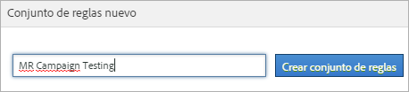

# Conjuntos de reglas de clasificación

Un conjunto de reglas es un grupo de reglas de clasificación para una variable específica. La variable se aplica al conjunto de reglas. Si se desea crear varios conjuntos de reglas para una variable, debe aplicarse cada uno de estos conjuntos a varios grupos de informes.

## Classification rule sets {#concept_CD3D510F5070486584F3BB535AE41524}

Un conjunto de reglas es un grupo de reglas de clasificación para una variable específica. La variable se aplica al conjunto de reglas. Si se desea crear varios conjuntos de reglas para una variable, debe aplicarse cada uno de estos conjuntos a varios grupos de informes.

## Página Clasificación del Generador de reglas {#section_C60B0888C76D49C596EF19F11808B718}

**[!UICONTROL Analytics]** &gt; **[!UICONTROL Administración]** &gt; **[!UICONTROL Clasificación del Generador de reglas]**

Los campos y las opciones disponibles en el [!UICONTROL Generador de reglas de clasificación] son los siguientes:

<table id="table_A5D92409969747E39E041216A5AA32CD"> 
 <thead> 
  <tr> 
   <th colname="col1" class="entry"> Elemento </th> 
   <th colname="col2" class="entry"> Descripción </th> 
  </tr> 
 </thead>
 <tbody> 
  <tr> 
   <td colname="col1"> 
<a href="../../../components/c-classifications2/crb/classification-rule-set.md#task_86F216DFD2534FA181E64ABDF306782B" format="dita" scope="local"> Agregar conjunto de reglas</a> 
 </td> 
   <td colname="col2"> 
Crea un conjunto de reglas. 
 </td> 
  </tr> 
  <tr> 
   <td colname="col1"> 
Reglas 
 </td> 
   <td colname="col2"> Muestra el número de reglas que contiene el conjunto. </td> 
  </tr> 
  <tr> 
   <td colname="col1"> 
Estado 
 </td> 
   <td colname="col2"> Muestra el estado de actividad del conjunto de reglas (por ejemplo, Borrador o Activo). Las reglas activas se procesan a diario y los datos de clasificación suelen examinarse de forma mensual. Las reglas comprueban automáticamente la existencia de nuevos valores y cargan las clasificaciones. </td> 
  </tr> 
  <tr> 
   <td colname="col1"> 
Cambiado por última vez 
 </td> 
   <td colname="col2"> Indica cuándo se ha editado el conjunto de reglas. </td> 
  </tr> 
  <tr> 
   <td colname="col1"> 
Duplicar 
 </td> 
   <td colname="col2"> Duplica (copia) un conjunto de reglas para aplicarlo a otra variable o a la misma en otro grupo de informes. </td> 
  </tr> 
 </tbody> 
</table>

## Create a Classification Rule Set {#task_86F216DFD2534FA181E64ABDF306782B}

<!-- 

t_classification_rule_set.xml

 -->

Nombre el conjunto de reglas de clasificación, aplique la variable y especifique la configuración de sobrescritura.

1. (Prerequisite) Define the classification structure in **[!UICONTROL Admin]** &gt; **[!UICONTROL Report Suites]**.

   (Consulte [Clasificaciones](https://marketing.adobe.com/resources/help/en_US/reference/index.html?f=classifications) en la ayuda de las herramientas de administración, donde se trata la adición de clasificaciones).

   Las variables se mostrarán en el panel [!UICONTROL Nuevo conjunto de reglas] solo después de haber definido como mínimo una clasificación para la variable.

   You can create classifications on a variable in **[!UICONTROL Admin]** &gt; **[!UICONTROL Report Suites]** &gt; **[!UICONTROL Traffic]** &gt; **[!UICONTROL Traffic Classifications]** (or **[!UICONTROL Conversion]** &gt; **[!UICONTROL Conversion Classifications]**). A continuación, debe seleccionar la variable y hacer clic en **[!UICONTROL Agregar clasificación]**.

1. To create the rule set, click **[!UICONTROL Admin]** &gt; **[!UICONTROL Classification Rule Builder]** &gt; **[!UICONTROL Add Rule Set]**.

   

1. Name the rule set, then click **[!UICONTROL Create Rule Set]**.
1. Seleccione el conjunto de reglas para editar.

   

1. Click **[!UICONTROL Select Report Suites and Variables]**.

   El grupo de informes y la lista de variables se rellenarán con todas las variables disponibles clasificadas en todos los grupos de informes de la empresa de inicio de sesión. Cada variable única de un grupo de informes solo puede pertenecer a un conjunto de reglas.

   Consulte *`Variable`* en las definiciones de la página [Generador de reglas de clasificación](../../../components/c-classifications2/crb/classification-rule-definitions.md#section_4D1A70A607C9419EB2116A5174EACB72) para obtener más información.
1. Specify the report suites and variables to use, then click **[!UICONTROL Save]**.
1. Continue by [adding classification rules](../../../components/c-classifications2/crb/classification-rule-set.md#task_86F216DFD2534FA181E64ABDF306782B) to the rule set.
