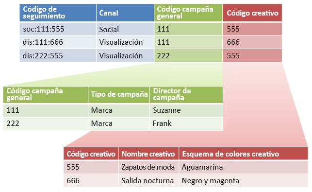
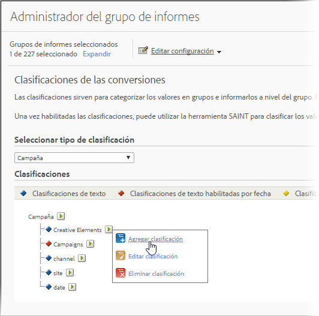

# Subclasificaciones y el Generador de reglas: Caso de uso

Puede combinar el Generador de reglas de clasificaciones con subclasificaciones para simplificar la administración de clasificaciones y reducir el número de reglas necesarias. Puede ser conveniente hacer esto si el código de seguimiento está formado por códigos que desea clasificar de forma independiente.

## Subclasificaciones y el Generador de reglas: Caso de uso {#concept_6C8672C242544D7487E82886BBFABE6E}

Puede combinar el Generador de reglas de clasificaciones con subclasificaciones para simplificar la administración de clasificaciones y reducir el número de reglas necesarias. Puede ser conveniente hacer esto si el código de seguimiento está formado por códigos que desea clasificar de forma independiente.

See [Sub-Classifications](../../../components/c-classifications2/c-sub-classifications.md#concept_19EE5513A7DC43C38CC396E96F306CFE) for conceptual information about sub-classifications.

**Ejemplo**

Supongamos que tenemos el siguiente código de seguimiento:

`channel:broad_campaign:creative`

Las jerarquías de clasificación permiten aplicar una clasificación a otra (llamada *`sub-classification`*). Es decir, puede usar el importador como si fuera una base de datos relacional con varias tablas. Una tabla asigna los códigos de seguimiento completos a claves y otra asigna esas claves a otras tablas.

Una vez preparada esta estructura, puede usar el [Generador de reglas de clasificaciones](../../../components/c-classifications2/crb/classification-rule-builder.md) para cargar archivos pequeños que solo actualicen las tablas de búsqueda (las tablas verde y roja de la imagen anterior). A continuación, puede usar el Generador de reglas para mantener actualizada la tabla de la clasificación principal.

En la siguiente tarea, se describe cómo hacerlo.

## Set up Sub-Classifications using the Rule Builder{#task_2D9016D8B4E84DBDAF88555E5369546F}

<!-- 

t_rule_builder_subclass.xml

 -->

Ejemplo paso por paso que describe cómo cargar subclasificaciones mediante el Generador de reglas.

>[!NOTE]
>
>Estos pasos describen cómo se lleva a cabo el caso de uso descrito en [Subclasificaciones y el Generador](../../../components/c-classifications2/crb/sub-classification-rule-builder.md)de reglas.

1. Cree clasificaciones y subclasificaciones en el [Administrador de clasificación](https://marketing.adobe.com/resources/help/en_US/reference/classifications.html).

   Ejemplo:

   

1. In the [Classifications Rule Builder](../../../components/c-classifications2/crb/classification-rule-builder.md#concept_C1F219E622044D43852EF5168FF7192A), classify the sub-classification key from the original tracking code.

   Para hacerlo, se usa una expresión regular. En este ejemplo, la regla para rellenar el *`Broad Campaign code`* utilizaría esta expresión regular:

   | `#` | Tipo de regla | Coincidencias | Configurar clasificación | Para |
   |---|---|---|---|---|
   |  | Expresión regular | `[^\:]:([^\:]):([^\:]`) | código Campaña general | `$1` |
   |  | Expresión regular | `[^\:]:([^\:]):([^\:]`) | código Creativo | `$2` |

   >[!NOTE]
   >
   >At this point, you do not populate the sub-classifications *`Campaign Type`* and *`Campaign Director`*.

1. Cargue un archivo de clasificación que incluya solamente las subclasificaciones especificadas.

   Consulte Clasificaciones [de](../../../components/c-classifications2/c-sub-classifications.md#concept_35AD906CDDC4441DAAF70664CF76AA0A)varios niveles.

   Ejemplo:

   | Clave | Canal | código Campaña general | Campaña amplia, código&amp;Sombrero;Tipo de campaña | Campaña amplia de código&amp;Sombrero;Director de campaña | ... |
   |---|---|---|---|---|---|
   | * |  | 111 | Marca | Suzanne |  |
   | * |  | 222 | Marca | Frank |  |

1. Para realizar el mantenimiento de las tablas de búsqueda, cargue un archivo pequeño (como se muestra arriba).

   You would upload this file, for example, when a new *`Broad Campaign code`* is introduced. Este archivo se aplicaría a los valores clasificados previamente. Del mismo modo, si crea una nueva subclasificación (por ejemplo, *`Creative Theme`* como subclasificación de *`Creative code`*), solo se carga el archivo de subclasificación, en lugar de todo el archivo de clasificación.

   Por lo que respecta a los informes, estas subclasificaciones funcionan exactamente igual que las clasificaciones de nivel superior. De este modo, se reduce la carga administrativa necesaria para usarlas.
