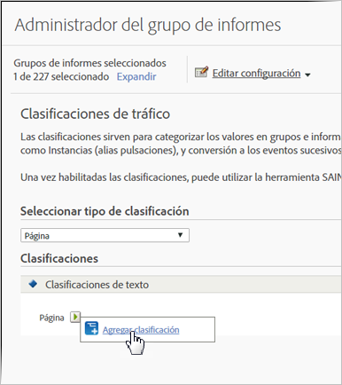

# Clasificaciones de tráfico

Las clasificaciones de tráfico permiten clasificar variables de tráfico (props). Las clasificaciones de tráfico solo pueden usar clasificaciones de texto.

## Traffic classifications {#concept_028079B29A9C412AA68910A87E11176F}

Las clasificaciones de tráfico permiten clasificar variables de tráfico (props). Las clasificaciones de tráfico solo pueden usar clasificaciones de texto.

La página Clasificaciones de tráfico permite crear clasificaciones de los grupos de informes seleccionados. Una vez clasificado, cualquier informe que se pueda generar con los datos clave también se puede generar con los atributos asociados.

Después de activar las clasificaciones, utilice el [Importador de clasificaciones](../../components/c-classifications2/c-classifications-importer/c-working-with-saint.md#concept_08ED8C7A86C64E7DA5DE3044BB94B2EA) para asignar valores determinados a la clasificación adecuada.

## Add a Traffic Classification {#task_4DB49CCB1D764483907BC33A5CEB7315}

<!-- 

t_classification_add_traffic.xml

 -->

Instrucciones que describen cómo agregar o editar clasificaciones para los grupos de informes seleccionados.

1. Click **[!UICONTROL Admin]** &gt; **[!UICONTROL Report Suites]** in the Suite header.
1. Seleccione un grupo de informes.
1. En el campo **Seleccionar tipo de clasificación**, seleccione la variable donde desee agregar una clasificación.
1. Click **[!UICONTROL Edit Settings]** &gt; **[!UICONTROL Traffic]** &gt; **[!UICONTROL Traffic Classifications]**.

   

1. Mouse over the **[!UICONTROL Edit Classification]** icon, then select **[!UICONTROL Add Classification]** or **[!UICONTROL Edit Classification]**.
1. In the **[!UICONTROL Text Classification]** dialog box, configure the classification as desired:

   **[!UICONTROL Nombre:]** Especifique el nombre de la clasificación.

   **[!UICONTROL Descripción]**: Proporcione una descripción más detallada.
1. Haga clic en **[!UICONTROL Guardar]**.
