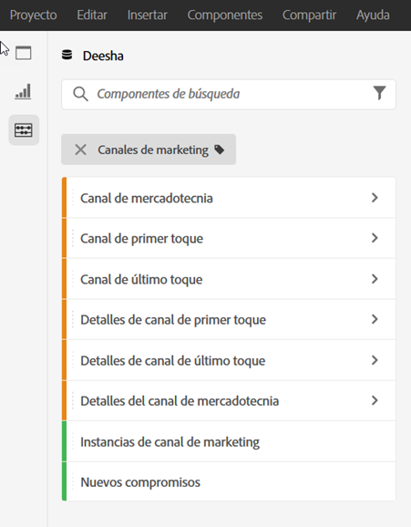
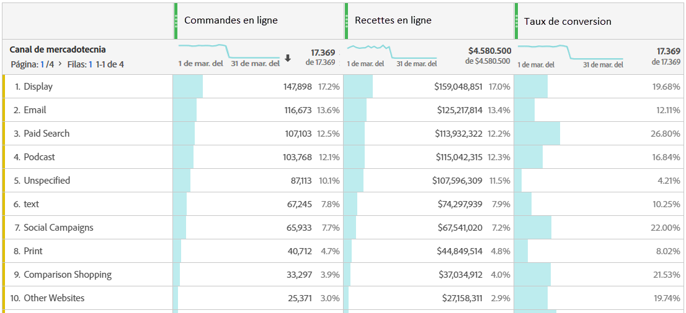
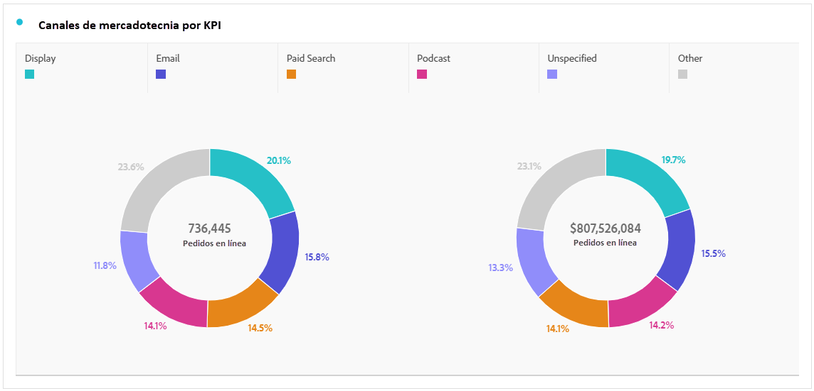
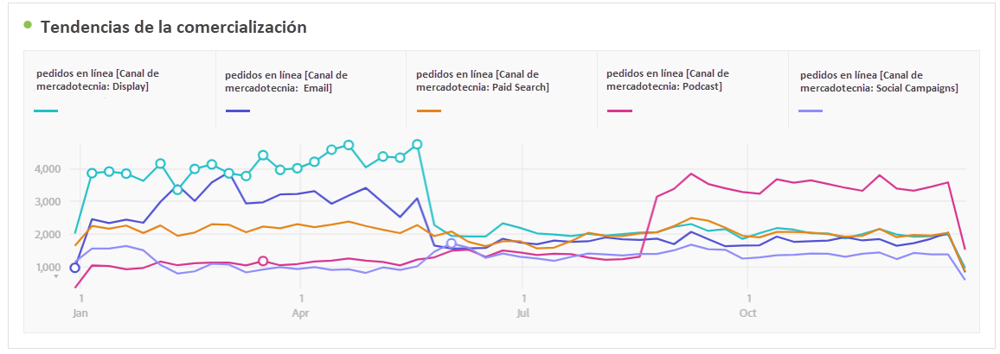
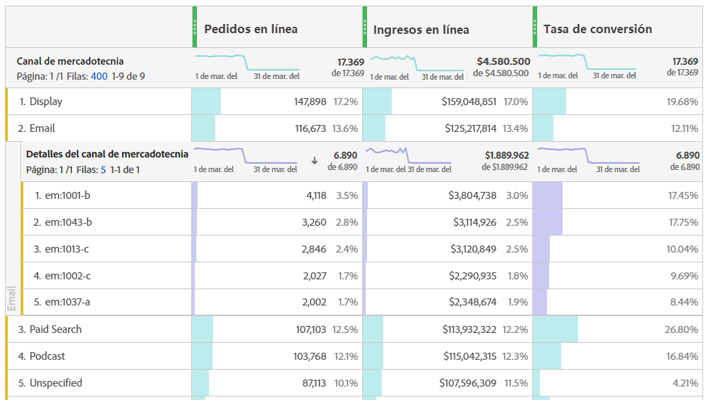
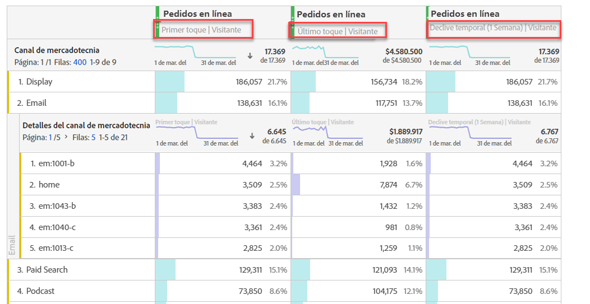
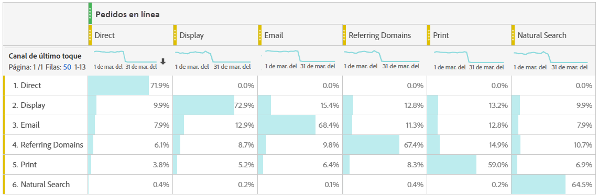

# Analizar Canales de marketing

>[!NOTE]
>
>Para maximizar la eficacia de los canales de marketing para Attribution IQ y Customer Journey Analytics, hemos publicado algunas [prácticas recomendadas revisadas](/help/components/c-marketing-channels/mchannel-best-practices.md).

Quizá quiera saber cuál de sus canales de marketing es el más efectivo y con quién, para que pueda dirigir mejor sus esfuerzos y recibir un mejor retorno de la inversión de marketing. En Adobe Analytics, las dimensiones y métricas de los Canales de marketing en Workspace son una de las herramientas que pueden ayudarle a realizar un seguimiento de la influencia de diferentes canales en sus pedidos, ingresos, etc. y le proporciona información útil sobre el canal. Estas son las dimensiones y métricas que puede usar relacionadas con los Canales de marketing:

| Dimensión/Métrica | Definición |
| --- | --- |
| Canal de marketing | Esta es la dimensión de Canales de marketing que se recomienda utilizar. Los modelos de Attribution IQ se pueden aplicar en tiempo de ejecución. Esta dimensión se comporta de forma idéntica a la dimensión del canal de último contacto, pero tiene una etiqueta diferente para evitar confusiones al usarla con un modelo de atribución distinto. |
| Canal de último contacto | Dimensión heredada, con modelo de atribución de último contacto preaplicado e inmodificable. |
| Canal de primer contacto | Dimensión heredada, con modelo de atribución de primer contacto preaplicado e inmodificable. |
| Instancias de Canal de marketing | Esta métrica mide el número de veces que se definió un canal de marketing en una solicitud de imagen, incluidas las vistas de página estándar y las llamadas de vínculo personalizado. No incluye valores persistentes. |
| Nuevos compromisos | Esta métrica es similar a Instancias, pero solo se incrementa cuando el canal de marketing de primer toque se define en una solicitud de imagen. |

## Análisis básico

Esta tabla improvisada muestra las métricas Pedidos en línea, Ingresos en línea y la Tasa de conversión de cada uno de los Canales de marketing:

Aquí puede ver los pedidos en línea e ingresos en línea de cada Canal de marketing en un gráfico circular:

Este gráfico de líneas muestra las tendencias de los pedidos en línea de varios canales a lo largo del tiempo:

## Análisis avanzado

Los detalles de Canales de marketing se insertan más profundamente en cada canal para mostrar campañas, colocaciones, etc. específicas. Puede desglosar cada Canal de marketing en detalles:

## Aplicar modelos de atribución

Puede utilizar [Attribution IQ](https://docs.adobe.com/content/help/es-ES/analytics/analyze/analysis-workspace/panels/attribution.html) para aplicar distintos modelos de atribución de manera instantánea:

Observe cómo la misma métrica (Pedidos en línea) genera resultados diferentes al aplicar modelos de atribución diferentes.

## Análisis de marketing entre fichas

Con el Canal de primer toque heredado y el Canal de último toque, puede obtener una vista útil de las interacciones de canal:

Obtenga más información acerca del análisis de marketing entre pestañas en este vídeo: [Uso del análisis entre pestañas para explorar la atribución de marketing básica en Analysis Workspace](https://docs.adobe.com/content/help/es-ES/analytics-learn/tutorials/analysis-workspace/attribution-iq/using-cross-tab-analysis-to-explore-basic-marketing-attribution-in-analysis-workspace.html).
