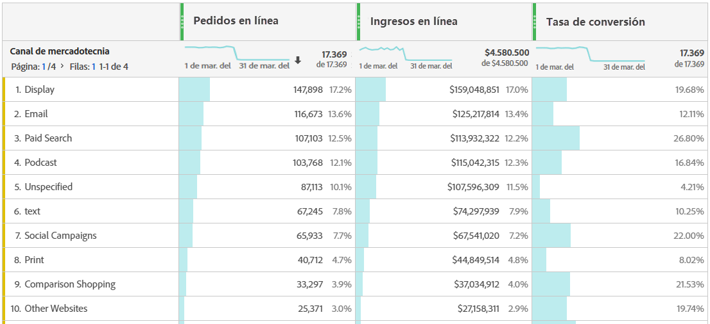

# Analizar Canales de mercadotecnia

Probablemente quiera saber cuál de sus canales de mercadotecnia es el más efectivo y con quién, para que pueda realizar un mejor destinatario de sus esfuerzos y recibir un mejor retorno en los dólares de mercadotecnia. En Adobe Analytics, las dimensiones y métricas de Canales de marketing en Workspace son una de las herramientas que pueden ayudarle a realizar un seguimiento de la influencia de diferentes canales en sus pedidos, ingresos, etc. y le proporciona información útil sobre el canal. Estas son las dimensiones y métricas que puede utilizar relacionadas con los Canales de mercadotecnia:

| Dimensión/Métrica | Definición |
|---|---|
| Canal de marketing | Ésta es la dimensión de Canales de mercadotecnia que se recomienda utilizar. Los modelos de IQ de atribución se pueden aplicar en tiempo de ejecución. Esta dimensión se comporta de forma idéntica a la dimensión de Canal de último toque, pero tiene una etiqueta diferente para evitar confusiones al utilizarla con un modelo de atribución diferente. |
| Canal de último toque | Dimensión heredada, con modelo de atribución de último toque preaplicado e inmodificable. |
| Canal de primer toque | Dimensión heredada, con modelo de atribución de primer toque preaplicado e inmodificable. |
| Instancias de Canal de mercadotecnia | Esta métrica mide el número de veces que se definió un canal de marketing en una solicitud de imagen, incluidas las vistas de página estándar y las llamadas de vínculo personalizado. No incluye valores persistentes. |
| Nuevos compromisos | Esta métrica es similar a Instancias, pero solo se incrementa cuando el canal de marketing de primer toque se define en una solicitud de imagen. |

## Análisis básico

Esta tabla improvisada muestra las métricas Pedidos en línea, Ingresos en línea y la Tasa de conversión de cada uno de los Canales de mercadotecnia:

Aquí puede ver los pedidos en línea e ingresos en línea de cada Canal de mercadotecnia en un gráfico circular:

Este gráfico de líneas muestra las tendencias de los pedidos en línea de varios canales a lo largo del tiempo:

## análisis avanzada

Los detalles de Canales de marketing se insertan más profundamente en cada canal para mostrar campañas, colocaciones, etc. específicas. Puede desglosar cada Canal de mercadotecnia en detalles:

## Aplicar modelos de atribución

Puede utilizar IQ [de](https://docs.adobe.com/content/help/en/analytics/analyze/analysis-workspace/panels/attribution/use-attribution.html) atribución para aplicar distintos modelos de atribución instantáneamente:

Observe cómo la misma métrica (Pedidos en línea) genera resultados diferentes al aplicar modelos de atribución diferentes.

Aquí hay algunos videos que explican el CI de atribución con más detalle: [Lista de reproducción de IQ de atribución](https://www.youtube.com/playlist?list=PL2tCx83mn7GuDzYEZ8jQlaScruZr3tBTR).

## análisis de mercadotecnia entre fichas

Con el Canal de primer toque heredado y el Canal de último toque, puede obtener una vista útil en las interacciones de canal:

Obtenga más información sobre la análisis de marketing entre fichas en [este vídeo](https://www.youtube.com/watch?v=M3EOdONa-3E).
