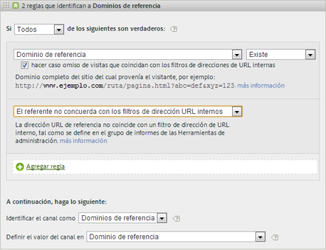

# Preguntas más frecuentes sobre los Canales de mercadotecnia

Preguntas más frecuentes sobre los canales de mercadotecnia.

## Mis códigos de seguimiento no siguen un patrón, y tengo miles que deben especificarse para mi canal de Afiliados.

* Utilice el proceso de eliminación. Si los canales Correo electrónico y Afiliados utilizan el mismo parámetro de cadena de consulta pero solamente tiene unos cuantos códigos de seguimiento de correo electrónico, puede especificar los códigos de seguimiento de correo electrónico en un conjunto de reglas que definan el correo electrónico. Luego, clasifique todos los demás códigos de seguimiento con *`affiliates.`*
* En su sistema de correo electrónico, agregue un parámetro de cadena de consulta a todas las direcciones URL de páginas de aterrizaje, como *`&ch=eml`*. Cree un conjunto de reglas que detecte si el parámetro de consulta ch es igual a *`eml`*. Si no contiene *`eml`*, entonces es un afiliado.

## Los dominios de referencia contienen más datos de los que esperaba.

* Es posible que los dominios de referencia estén demasiado arriba en la lista de reglas de procesamiento. Dicho conjunto de reglas debería ser uno de los últimos (o el último): el orden de procesamiento es importante.

## He creado una regla que coincide con un parámetro de cadena de consulta y que no funciona.

* Compruebe que el nombre del parámetro esté especificado en los campos del parámetro de la cadena de consulta (normalmente, un valor alfanumérico). Asegúrese, también, de que el valor del parámetro se especifica después del operador, como se muestra en el siguiente ejemplo de regla de correo electrónico.

   

## ¿Por qué se atribuye todo mi tráfico de último toque a un dominio interno?

* Hay una regla que concuerda con el tráfico interno. Recuerde que estas reglas se procesan con cada visita que el visitante haga al sitio, y no solo con la primera visita. Si tiene alguna regla similar a *`Page URL exists`* sin ningún otro criterio, con cada visita sucesiva a su sitio web, se encuentran coincidencias con ese canal, porque siempre existe una URL de página.

## ¿Cómo se depura el tráfico que se muestra en Ningún Canal identificado en el informe?

* Las reglas se procesan en orden. Si no se encuentra ninguna concordancia con un criterio específico, las visitas caen en una de estas tres categorías:

1. Sin referente (visita directa).

2. Referente interno, en la primera página de la visita.

3. Problema técnico de procesamiento en la página.

Asegúrese de tener un canal para estas tres posibilidades. Por ejemplo, cree reglas como estas:

1. **[!UICONTROL Referente]** y **[!UICONTROL No existe]** y **[!UICONTROL Es la primera página de la visita]**. (Consulte [Directas.](/help/components/c-marketing-channels/c-faq.md))

2. **[!UICONTROL El referente coincide con los filtros de dirección URL internos]** y **[!UICONTROL Es la primera página de la visita]**. (Consulte [Internas](/help/components/c-marketing-channels/c-faq.md).)

3. **[!UICONTROL Referente]** y **[!UICONTROL Existe]** y **[!UICONTROL El referente no concuerda con los filtros de dirección URL internos]**.

Por último, cree el canal *Otros* para que capture las visitas restantes, tal como se describe en [No se ha identificado el canal](/help/components/c-marketing-channels/c-faq.md#no-channel-identified).

## Relación entre primer y último contacto

Para comprender la interacción entre las dimensiones de primer y último toque heredadas y confirmar que las sobrescrituras funcionan según lo esperado, puede extraer un informe de canal de primer toque, subrelacionado con un informe de canal de último toque, con la métrica de éxito clave agregada en (ver ejemplo más abajo). En el ejemplo se muestra la interacción entre los canales de primer y último contacto.

La intersección donde el primer toque es igual que el último toque es la diagonal de la tabla. Tanto la actualización directa como la actualización de sesión solo obtienen crédito de último toque si también son canales de primer toque, ya que no pueden tomar crédito de otros canales persistentes (filas resaltadas).

## Razones por las que no se identificó ningún Canal {#no-channel-identified}

Cuando las reglas no capturan datos o si las reglas no se han configurado correctamente, el informe muestra los datos en la fila [!UICONTROL No se ha identificado el canal] del informe. Por ejemplo, puede crear un conjunto de reglas denominado *Otro* al final del orden de procesamiento, que también identifique el tráfico interno.

Este tipo de regla sirve de captador global para asegurar que el tráfico de los canales siempre coincide con el tráfico exterior y normalmente no finaliza en **[!UICONTROL Ningún canal identificado]**. Tenga cuidado de no crear una regla que identifique también el tráfico interno. Asignar al valor del canal **[!UICONTROL Dominio de referencia]** o **[!UICONTROL Dirección URL de página]** es el modo más frecuente y útil de crear una regla Otro que funcione.

>[!NOTE]
>
>Debería haber todavía algún tráfico de canal que podría caer en la categoría Ningún canal identificado. Por ejemplo: un visitante viene al sitio, crea un marcador de una página y en la misma visita, vuelve a la página a través del marcador. Debido a que esta no es la primera página de la visita, irá al canal Directo o al canal Otros porque no hay dominio de referencia.

## Razones para la actualización interna de la sesión {#internal}

El último toque interno (Actualización de sesión) solo puede producirse si también fue el primer toque (consulte &quot;Relación entre primer y último toque&quot; más arriba). Los escenarios siguientes explican cómo la actualización de la sesión podría ser un canal de primer toque.

* **Tiempo de espera** de sesión: Un visitante llega al sitio web y luego deja la ficha abierta en su explorador para usarla más adelante. El periodo de interacción del visitante caduca (o elimina voluntariamente sus cookies) y utiliza la pestaña abierta para volver a visitar el sitio web. Dado que la dirección URL de referencia es un dominio interno, la visita se clasificará como “Actualización de sesión”.

* **No todas las páginas del sitio están etiquetadas**: Un visitante aterriza en la Página A que no está etiquetada y luego se mueve a la página B que está etiquetada. La página A se trataría como el referente interno y la visita se clasificaría como “Actualización de sesión”.

* **Redirecciones**: Si no se configura un redireccionamiento para pasar datos de remitente del reenvío a la nueva página de aterrizaje, se pierden los datos reales del remitente del reenvío de entrada y ahora la página de redireccionamiento (probablemente una página interna) aparece como el dominio de referencia. La visita se clasificará como “Actualización de sesión”.

* **Tráfico** entre dominios: Un visitante pasa de un dominio que se activa a Suite A a un segundo dominio que se activa a Suite B. Si en la Suite B los filtros de URL internos incluyen el primer dominio, la visita en la Suite B se registrará como interna, ya que los Canales de mercadotecnia la verán como una nueva visita en el segundo grupo. La visita se clasificará como “Actualización de sesión”.

* **Tiempos** de carga largos de la página de entrada: Un visitante aterriza en la página A, que tiene mucho contenido, y el código de Adobe Analytics se encuentra en la parte inferior de la página. Antes de cargar todo el contenido (incluida la solicitud de imagen de Adobe Analytics), el visitante hace clic en la página B. La página B activa su solicitud de imagen de Adobe Analytics. Dado que la solicitud de imagen de la página A nunca se cargó, la segunda página aparece como la primera visita individual en Adobe Analytics, con la página A como referente. La visita se clasificará como “Actualización de sesión”.

* **Borrado de cookies en el sitio** intermedio: Un visitante llega al sitio y a mitad de la sesión borra sus cookies. Los canales de primer y último contacto se restablecerían y la visita se clasificaría como “Actualización de sesión” (porque el referente sería interno).

A continuación se muestra un ejemplo de la configuración interna (actualización de sesión) como canales de primer y último toque:

* Día 1: el usuario llega al sitio y este aparece en la pantalla. Los canales de primer y último contacto se definirán como “Pantalla”.
* Día 2: el usuario entra al sitio a través de una búsqueda natural. El primer contacto permanece como “Pantalla” y el último contacto se establece como “Búsqueda natural”.
* Día 35: el usuario no ha accedido al sitio en 33 días y regresa usando la pestaña que había abierto en su navegador. Suponiendo que se trate de una ventana de participación de 30 días, la ventana se habría cerrado y las cookies del canal de marketing habrían caducado. El canal de primer contacto y último contacto se restablecerán y se configurarán en Actualización de sesión, ya que el usuario accedió con una URL interna.

## ¿Por qué algunos canales no cambian después de modificar las reglas de procesamiento de Marketing canal?

A veces, las reglas de procesamiento de Marketing Canal se configuran incorrectamente, lo que hace necesario cambiar las reglas de procesamiento. Después de aplicar los cambios, puede ver que algunas métricas siguen atribuyendo datos a un canal incorrecto. Hay varias cosas que considerar:

* **Los datos de Canal de marketing se recopilan en tiempo** real: Los datos de Marketing canal se procesan tras la recopilación de datos y son 100% permanentes. El cambio de las reglas de procesamiento no afecta a los datos de forma retroactiva.
* **El cambio de las reglas de procesamiento no afecta inmediatamente a los datos** de primer toque: Por ejemplo:
   1. Un usuario ingresa a través de su canal de correo electrónico porque se configuró incorrectamente y luego abandona el sitio.
   2. Al día siguiente, cambia la regla de procesamiento de correo electrónico para corregirla.
   3. Ese usuario regresa varios días después a través de la búsqueda natural y realiza una compra.
   4. El canal de correo electrónico recibe crédito de primer toque y la búsqueda natural recibe crédito de último toque.

   Incluso varios días después de cambiar las reglas de procesamiento, los datos se pueden recopilar en el canal de primer toque incorrecto. Los datos de primer toque se recopilan continuamente en el canal incorrecto hasta que caduca la participación de todos los usuarios en el visitante.

La mejor manera de solucionar estas discrepancias es hacer una o ambas de las siguientes acciones:

* **Expirar manualmente todos los períodos** de compromiso de visitante: Esta configuración caduca instantáneamente todos los canales de primer y último toque en todos los visitantes:
   1. Vaya a Herramientas de administración > Grupos de informes.
   2. Pase el ratón sobre la imagen Editar configuración > Canales de marketing > Caducidad de compromiso de Visitante
   3. Haga clic en Caduca todo.
   4. Haga clic en Aceptar en la ventana emergente de advertencia, reconociendo que comprende lo que va a hacer.

* **Solo las métricas de último toque de vista desde el momento en que se corrigieron las reglas hacia adelante**: Las métricas de último toque siempre siguen el conjunto de reglas actual. La visualización del tiempo desde el momento en que se han cambiado las reglas de procesamiento hacia delante refleja correctamente las reglas de procesamiento más actuales.
