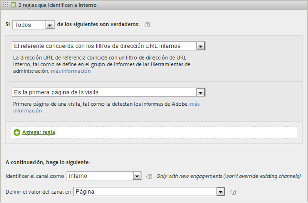
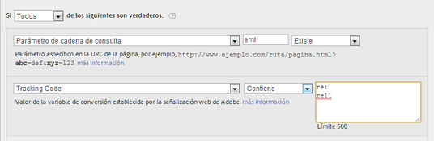

# Preguntas frecuentes y ejemplos

<!--
Read about best practices and examples of how to populate various rules you can set up for your marketing channels.

* [Frequently Asked Questions](/help/components/c-marketing-channels/c-faq.md#section_E490CEAF0E76422C91D34D8A80A0C573) 
* [No Channel Identified](/help/components/c-marketing-channels/c-faq.md##no-channel-identified) 
* [Paid Search](/help/components/c-marketing-channels/c-faq.md#section_E934BFE182E4404A93FE07AFEAE64DC1) 
* [Natural Search](/help/components/c-marketing-channels/c-faq.md#section_A4C6B8F0360449BE94F0128FF7C71386) 
* [Affiliates](/help/components/c-marketing-channels/c-faq.md#section_8D142C7074CD4DEC87DF55B691107622) 
* [Social Networks](/help/components/c-marketing-channels/c-faq.md#section_492B72A3B261479D9C84F631E90C03D8) 
* [Display](/help/components/c-marketing-channels/c-faq.md#section_4FD846B89FCE4ECFB7781BD02874A1AB) 
* [Internal](/help/components/c-marketing-channels/c-faq.md#section_179A2BE5C8E24719A9E5C0DC09AF0947) 
* [Email](/help/components/c-marketing-channels/c-faq.md#section_4A927BE947B748E39595F4525B7280DE) 
* [Direct](/help/components/c-marketing-channels/c-faq.md#section_D0A1DD9D5EEF4A05A1CC81F9EADC074A)
-->

Consulte [Creación de reglas de procesamiento de canal de marketing](/help/components/c-marketing-channels/t-rules.md) para ver las definiciones de los campos que aparecen en la página [!UICONTROL Reglas de procesamiento de canal de marketing].

## Preguntas frecuentes {#faq}

Cada implementación de las reglas de procesamiento de canal de mercadotecnia podría diferir, según sus códigos de seguimiento. La configuración de las reglas que proporcionen los resultados que necesita podría requerir cierta creatividad para resolver los problemas.

**Pregunta**: mis códigos de seguimiento no se rigen por ningún patrón y tengo que especificar miles de ellos para el canal Afiliados.

* Utilice el proceso de eliminación. Si los canales Correo electrónico y Afiliados utilizan el mismo parámetro de cadena de consulta pero solamente tiene unos cuantos códigos de seguimiento de correo electrónico, puede especificar los códigos de seguimiento de correo electrónico en un conjunto de reglas que definan el correo electrónico. Luego, clasifique todos los demás códigos de seguimiento con  *`affiliates.`*
* En su sistema de correo electrónico, agregue un parámetro de cadena de consulta a todas las direcciones URL de páginas de aterrizaje, como *`&ch=eml`*. Cree un conjunto de reglas que detecte si el parámetro de consulta ch es igual a *`eml`*. Si no contiene *`eml`*, entonces es un afiliado.

**Pregunta**: Los dominios de referencia contienen más datos de lo que tenía previsto.

* Es posible que los dominios de referencia estén demasiado arriba en la lista de reglas de procesamiento. Dicho conjunto de reglas debería ser uno de los últimos (o el último): el orden de procesamiento es importante.

**Pregunta**: he creado una regla que concuerda con un parámetro de cadena de consulta y que no funciona.

*  Compruebe que el nombre del parámetro esté especificado en los campos del parámetro de la cadena de consulta (normalmente, un valor alfanumérico). Asegúrese, también, de que el valor del parámetro se especifica después del operador, como se muestra en el siguiente ejemplo de regla de correo electrónico.

   

**Pregunta**: ¿por qué se atribuye todo mi tráfico de último toque a un dominio interno?

* Hay una regla que concuerda con el tráfico interno. Recuerde que estas reglas se procesan con cada visita que el visitante haga al sitio, y no solo con la primera visita. Si tiene alguna regla similar a  *`Page URL exists`* sin ningún otro criterio, con cada visita sucesiva a su sitio web, se encuentran coincidencias con ese canal, porque siempre existe una URL de página.

**Pregunta**: ¿cómo se depura el tráfico que se muestra en No se ha identificado el canal, en el informe?

*  Las reglas se procesan en orden. Si no se encuentra ninguna concordancia con un criterio específico, las visitas caen en una de estas tres categorías:

1. Sin referente (visita directa).

2. Referente interno, en la primera página de la visita.

3. Problema técnico de procesamiento en la página.

Asegúrese de tener un canal para estas tres posibilidades. Por ejemplo, cree reglas como estas:

1. **[!UICONTROL Referente]** y **[!UICONTROL No existe]** y **[!UICONTROL Es la primera página de la visita]**. (Consulte [Directas.](/help/components/c-marketing-channels/c-faq.md))

2. **[!UICONTROL El referente coincide con los filtros de dirección URL internos]** y **[!UICONTROL Es la primera página de la visita]**. (Consulte [Internas](/help/components/c-marketing-channels/c-faq.md).)

3. **[!UICONTROL Referente]** y **[!UICONTROL Existe]** y **[!UICONTROL El referente no concuerda con los filtros de dirección URL internos]**.

Por último, cree el canal *Otros* para que capture las visitas restantes, tal como se describe en [No se ha identificado el canal](/help/components/c-marketing-channels/c-faq.md#no-channel-identified).

## No se ha identificado el canal  {#no-channel-identified}

Cuando las reglas no capturan datos o si las reglas no se han configurado correctamente, el informe muestra los datos en la fila [!UICONTROL No se ha identificado el canal] del informe. Por ejemplo, puede crear un conjunto de reglas denominado *Otro* al final del orden de procesamiento, que también identifique el tráfico interno.

Este tipo de regla sirve de captador global para asegurar que el tráfico de los canales siempre coincide con el tráfico exterior y normalmente no finaliza en **[!UICONTROL Ningún canal identificado]**. Tenga cuidado de no crear una regla que identifique también el tráfico interno. Asignar al valor del canal **[!UICONTROL Dominio de referencia]** o **[!UICONTROL Dirección URL de página]** es el modo más frecuente y útil de crear una regla Otro que funcione.

> [!NOTE] Debería haber todavía algún tráfico de canal que podría caer en la categoría Ningún canal identificado. Por ejemplo: un visitante viene al sitio, crea un marcador de una página y en la misma visita, vuelve a la página a través del marcador. Debido a que esta no es la primera página de la visita, irá al canal Directo o al canal Otros porque no hay dominio de referencia.

## Búsqueda de pago {#paid-search}

La búsqueda paga es una palabra o frase por la que se paga a un motor de búsqueda, para que la coloque en los resultados de la búsqueda. Para buscar coincidencias con las reglas de detección de búsqueda paga, el canal de mercadotecnia usa la configuración de la página [!UICONTROL Detección de búsqueda paga]. ( **[!UICONTROL Administración]** &gt; **[!UICONTROL Grupos de informes]** &gt; **[!UICONTROL Editar configuración]** &gt; **[!UICONTROL General]** &gt; **[!UICONTROL Detección de búsqueda de pago]**). La dirección URL de destino coincide con la regla de detección de búsqueda paga existente para dicho motor de búsqueda.

En la regla de canal de mercadotecnia, la configuración de [!UICONTROL Búsqueda paga] es la siguiente:

Consulte [Detección de búsqueda paga](https://marketing.adobe.com/resources/help/en_US/reference/paid_search_detection.html) en Administración para obtener más información.

## Búsqueda natural  {#natural-search}

Las búsquedas naturales tienen lugar cuando los visitantes encuentran su sitio web a través de una búsqueda en Internet en la que el motor de búsqueda clasifica su sitio sin que usted haya pagado específicamente para ello. Puede controlar la URL de destino que el motor de búsqueda utiliza para establecer el vínculo a su sitio. Esta URL permite a Analytics identificar si una búsqueda es natural.

No hay detección de búsquedas naturales en Analytics. Después de configurar la detección de búsqueda paga, el sistema sabe que, si un referente de búsqueda no es de búsqueda paga, tiene que ser de búsqueda natural. En la búsqueda natural, la dirección URL de destino no coincide con la regla de detección de búsqueda paga de ese motor de búsqueda.

En la regla de canal de mercadotecnia, la configuración de búsqueda natural es la siguiente:

Consulte [Detección de búsqueda paga](https://marketing.adobe.com/resources/help/en_US/reference/paid_search_detection.html) en Administración para obtener más información.

## Afiliados  {#afilliates}

Las reglas de afiliados identifican a los visitantes que proceden de un conjunto específico de dominios de referencia. En la regla, se enumeran los dominios de los afiliados de los que desee hacer un seguimiento, de este modo:

## Redes sociales  {#social-networks}

Esta regla identifica a los visitantes que se originan en una red social como, por ejemplo, Facebook*. La configuración puede ser así:

## Mostrar  {#display}

Esta regla identifica a los visitantes que proceden de anuncios de banners. Se identifica con un parámetro de cadena de consulta en la dirección URL de destino, en este caso  *`Ad_01`*.

## Internas {#internal}

Esta regla identifica a los visitantes que proceden de un referente que coincide con los filtros de URL internos del grupo de informes.

## Correo electrónico  {#email}

Para configurar esta regla, se indica el parámetro de cadena de consulta correspondiente a la campaña de correo electrónico. En este ejemplo, el parámetro es  *`eml`*:

Si la regla contiene códigos de seguimiento, escriba un valor en cada línea, de este modo:

## Directas  {#direct}

Esta regla identifica a los visitantes que no cuentan con un dominio de referencia. Esto incluye a los visitantes que llegan a su sitio directamente como, por ejemplo, con un vínculo de Favoritos, o que han pegado el vínculo en el navegador.

