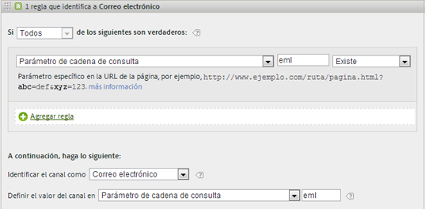

# Preguntas más frecuentes sobre los canales de marketing

>[!NOTE]
>
>Para maximizar la eficacia de los canales de marketing para Attribution IQ y Customer Journey Analytics, hemos publicado algunas [prácticas recomendadas revisadas](/help/components/c-marketing-channels/mchannel-best-practices.md).

Preguntas más frecuentes sobre los canales de marketing.

## Mis códigos de seguimiento no se rigen por ningún patrón y tengo que especificar miles de ellos para el canal Afiliados.

* Utilice el proceso de eliminación. Si los canales Correo electrónico y Afiliados utilizan el mismo parámetro de cadena de consulta pero solamente tiene unos cuantos códigos de seguimiento de correo electrónico, puede especificar los códigos de seguimiento de correo electrónico en un conjunto de reglas que definan el correo electrónico. Luego, clasifique todos los demás códigos de seguimiento con *`affiliates.`*
* En su sistema de correo electrónico, agregue un parámetro de cadena de consulta a todas las direcciones URL de páginas de aterrizaje, como *`&ch=eml`*. Cree un conjunto de reglas que detecte si el parámetro de consulta ch es igual a *`eml`*. Si no contiene *`eml`*, entonces es un afiliado.

## Los dominios de referencia contienen más datos de lo que tenía previsto.

* Es posible que los dominios de referencia estén demasiado arriba en la lista de reglas de procesamiento. Dicho conjunto de reglas debería ser uno de los últimos (o el último): el orden de procesamiento es importante.

## He creado una regla que concuerda con un parámetro de cadena de consulta y que no funciona.

* Compruebe que el nombre del parámetro esté especificado en los campos del parámetro de la cadena de consulta (normalmente, un valor alfanumérico). Asegúrese, también, de que el valor del parámetro se especifica después del operador, como se muestra en el siguiente ejemplo de regla de correo electrónico.

   

## ¿Por qué se atribuye todo mi tráfico de último contacto a un dominio interno?

* Hay una regla que concuerda con el tráfico interno. Recuerde que estas reglas se procesan con cada visita que el visitante haga al sitio, y no solo con la primera visita. Si tiene alguna regla similar a *`Page URL exists`* sin ningún otro criterio, con cada visita sucesiva a su sitio web, se encuentran coincidencias con ese canal, porque siempre existe una URL de página.

## ¿Cómo se depura el tráfico que se muestra en No se ha identificado el canal, en el informe?

* Las reglas se procesan en orden. Si no se encuentra ninguna concordancia con un criterio específico, las visitas caen en una de estas tres categorías:

1. Sin referente (visita directa).

2. Referente interno, en la primera página de la visita.

3. Problema técnico de procesamiento en la página.

Asegúrese de tener un canal para estas tres posibilidades. Por ejemplo, cree reglas como estas:

1. **[!UICONTROL Referente]** y **[!UICONTROL No existe]** y **[!UICONTROL Es la primera página de la visita]**. (Consulte [Directas.](/help/components/c-marketing-channels/c-faq.md))

2. **[!UICONTROL El referente coincide con los filtros de dirección URL internos]** y **[!UICONTROL Es la primera página de la visita]**. (Consulte [Internas](/help/components/c-marketing-channels/c-faq.md).)

3. **[!UICONTROL Referente]** y **[!UICONTROL Existe]** y **[!UICONTROL El referente no concuerda con los filtros de dirección URL internos]**.

Por último, cree el canal *Otros* para que capture las visitas restantes, tal como se describe en [No se ha identificado el canal](/help/components/c-marketing-channels/c-faq.md#no-channel-identified).

## Relación entre primer y último contacto

Para comprender la interacción entre las primeras y últimas dimensiones de contacto, y confirmar que las anulaciones funcionan según lo esperado, puede extraer un informe de canal de primer contacto, subrelacionado con un informe de canal de último contacto, con la métrica de éxito clave en (ver ejemplo más abajo). En el ejemplo se muestra la interacción entre los canales de primer y último contacto.

La intersección donde el primer contacto es igual que el último es la diagonal de la tabla. Tanto la actualización directa como la actualización de sesión solo obtienen crédito de último contacto si también son el canal de primer contacto, ya que no pueden tomar crédito de otros canales persistentes (filas resaltadas).

## Razones por las que no se identificó ningún canal {#no-channel-identified}

Cuando las reglas no capturan datos o si las reglas no se han configurado correctamente, el informe muestra los datos en la fila [!UICONTROL No se ha identificado el canal] del informe. Por ejemplo, puede crear un conjunto de reglas denominado *Otro* al final del orden de procesamiento, que también identifique el tráfico interno.

Este tipo de regla sirve de captador global para asegurar que el tráfico de los canales siempre coincide con el tráfico exterior y normalmente no finaliza en **[!UICONTROL Ningún canal identificado]**. Tenga cuidado de no crear una regla que identifique también el tráfico interno. Asignar al valor del canal **[!UICONTROL Dominio de referencia]** o **[!UICONTROL Dirección URL de página]** es el modo más frecuente y útil de crear una regla Otro que funcione.

>[!NOTE]
>
>Debería haber todavía algún tráfico de canal que podría caer en la categoría Ningún canal identificado. Por ejemplo: un visitante viene al sitio, crea un marcador de una página y en la misma visita, vuelve a la página a través del marcador. Debido a que esta no es la primera página de la visita, irá al canal Directo o al canal Otros porque no hay dominio de referencia.

## Razones para la actualización interna (actualización de la sesión) {#internal}

El último contacto interno (actualización de la sesión) solo se puede producir si también fue el primer contacto; consulte “Relación entre el primer y el último contacto” más arriba. Las siguientes situaciones explican cómo la actualización de la sesión podría ser un canal de primer contacto.

* **Tiempo de espera de sesión**: Un visitante llega al sitio web y luego deja la pestaña abierta en el navegador para usarla días más tarde. El periodo de interacción del visitante caduca (o elimina voluntariamente sus cookies) y utiliza la pestaña abierta para volver a visitar el sitio web. Dado que la dirección URL de referencia es un dominio interno, la visita se clasificará como “Actualización de sesión”.

* **No todos los sitios están etiquetados**: Un visitante llega a la página A que no está etiquetada y luego se mueve a la página B que está etiquetada. La página A se trataría como el referente interno y la visita se clasificaría como “Actualización de sesión”.

* **Redirecciones**: Si no se configura una redirección para pasar datos del referente a la nueva página de llegada, se pierden los datos del referente de entrada real y ahora la página de redirección (probablemente una página interna) aparece como el dominio de referencia. La visita se clasificará como “Actualización de sesión”.

* **Tráfico entre dominios**: Un visitante pasa de un dominio que se activa con el grupo A a un segundo dominio que se activa con el grupo B. Si en el grupo B los filtros de URL internos incluyen el primer dominio, la visita en el grupo B se registrará como interna, ya que los canales de marketing la ven como una nueva visita en el segundo grupo. La visita se clasificará como “Actualización de sesión”.

* **Tiempos de carga de la página de entrada largos**: Un visitante llega a la página A, que tiene mucho contenido, y el código de Adobe Analytics se encuentra en la parte inferior de la página. Antes de cargar todo el contenido (incluida la solicitud de imagen de Adobe Analytics), el visitante hace clic en la página B. La página B activa su solicitud de imagen de Adobe Analytics. Dado que la solicitud de imagen de la página A nunca se cargó, la segunda página aparece como la primera visita individual en Adobe Analytics, con la página A como referente. La visita se clasificará como “Actualización de sesión”.

* **Borrar cookies en el sitio en mitad de la sesión**: Un visitante ingresa al sitio y luego borra las cookies a mitad de la sesión. Los canales de primer y último contacto se restablecerían y la visita se clasificaría como “Actualización de sesión” (porque el referente sería interno).

A continuación, se muestra un ejemplo de la configuración interna (actualización de la sesión) como canales de primer y último contacto:

* Día 1: el usuario llega al sitio y este aparece en la pantalla. Los canales de primer y último contacto se definirán como “Pantalla”.
* Día 2: el usuario entra al sitio a través de una búsqueda natural. El primer contacto permanece como “Pantalla” y el último contacto se establece como “Búsqueda natural”.
* Día 35: el usuario no ha accedido al sitio en 33 días y regresa usando la pestaña que había abierto en su navegador. Suponiendo que se trate de una ventana de participación de 30 días, la ventana se habría cerrado y las cookies del canal de marketing habrían caducado. El canal de primer contacto y último contacto se restablecerán y se configurarán en Actualización de sesión, ya que el usuario accedió con una URL interna.

## ¿Por qué algunos canales no cambian después de modificar las reglas de procesamiento del canal de marketing?

A veces, las reglas de procesamiento del canal de marketing se configuran incorrectamente, lo que hace necesario cambiar las reglas de procesamiento. Después de aplicar los cambios, puede ver que algunas métricas siguen atribuyendo datos a un canal incorrecto. Hay varias cosas que hay que tener en cuenta:

* **Los datos del canal de marketing se recopilan en tiempo real**: Los datos del canal de marketing se procesan tras la recopilación de datos y son 100 % permanentes. El cambio de las reglas de procesamiento no afecta a los datos de forma retroactiva.
* **El cambio de las reglas de procesamiento no afecta inmediatamente a los datos de primer contacto**: Por ejemplo:
   1. Un usuario ingresa a través de su canal de correo electrónico porque se configuró incorrectamente y luego abandona el sitio.
   2. Al día siguiente, cambia la regla de procesamiento de correo electrónico para corregirla.
   3. Ese usuario regresa varios días después a través de una búsqueda natural y realiza una compra.
   4. El canal de correo electrónico recibe crédito de primer contacto y la búsqueda natural recibe crédito de último contacto.

   Incluso varios días después de cambiar las reglas de procesamiento, los datos se pueden recopilar en el canal de primer contacto incorrecto. Los datos de primer contacto se recopilan continuamente en el canal incorrecto hasta que caduca la participación del visitante de todos los usuarios.

La mejor manera de solucionar estas discrepancias es hacer una o ambas de las siguientes acciones:

* **Caducar manualmente todos los períodos de participación de los visitantes**: Esta configuración caduca instantáneamente todos los canales de primer y último contacto en todos los visitantes:
   1. Vaya a Herramientas de administración > Grupos de informes.
   2. Pase el ratón sobre la imagen Editar configuración > Canales de marketing > Caducidad de la participación del visitante
   3. Haga clic en Caducar todo.
   4. Haga clic en Aceptar en la ventana emergente de advertencia, lo cual reconoce que comprende lo que va a hacer.

* **Ver solo las métricas de último contacto desde el momento en que se corrigieron las reglas hacia adelante**: Las métricas de último contacto siempre siguen el conjunto de reglas actual. La visualización del tiempo desde el momento en que se han cambiado las reglas de procesamiento hacia adelante refleja correctamente las reglas de procesamiento más actuales.
