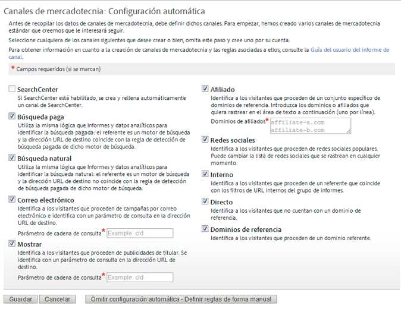

# Introducción a los canales de marketing

>[!NOTE]
>
>Para maximizar la eficacia de los canales de marketing para Attribution IQ y Customer Journey Analytics, hemos publicado algunas [prácticas recomendadas revisadas](/help/components/c-marketing-channels/mchannel-best-practices.md).

Los canales de marketing se utilizan habitualmente para saber cómo llegan los visitantes al sitio. Se pueden personalizar reglas de procesamiento de canal de marketing en función de los canales que quiera rastrear y de cómo desea hacerlo.

Los canales de marketing giran en torno a las métricas de primer y último contacto, las cuales son componentes de las métricas de conversión estándar.

## Flujo de trabajo de canales de marketing

 Definir los canales en función de las necesidades empresariales.

La definición de los canales utilizados es una de las partes más importantes de los canales de marketing. La definición de canales exige la colaboración entre distintos integrantes de su organización. Estas son algunas cuestiones que hay que tener en cuenta:

* ¿Está usando una búsqueda paga?
* ¿Está usando campañas de correo electrónico? ¿Está usando varias campañas de correo electrónico y le gustaría hacer un seguimiento por separado?
* ¿Tiene afiliados que dirijan el tráfico a su sitio? ¿Hay afiliados a los que querría seguir de manera individual?
* ¿Hay campañas externas que sería mejor seguir por separado?
* ¿Desea sumar todos los sitios de redes sociales o hay alguno que le gustaría seguir de forma individual?
* ¿Existen otros canales que podrían afectar a la conversión y que quiera rastrear?

Hay una lista de canales recomendados en [Preguntas frecuentes y ejemplos](/help/components/c-marketing-channels/c-faq.md). Cree una lista con los canales que desee usar. De este modo, será más fácil activar y definir los canales a la hora de crearlos.

 Añada canales de marketing en la página del [!UICONTROL Administrador de canales de marketing].

Después de definir los canales para seguir, los habilita en **[!UICONTROL Administración]** > **[!UICONTROL Grupos de informes]**.

Consulte [Acerca de los canales y las reglas](/help/components/c-marketing-channels/c-channels.md) para obtener información importante sobre requisitos previos y conceptos.

Consulte [Agregar canales](/help/components/c-marketing-channels/c-channels.md) de marketing para ver el procedimiento.

>[!NOTE]
>
>Si los canales de marketing no se han configurado anteriormente, se muestra la [configuración automática](/help/components/c-marketing-channels/c-getting-started-mchannel.md). Esta configuración proporciona varios canales preconfigurados que se pueden personalizar. Adobe recomienda usar estas reglas como plantilla. No obstante, si ya tiene definiciones de canales consolidadas, puede omitir la configuración automática.

 Configure o pula las reglas de cada canal en la página [!UICONTROL Reglas de procesamiento de canal de marketing].

Después de crear los canales en la página [!UICONTROL Administrador de canales de marketing], configure las reglas para que esos canales puedan obtener datos y crear informes.

Consulte [Reglas de procesamiento de canal de marketing](/help/components/c-marketing-channels/c-rules.md).

Si los canales se han creado en la configuración automática, las reglas de los canales ya estarán definidas. Puede modificarlas para adaptarlas a sus necesidades.

## Configuración automática para canales de marketing {#run-auto-setup}

El informe Canal de marketing incluye una página de configuración de una sola vez para ayudarle a empezar. Proporciona varios canales de marketing que puede utilizar para realizar seguimientos. Puede omitir esta configuración si ya sabe cómo crear canales y reglas. Sin embargo, Adobe recomienda dejar que sea el asistente el que cree los canales. La configuración automática permite ver cómo se construyen las reglas, o editarlas para los fines que desee. Puede deshabilitar o eliminar los canales predefinidos en cualquier momento.

Cómo se ejecuta la configuración automática para los canales de marketing.

1. Haga clic en **[!UICONTROL Analytics]** > **[!UICONTROL Administración]** > **[!UICONTROL Grupos de informes]**.
1. En el [!UICONTROL Administrador del grupo de informes], seleccione un grupo de informes.
1. Haga clic en **[!UICONTROL Editar configuración]** > **[!UICONTROL Canales de marketing]** > **[!UICONTROL Administrador de canales de marketing]**.

   

   >[!NOTE]
   >
   >La página [!UICONTROL Canales de marketing: configuración automática] se abre automáticamente al acceder a las aplicaciones de configuración de canal en las Herramientas de administración. (Consulte el [administrador de Canales de marketing](/help/components/c-marketing-channels/c-channels.md).) Esta página no indica si el grupo de informes contiene uno o más canales de marketing. Solo podrá volver a acceder a esta página si selecciona otro grupo de informes que no contenga canales de marketing.

1. Asegúrese de que los canales que desee crear estén seleccionados.

   Una vez seleccionados, los campos **[!UICONTROL Correo electrónico]**, **[!UICONTROL Visualización]** y **[!UICONTROL Afiliados]** son obligatorios.

1. Haga clic en **[!UICONTROL Guardar]**.

## Aplicación de la configuración de un grupo de informes de plantilla a varios grupos de informes

Cómo se utiliza un grupo de informes principal como plantilla para poner a prueba la configuración de su canal de marketing. Para ahorrar tiempo, puede aplicar esta plantilla a uno o más grupos de informes de producción en una actualización masiva. Esta tarea se realiza por separado con los canales y los conjuntos de reglas.

>[!NOTE]
>
>Aplique los canales a partir de una plantilla antes de aplicar los conjuntos de reglas. Los canales deben ser los mismos en todos los grupos de informes al realizar este procedimiento.

1. Asegúrese de que el informe de canal de marketing esté habilitado en los grupos de informes seleccionados. El administrador de su cuenta será el encargado de llevar a cabo este paso.
1. Haga clic en **[!UICONTROL Analytics]** > **[!UICONTROL Administración]** > **[!UICONTROL Grupos de informes]**.
1. En la página **[!UICONTROL Administrador del grupo de informes]**, seleccione el grupo de informes de plantilla, y uno o más de los grupos de informes de destino.
1. Haga clic en **[!UICONTROL Editar configuración]** > **[!UICONTROL Canales de marketing]** > **[!UICONTROL Administrador de canales de marketing]**.
1. En la página **[!UICONTROL Seleccionar grupos de informes principales]**, seleccione un grupo de informes de plantilla.
1. Haga clic en **[!UICONTROL Guardar todos]**.
1. Aplique las reglas a partir de una plantilla a varios grupos de informes:
   1. Vuelva a la página [!UICONTROL Administrador del grupo de informes].
   1. Seleccione el grupo de informes de plantilla y uno o más grupos de informes de destino.
   1. Haga clic en **[!UICONTROL Editar configuración]** > **[!UICONTROL Canales de marketing]** > **[!UICONTROL Reglas de procesamiento de canal de marketing]**.
   1. Haga clic en **[!UICONTROL Guardar]**. Si el botón Guardar está deshabilitado en este paso, expanda una de las reglas para habilitarlo.

