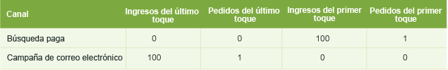
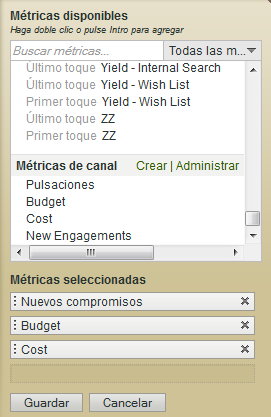

# Métricas utilizadas en los informes Canal de mercadotecnia

Cómo utilizar las métricas en los informes Canal de mercadotecnia.

## Metrics used in Marketing Channel reports {#topic_F83F5D4C3E144967AD90D956F0E8A999}

Cómo utilizar las métricas en los informes Canal de mercadotecnia.

Agregue (o edite) las métricas.

Agregue una columna al informe.

## First and last-touch metrics {#concept_68D9A50204304BA58C1F8013451E7853}

Los atributos de canal y de primer toque son atributos de canal que permiten ver cuántas participaciones (o datos de métricas como vistas de productos, ingresos y pedidos) resultan de la actividad de un visitante en el canal.

When a success event occurs, Analytics looks at the entire visitor's activity and history (back to the [visitor's engagement expiration](../../components/c-marketing-channels/visitor-engagement.md#topic_32ADFDB12D3A4F35843A4545AC97C49F)). Se anotan tanto el primer canal por el que entró el usuario, como el canal más reciente. A continuación, se otorga crédito del evento de éxito a los canales correspondientes.

<!-- 

<note>
  A first-touch value has a rolling expiration based on the frequency of a visitor returning to the site. This first-touch expiration resets whenever a visitor returns to the site. This effects reporting by causing first-touch values to persist longer than you might expect. For example, this can occur if an instance of an first-touch channel was created a year ago. Remove the values on the eVar in the admin console to reset. 
</note>

 -->

**Ejemplo**

Supongamos que configura dos canales de mercadotecnia: Búsqueda paga y Campaña de correo electrónico.

La búsqueda paga es un anuncio de un producto. Capta el interés del visitante y genera una vista de producto pero no provoca un evento de conversión.

Un mes más tarde, usted lanza una campaña de correo electrónico del mismo producto. Tiene como resultado una compra de 100 dólares (u otro evento de conversión deseado).

En el informe de canal de mercadotecnia, el resultado podría mostrarse de este modo:

El canal Búsqueda paga recibe un crédito de 100 dólares como canal de primer toque en los ingresos, con 1 pedido de primer toque. El canal Campaña de correo electrónico recibe un crédito de 100 dólares como canal de ingresos de último toque (el canal que el usuario tocó por última vez antes del evento de conversión) y con 1 pedido de último toque. En otras palabras, el principal propósito del informe es ver la forma en la que el desglose de ingresos a través de los canales de primer toque difiere del desglose de ingresos a través de los canales de último toque.

Cada instancia de evento de éxito tendrá exactamente un canal de primer toque y un canal de último toque. Esto significa que si se suma una determinada columna de métrica para cualquier evento de éxito, siempre igualará de manera exacta el total del mismo período de tiempo. Este total será exactamente igual al número total de eventos en el informe correspondiente [!UICONTROL Métricas del sitio] &gt; [!UICONTROL Eventos personalizados]. Para las métricas de eventos sin éxito, como visitas y visitantes, no habrá una coincidencia 1 a 1, ya que en la misma visita se pueden activar varios canales.

>[!NOTE]
>
>Este informe utiliza la versión de primer toque o último toque de cada métrica. Por ello, es posible que los datos que se muestran en un informe [!UICONTROL Canal de mercadotecnia] no coincidan con los datos de otros informes.

## Metric definitions {#section_364D003D34D748B79503DFA4DD208EDB}

| Métrica | Definición |
|--- |--- |
| Canal de primer toque | El primer canal de mercadotecnia que atrae al visitante. Técnicamente, el canal de primer toque es una evar con asignación original. |
| Visitante de primer toque | En los informes de canal, el visitante de primer toque es un visitante único diario que se originó en un canal. El compromiso del cliente se almacena durante el período de compromiso con el sitio, que podría durar varias visitas. |
| Canal de último toque | El canal de conversión, es decir, el último canal de mercadotecnia que atrae al visitante y que provoca una conversión. Solamente se establece un canal como el canal de primer toque. El canal de último toque puede cambiar con cada visita de retorno al sitio. Cada visita tiene un canal de primer toque y uno de último toque, pero el valor del canal de primer toque nunca cambia con las visitas subsiguientes. |

## Pulsación {#reference_55E2254F02EF4E7EB0AD2838C948347A}

La pulsación es una instancia del canal de último toque. Constituye una eVar con la asignación más reciente.

Por ejemplo, supongamos que un visitante llega al sitio web una vez al día y que cada visita se origina en un canal de mercadotecnia distinto:

* Día 1: búsqueda paga
* Día 2: visualización
* Día 3: búsqueda natural
* Día 4: visualización
* Día 5: búsqueda paga
* Día 6: visualización
* Día 7: búsqueda natural

El informe Canal de primer toque muestra 1 nuevo compromiso para la búsqueda paga. Cada uno de los demás canales muestra 0 nuevos compromisos. El informe Canal de último toque muestra 2 pulsaciones para la búsqueda paga; 3 para la visualización, y 2 para la búsqueda natural.

## Agregar métricas a un informe de canal de mercadotecnia {#task_D381139E00504666AB2402D553CFEA5B}

Agregue métricas a un informe de canal de mercadotecnia. Puede agregar hasta cuatro métricas a cada columna del informe, y todas las columnas que desee.

1. Abra el [!UICONTROL Informe de canal de mercadotecnia].
1. Haga clic en Agregar métricas.

   

1. En [!UICONTROL Métricas disponibles], arrastre y suelte las métricas desde la sección [!UICONTROL Métricas disponibles] hasta la sección [!UICONTROL Métricas seleccionadas.]

   

1. Para crear métricas calculadas, desplácese hasta [!UICONTROL Métricas calculadas]**y haga clic en[!UICONTROL Crear]**.
1. Haga clic en **[!UICONTROL Guardar.]**
