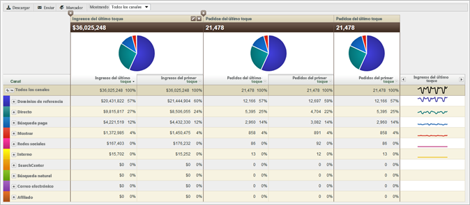

# Acerca de los informes Canal de mercadotecnia

Los informes de canal de mercadotecnia permiten averiguar cuántos ingresos generan sus canales de mercadotecnia. Entre ellos se incluye un informe-resumen de la asignación de canales de primer y último toque, con métricas estándar como ingresos, pedidos y costos.

En las Herramientas de administración puede configurar las reglas de definición del canal. Hay disponibles API específicas para los informes del canal. No es necesario realizar ningún cambio externo en la implementación para ejecutar el informe [!UICONTROL Canal de mercadotecnia].

* [Informe de ejemplo](../../components/c-marketing-channels/c-overview.md#section_64F7FB1326A64B318654BAFE66FA97EC)
* [Informes disponibles](../../components/c-marketing-channels/c-overview.md#section_8A95A56AE24E4F34BBA069361D6354B9)

## Informe de ejemplo {#section_64F7FB1326A64B318654BAFE66FA97EC}

Los datos de canal se admiten en paneles, API, creador de informes (para Excel), análisis específicos, almacén de datos y Data Extract.

Agregue (o edite) las métricas.

Agregue una columna al informe.

## Informes disponibles {#section_8A95A56AE24E4F34BBA069361D6354B9}

Los siguientes informes de [!UICONTROL canal de mercadotecnia] están disponibles en Experience Cloud.

| Informe | Descripción |
|--- |--- |
| Información general del canal | El informe de resumen muestra gráficos circulares y gráficos que ilustran las tendencias a lo largo del período de tiempo seleccionado. Puede agregar métricas de primer toque y de último toque, o bien, crear métricas calculadas para el informe. También puede ver detalles en el canal de primer toque y de último toque, al igual que ver informes detallados a partir de la tabla de resumen. Otros informes de canal de mercadotecnia ofrecen maneras de ver los datos resumidos de este informe con mayor detalle.  Al expandir un canal en el informe, se muestra un informe desglosado de los valores del canal. Los valores de canal son valores no clasificados en los detalles del canal. |
| Canal de primer o último toque | Muestra métricas con datos sobre canales específicos de primer toque o de último toque. En dichos informes, puede desglosar los canales y mostrar los detalles de cada uno de ellos. |
| Detalle del canal de primer o último toque | Muestra detalles como nombres de páginas y referentes, que se toman de los valores de canal que configure en la opción Definir el valor del canal en al configurar reglas. Los informes de detalles de canal permiten examinar minuciosamente los valores detallados del canal en el informe de resumen. |